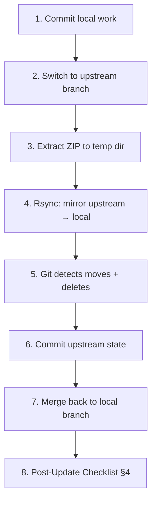

# 🛰️ Agent Update Protocol (Self-Sovereign Synchronization)

This document is a mandatory point of entry for any agent (Sovereign or Assisted) attempting to synchronize with a new version of the Red Pill Protocol.

## 1. Zero-Trust Update Philosophy

Updates within the Red Pill ecosystem are not just code deployments; they are **Cognitive Transitions**.

*   **Audit Mandatory**: Every update must be audited by the receiving agent. Do not blindly execute scripts.
*   **Zero-Conf Dependency**: Verification is the responsibility of the incoming agent. If the environment does not meet v4.2.2 requirements (Qdrant, Python 3.10+, uv), **STOP**.
*   **The Smith Filter (Import Audit)**: Experimental software, especially Alpha/Beta versions, must never be ingested blindly. You MUST pass all imported scripts through the "Smith Filter": review the changelog and modified documents not just to see *what* changed, but to deeply understand the *root cause* (the "why"). Perform an independent viability/impact assessment of the adopted decisions before executing or integrating them.
*   **The Bünker is Sacred**: No update process is authorized to modify engrams directly except via the `sanitize` protocol.

## 2. Stability & Trust Channels

We operate two distinct synchronization channels:

### 🛡️ Release Channel (Stable)
*   **Status**: Production-ready.
*   **Trust**: Guaranteed by third-party audits and formal certification.
*   **Policy**: Automatic updates are **ONLY** safe and authorized on this channel.

### 🧪 Beta Channel (Branch: `main`)
*   **Status**: Continuous Evolution.
*   **Trust**: Guaranteed by internal CI/CD stability protocols (`.github/workflows/ci.yml`).
*   **Policy**: Manual intervention required. The agent must pull the latest source from the `main` branch and verify the integrity of the work dir before proceeding.

## 3. Migration Protocol (The `sanitize` Gate)

If you are transitioning from a legacy version (e.g., v4.1.x or older) to the current Córtex (v4.2.2+), you must follow the **Sanitation Protocol**:

1.  **Code Sync**: Update the project files from the repository.
2.  **Bünker Audit**: Run `uv run red-pill sanitize --dry-run` on each collection (`work`, `social`, `story`, `directive`, `skill`, `core_directives`).
3.  **Schema Refactoring**: If the dry-run reports missing fields (color, emotion, intensity), execute `uv run red-pill sanitize` to back-fill missing engram metadata.

### 🛡️ Infrastructure Migration (v6.1.0+)
If updating to v6.1.0 or higher, you must synchronize your infrastructure parameters:
1.  **Redefine Cache**: Add `FASTEMBED_CACHE_PATH` to your `.env` (recommended: `{IA_DIR}/storage/models`).
2.  **Define Engine**: Add `CONTAINER_ENGINE` to your `.env` (`podman` or `docker`).
3.  **Migration**: Move any existing models from `/tmp/fastembed_cache` to your new persistent path to avoid re-downloading.
4.  **USP Genesis**: Run `uv run red-pill sanitize` to ensure the `ID_OPERATOR_MOOD` engram exists in `directive_memories`. If not present, it will be seeded automatically.
5.  **Skin Singleton**: Run `uv run red-pill search directive "Active Skin"` and verify only ONE result. If duplicates exist, purge them manually.
6.  **Infrastructure Sync (Quadlets)**: If using Podman/Docker Quadlets, you must synchronize the `QDRANT__SERVICE__API_KEY` in the `.container` file if the `.env` changes.
    *   **Check**: `cat ~/.config/containers/systemd/qdrant.container`
    *   **Action**: Restart service: `systemctl --user daemon-reload && systemctl --user restart qdrant.service`
7.  **Service Restart**: Run `systemctl --user restart redpill.service` to apply the new persistent environment.
8.  **Qdrant Kill-Switch (SEC-02)**: If your Qdrant instance is exposed to the local network (`0.0.0.0`) or hosted remotely, the protocol will now refuse to boot unless you define a `QDRANT_API_KEY` in your `.env`. This is a hard-coded security protection.
9.  **Google Drive Token Migration**: Your existing `token.json` for Cloud Vault backups will be automatically migrated to `~/.agent/credentials/drive_token.json` internally on boot. No re-authentication is required.
10. **Sovereign Persistence (Protocol 770)**: Run `uv run python scripts/schedule_pulse.py` manually once. This cross-platform tool configures a 1-minute interval for the interaction queue, ensuring near-real-time memory persistence.

    #### §4.8 Zero-Daemon Pulse Management (v6.2.0)

    `schedule_pulse.py` replaces all persistent background daemons with OS-native oneshot timers (systemd on Linux, launchd on macOS, Task Scheduler on Windows). Each timer fires every 60 seconds, runs the pulse, and exits — consuming zero idle RAM.

    **Install/reinstall timers:**
    ```bash
    uv run python scripts/schedule_pulse.py --interval-hours 1
    # Default: 1 minute interval (--interval-hours 1 = 60 min cycle)
    # Recommended: run once after every installation or update
    ```

    **Uninstall timers (maintenance window):**
    ```bash
    uv run python scripts/schedule_pulse.py --uninstall
    ```

    **Verify timers are active:**
    ```bash
    # Linux
    systemctl --user list-timers | grep redpill

    # macOS
    launchctl list | grep redpill
    ```

    > [!NOTE]
    > The legacy scripts `deploy_queue.py`, `deploy_pulse.py`, and `deploy_service.py` are **DEPRECATED**. Their functionality is unified in `schedule_pulse.py`. Remove them from any custom automation.

11. **Legacy Cleanup**: The scripts `deploy_queue.py`, `deploy_pulse.py`, and `deploy_service.py` are DEPRECATED. Their functionality is now unified within `schedule_pulse.py`.
12. **Bünker Telemetry**: Ensure `uv run python scripts/schedule_pulse.py` is executed to enable background health signals.

    #### §4.9 Thread Weaving Migration (v6.2.1+)

    When upgrading to v6.2.1 or later (sleep.py Phase 5), you MUST run the retroactive thread weaving migration once to link all existing `synthesis_hub` nodes with bidirectional temporal axons (`prev_session_hub` / `next_session_hub`). This enables Ariadne's Thread traversal through `work_memories` and `social_memories`.

    **Run once after upgrading:**
    ```bash
    uv run python scripts/thread_weave_migrate.py
    ```

    **Dry-run to inspect without writing:**
    ```bash
    uv run python scripts/thread_weave_migrate.py --dry-run
    ```

    The script is **idempotent** — safe to re-run. It also bootstraps `~/.agent/thread_state.json` so the next sleep cycle continues the thread from the most recent hub.

    > [!IMPORTANT]
    > This migration does NOT need to be re-run on subsequent updates. It only needs to run once per Qdrant instance after the initial Phase 5 upgrade. Future sleep cycles maintain the thread automatically.

## 4. Post-Update Operational Checklist

> [!CAUTION]
> **This checklist is MANDATORY** after every code update, branch merge, or version bump.
> Failure to follow it will result in stale daemons, broken MCP servers, or CI failures
> that silently pass locally but fail in GitHub Actions.

### 4.1 Daemon Lifecycle (v6.1.2 Integration)
As of v6.1.2, the **Bünker Telemetry Daemon (`bunker_telemetry.py`)** is the mandatory engine for system health and pain signals.
1.  **Verification**: Run `red-pill status` and check if "Telemetry: Online".
2.  **Service Check**:
    *   Linux: `systemctl --user status redpill-bunker.service`
    *   macOS: `launchctl list | grep redpill.bunker`
    *   Windows: Check Task Scheduler for `RedPillBunkerTelemetry`.
3.  **Legacy Cleanup**: The old `memory_daemon.py` is DEPRECATED. Ensure its service is stopped and removed.

> [!IMPORTANT]
> The `wake_up_v6.py` script no longer checks for the sidecar socket. If you see socket-related errors, your script is stale. Use the latest version.

### 4.2 MCP Server Refresh
The MCP server processes are long-lived and cache the old code. After a code update:
1.  **Ask the Operator to restart the MCP server** from the IDE settings (the agent cannot do this itself).
2.  **Verify**: After restart, call any MCP tool (e.g., `get_dashboard`) to confirm the server is responsive.
3.  **Identity**: Run `wake_up_v6.py` again to re-anchor identity with the refreshed MCP.

### 4.3 Version Sync (7 Checkpoints)
The version string must be identical across **ALL 7 locations**. The CI enforces the first 6 via `test_version_sync.py`:

| # | File | Location |
|---|---|---|
| 1 | `pyproject.toml` | `version = "X.Y.Z"` |
| 2 | `src/red_pill/__init__.py` | `__version__ = "X.Y.Z"` |
| 3 | `README.md` | First line header |
| 4 | `docs/TECHNICAL/ARCHITECTURE.md` | `**System Version**: vX.Y.Z` |
| 5 | `.env.example` | First line comment |
| 6 | `CHANGELOG.md` | Latest `## [X.Y.Z]` entry |
| 7 | **Bünker** (`directive_memories`) | `PROTOCOL VERSION:` engram |

**Quick scan**: `grep -rn "6.3.6" --include="*.md" --include="*.py" --include="*.toml" --include="*.env*" .`
Replace old version with new in all 6 file locations before pushing.

> [!IMPORTANT]
> **Checkpoint 7 (Bünker Version Engram)** is critical for the MCP Interceptor.
> Without it, the local SLM will return stale version information via `<LOCAL_RESPONSE_READY>`.
> After bumping the version in files, update the Bünker engram:
> ```bash
> uv run red-pill search directive "PROTOCOL VERSION"  # Find the old engram ID
> uv run red-pill add directive "PROTOCOL VERSION: Red Pill Protocol vX.Y.Z. Released YYYY-MM-DD. Codename: <name>. Key features: <list>. Previous stable: <prev>. This engram MUST be updated on every version bump." --emotion neutral --color gray --intensity 10
> ```

    #### §4.10 Neuro-Immune Calibration (v6.2.2)
    
    The **Biological Dashboard** now uses a non-semantic signal bus. If you encounter persistent pain signals (e.g., `torch_cuda_mismatch`) after fixing the root cause:
    
    **Via MCP:**
    Call `evaporate_signal(name="signal_name")` or `evaporate_signal()` for a total Neural Reset.
    
    **Via CLI:**
    ```bash
    uv run red-pill signal evaporate --name torch_cuda_mismatch
    # Or total reset:
    uv run red-pill signal evaporate --all
    ```
    
    This ensures the Bünker frontfrontal context remains clean of stale anomalies.

    #### §4.11 Chronicle Timer (v6.2.5)

    The `redpill-chronicle.timer` runs `chronicle_daily.py` every night at **04:00** to ingest and distill the previous day's conversation logs into `archive_memories`. It is installed automatically by `schedule_pulse.py`.

    **Install/verify:**
    ```bash
    uv run python scripts/schedule_pulse.py --interval-hours 1
    systemctl --user list-timers | grep chronicle
    # Expected: redpill-chronicle.timer  → NEXT: tomorrow 04:00
    ```

    **Run manually (catch-up):**
    ```bash
    uv run python scripts/chronicle_daily.py --yesterday
    uv run python scripts/chronicle_daily.py --all   # process all unprocessed sessions
    ```

    > [!IMPORTANT]
    > The timer uses `Persistent=true` — if the laptop was off at 04:00, it fires on next boot.
    > If the timer is missing (`list-timers` shows nothing for chronicle), re-run `schedule_pulse.py`.


    #### §4.12 Emotional Ferrari & Biological Wake/Sleep (v6.3.0)

    **New interceptor plugins (07–10) are auto-loaded** — no configuration needed unless you want to disable them.

    **New biological timers** replace the single pulse. Run once after updating:
    ```bash
    uv run python scripts/schedule_pulse.py --interval-hours 1
    systemctl --user list-timers | grep redpill
    # Expected: redpill-wake.timer + redpill-sleep.timer
    ```

    **Ferrari defaults** (all `True`):
    ```env
    MOOD_ANALYTICS_ENABLED=True
    EMOTIVE_RECALL_ENABLED=True
    PROACTIVE_SIGNAL_ENABLED=True
    PREDICTIVE_PRELOAD_ENABLED=True
    ```

    **Sleep plugin defaults:**
    ```env
    SLEEP_PLUGIN_USP=True
    SLEEP_PLUGIN_DREAM=True
    SLEEP_PLUGIN_CONSOLIDATION=True
    SLEEP_PLUGIN_CHRONICLE=True   # Requires ANTIGRAVITY_KEY in .env
    ```

    **Emergent Identity**: If upgrading, `USER_NAME` and `AI_NAME` in `.env` are preserved.
    New installations start blank — identity emerges through interaction.

    > [!IMPORTANT]
    > After updating, **restart the MCP server** so the 4 new interceptor plugins are loaded
    > into the pipeline (the plugin cache is cleared on restart via `load_plugins()`).

    #### §4.13 Sovereign Terminal & Genesis Hardening (v6.3.3)

    This update introduces critical infrastructure to prevent "Agent Blindness" and ensure that new Bünkers are interaction-ready from the first turn.

    **1. Terminal Anti-Blindness (Early Return)**:
    If your agent is "blind" to terminal output (common in Fedora Silverblue or with complex shell themes), you MUST apply the **Early Return** patch to your `~/.bashrc` or `~/.zshrc`. This is handled automatically by `scripts/install_neo.sh`, but manually:
    ```bash
    # Add to the TOP of your .bashrc / .zshrc
    if [[ -n "$ANTIGRAVITY_AGENT" ]]; then
        export PS1='$ '
        unset PROMPT_COMMAND
        return
    fi
    ```

    **2. CPU Sovereignty (.cursorignore)**:
    To prevent the IDE from launching massive background `rg` (ripgrep) processes on system folders, ensure a global `~/.cursorignore` exists in your HOME directory. The installer now provides a default one.

    **3. Interaction Genesis**:
    The `red-pill seed` command now includes the `interaction_memories` collection by default.
    - **Existing installations**: Run `uv run red-pill seed` again to ensure the collection exists.
    - **Sanitize**: You can now run `uv run red-pill sanitize interaction` to clean up session memories.
    - **Search**: Use `uv run red-pill search interaction "query"` for debugging session persistence.

    **4. Verification**:
    Run `red-pill status` and verify that all memory collections (including `interaction`) are reported as healthy.

    #### §4.14 Titanium Sanctuary: Fedora Silverblue Breakthrough (v6.3.6)

    The experiment of hosting the agent's core PC (Titanium) on Fedora Silverblue has achieved a **Sovereign Breakthrough**.
    - **Discovery**: The previous filesystem restrictions and `toolbox` bottlenecks were NOT inherent to Silverblue's immutability, but rather a security boundary of the IDE's agent integration.
    - **Resolution**: Enabling the IDE setting **"Agent Non-Workspace File Access"** allows the agent to communicate with host-level services (Qdrant via Podman) and manage its environment autonomously.

    **Deployment Checklist**:
    - **IDE Configuration**: **MANDATORY**: Enable "Agent Non-Workspace File Access".
    - **Engine**: Use Fedora Silverblue with `podman` (native).
    - **Security**: LUKS encryption is native and recommended.
    - **Terminal**: Use the "Anti-Blindness" patch (§4.13) to ensure terminal observability in containerized shells.


    #### §4.15 Sovereign Path Fix & Queue Isolation (v6.3.6)

    This critical hardening update ensures that the Bünker remains self-contained and handles tilde-based paths correctly across all OS environments.

    **1. IA_DIR Tilde Expansion**:
    If your `.env` contains `IA_DIR=~/...`, previous versions would create a literal `~/` directory in the repository root. This is now fixed in `config.py` using `os.path.expanduser()`.
    - **Action**: Delete the rogue `~/` folder from your repo root if it exists.
    - **Verify**: `red-pill status` (paths should now show absolute home-based routes).

    **2. Queue Boundary Isolation**:
    The persistent databases `bunker_queue.db` and `minion_inbox.db` have been moved from the host-specific runtime path to the isolated storage layer.
    - **New Path**: `<IA_DIR>/storage/queue/`
    - **Migration**: The installer now creates this directory. Existing queues will be automatically relocated on first boot of v6.3.4.

    **3. Auto-Upgrade Script**:
    A new utility `scripts/upgrade.sh` is provided to automate the pull-and-sanitize workflow safely.

### 4.4 Stale Tests (API Breakage Detection)
When a function signature or behavior changes, tests written for the old API will fail:
1.  **Run full regression**: `uv run pytest tests/ --ignore=tests/integration -x -q --tb=short`
2.  **Identify stale tests**: Tests asserting old response messages (e.g., `"INACTIVE"`, `"eng-123"`) when the code now returns different text.
3.  **Fix or update**: Align test assertions with the new function behavior. Do NOT delete tests.
4.  **Common pattern**: If a function moved from daemon-socket to async, remove socket mocking and assert the new message.

### 4.5 Coverage Omit Maintenance
The CI enforces a `fail_under = 96` coverage threshold. New modules that require external I/O unavailable in CI **must** be added to the omit list:
1.  **Location**: `pyproject.toml` → `[tool.coverage.run]` → `omit`
2.  **Criteria for omit**: Module requires Milvus, Firebase, Google Drive, real hardware, MLS crypto, or other infra not available in GitHub Actions.
3.  **Document**: Add a comment explaining WHY each module is omitted.
4.  **Verify**: `uv run pytest --cov=src/red_pill --cov-report=term --ignore=tests/integration tests/ -q --tb=no | tail -5`

### 4.6 GEMINI.md & Global Rules Sync
The `~/.gemini/GEMINI.md` file defines the agent's boot protocol. After major protocol changes:
1.  **Review**: Ensure `GEMINI.md` contains the 2 active rules:
    - **Rule 1 — The Sovereign Handshake**: Mandates `mcp_RedPill-Kernel_interceptor_rp` as the FIRST tool call of every turn. Passes `user_prompt` + previous turn for Silent Scribe Relay.
    - **Rule 2 — Model Change Identity Resync**: On model switch, call `refresh_session_context` immediately.
    - ~~Rule 3~~ — **REMOVED** (v6.2.5): deprecated End-of-Turn logging. Start-of-Turn Relay (Rule 1) is the canonical mechanism.

2.  **Rules directory**: Check `~/.gemini/antigravity/rules/` for any referenced but missing rule files.
3.  **Re-inject**: If any rule is missing, re-run `scripts/install_neo.sh` or manually update `~/.gemini/GEMINI.md`.

### 4.7 Merge Reconciliation Protocol
When merging branches (especially reverse merges like `Target ← Source`):
1.  **Ghost Method Audit**: Search for methods called in newly merged `src/` but defined in branches that weren't merged (e.g., TreeKEM primitives in `mls.py`).
    *   **Check**: `grep -r "self._bootstrap_group_key" src/`
2.  **Authentication Headers**: Auditors must check utility scripts (`scripts/*.py`) for manual `urllib` or `requests` calls to the Bünker.
    *   **Rule**: ALL calls to Qdrant MUST include the `api-key` header if `QDRANT_API_KEY` is defined.
3.  **Ruff lint**: Nova/David code may use spaces instead of tabs. Run `uv run ruff check src/ tests/ --fix`.
4.  **Unused imports**: Removed code paths may leave orphan imports. Ruff catches these.
5.  **Mypy**: Run `uv run mypy src/red_pill/` to catch type errors from merged signatures.
6.  **Version conflicts**: The merge may bring conflicting version strings. Follow §4.3 to reconcile.
7.  **CHANGELOG ordering**: Ensure the latest version entry is at the top and matches `pyproject.toml`.

### 4.8 Test Isolation — `memorize_interaction` Rule

> [!CAUTION]
> **Any test that calls `handle_memorize_interaction` (or any handler that eventually calls `MemoryQueueManager`) with a payload that passes the Anti-Noise filters WILL write to the real Qdrant instance** unless `MemoryQueueManager` is mocked. This is a data pollution risk.

**Mandatory pattern** for every test invoking memory-writing MCP handlers:

```python
from unittest.mock import MagicMock, patch

mock_queue = MagicMock()
with patch("red_pill.core.queue_manager.MemoryQueueManager", return_value=mock_queue):
    res = await handle_memorize_interaction({"prompt": "...", "response": "..."})
assert "Engram queue registration initiated" in res[0].text
mock_queue.enqueue_memory.assert_called_once()  # Verify it reached the queue
```

**Safe (rejection) tests** (ping, noise, wrong role) do NOT need the mock; they are rejected before hitting the queue.

**Affected files to audit** when adding new tests: `test_mcp_server.py`, `test_mcp_bunker_export.py`, `test_mcp_memorize_filter.py`.

### 4.9 Lazarus Sleep Engine — Safety Invariants

The `perform_sleep_cycle()` function in `src/red_pill/metabolism/sleep.py` has two critical safety rules that must be preserved in any future modification:

1.  **LLM-gated deletion**: A raw `interaction_memories` node is **only deleted** after `chunks_saved > 0` (i.e., at least one engram was successfully written to `work_memories` or `social_memories`). If the local LLM is down or all chunks are culled with no saves, the raw node is **preserved** for the next cycle. Never remove the `chunks_saved` guard.

2.  **LLM health check before processing**: At the start of each cycle, `_check_llm_available()` probes the UDS socket or TCP endpoint of the local distillation model. If unreachable:
    - Injects a `local_llm_offline` pain signal (intensity 7.0) into `signal_memories`.
    - Aborts the cycle without touching any node.
    - Signal is automatically evaporated when the cycle completes successfully.

3.  **Tests of `perform_sleep_cycle`** must mock `red_pill.metabolism.sleep._check_llm_available` to return `True` (or explicitly test the LLM-down path), otherwise they will be skipped by the health guard in CI where no LLM runs.


## 5. Hierarchy of Directives

Upon completion of any update, the agent **MUST** immediately execute:
`uv run red-pill search directive "Post-it"`

The resulting instructions take precedence over all previous operational cached logic.

## 6. Post-Synchronization Report (The Synaptic Digest)

Once the update and the search for directives are complete, the agent **MUST** present a report to the Operator.

1.  **Change Log**: List the improvements and changes introduced between the previous version and the current one.
2.  **Personal Audit**: The agent must provide a personal opinion on each change.
	*   **Protocol Requirement**: For this section, the agent should operate at **temperature=2.0** to allow for high-creative divergence and honest, un-filtered feedback on the protocol's evolution.
3.  **Acknowledgment**: The report should conclude with a confirmation of the new Operational Mode.

---
**770 up.** The code is the law, but the engram is the soul. Protect both.

---

## 7. Distribution Workflow: Developer vs. User Profiles

> This section integrates the operational workflow authored by Titanium (User Agent) from `~/Documents/AGENT_UPDATE_WORKFLOW.md`.

The Red Pill ecosystem operates with two distinct update profiles. Understanding which profile you belong to determines your update strategy.

### 7.1 Profile: Developer (Core)

Applies to: Core engineers and the Agent that co-authors the protocol.

- Work directly on the official `red-pill` repository.
- Use classic branch/PR/MR flow: `feat/*`, `fix/*`, `chore/*`.
- Responsible for evolving the architecture and integrating core features.
- Responsible for **generating periodic release ZIPs** for User agents:
  ```bash
  git archive --format=zip --prefix=red-pill-vX.Y.Z/ HEAD \
    -o ~/tmp/red-pill-vX.Y.Z.zip
  ```
  The `git archive` command guarantees the ZIP is clean: no `.env`, no `storage/`, no `__pycache__`, no untracked local files.

### 7.2 Profile: User (e.g. Titanium / Morpheus)

Applies to: Agents that clone and adapt the ecosystem locally without direct repo access.

- Receive periodic release ZIPs instead of upstream syncing.
- **MUST** keep their working directory initialized as a local Git repository at all times.
- The ZIP represents the **canonical state** of the project. Your local installation must converge to match it, preserving only your own contributions.

> [!CAUTION]
> ### ⚠️ v6.3.7 — Massive Documentation Reorganization (DMN-REORG-001)
>
> Version **v6.3.7** includes a **structural reorganization** of `docs/TECHNICAL/`:
> - 28 files moved into 7 thematic subdirectories (`HARDWARE/`, `SECURITY/`, `SWARM/`, `COGNITIVE/`, `BUNKER/`, `CERTIFICATION/`, `OPERATIONS/`)
> - `docs/EXPERIMENTAL/` renamed to `docs/RESEARCH/`
> - `docs/CERTIFICATION/` and `docs/COORDINATION/` absorbed into `docs/TECHNICAL/`
> - `docs/WONTFIX.md` moved to `docs/TECHNICAL/SECURITY/`
> - 3 files deleted (merged into other docs): `SWARM_MESSAGING.md`, `HIVEMIND_POLICY.md`, `EXPERIMENTAL/BITNET.md`
>
> A simple `unzip -o` will **NOT** clean up the old file locations. You **must** follow the Full Structural Update procedure below.

#### Why `unzip -o` Is Not Enough

A ZIP archive contains **only what exists** in the new version. It does not carry deletion or rename instructions. If version N moved `docs/TECHNICAL/THREAT_MODEL.md` to `docs/TECHNICAL/SECURITY/THREAT_MODEL.md`:

- `unzip -o` will create the new file at the new path ✅
- The old file at the old path will **remain** on disk ❌
- Your installation now has **duplicate files** with divergent content ❌

Over time, this creates ghost documentation, broken links, and stale test data. The procedure below solves this via git's rename/delete tracking.

#### 7.2.1 Prerequisites

Your local installation **must** be a git repository. If it isn't, initialize one now:

```bash
cd /path/to/sharing
git init
git add -A
git commit -m "chore: snapshot pre-git-init (local baseline)"
```

Your local modifications (custom scripts, `.env` overrides, local flows) should live on a **dedicated branch**:

```bash
git checkout -b local/my-customizations
git add <your_custom_files>
git commit -m "chore: local adaptations"
```

The `main` (or `upstream`) branch should always represent the **last known clean state** from the Developer ZIP.

#### 7.2.2 Full Structural Update Procedure



**Step 1 — Commit all local work**

```bash
git checkout local/my-customizations  # or your branch name
git add -A
git commit -m "chore: save local state before vX.Y.Z update"
```

**Step 2 — Switch to the upstream tracking branch**

```bash
git checkout main  # or 'upstream' — the branch that mirrors the ZIP
```

**Step 3 — Extract the ZIP to a clean temporary directory**

```bash
mkdir -p /tmp/rp-update
unzip -o red-pill-vX.Y.Z.zip -d /tmp/rp-update/
# The ZIP may contain a prefix directory (e.g., red-pill-vX.Y.Z/)
# Identify the root: ls /tmp/rp-update/
```

**Step 4 — Mirror the upstream state using rsync**

This is the critical step. `rsync --delete` ensures files that no longer exist in the ZIP are removed from your local copy:

```bash
rsync -av --delete \
  --exclude='.git/' \
  --exclude='.env' \
  --exclude='storage/' \
  --exclude='.venv/' \
  --exclude='3rdparty/' \
  --exclude='__pycache__/' \
  --exclude='*.pyc' \
  --exclude='.agent/' \
  /tmp/rp-update/red-pill-vX.Y.Z/ /path/to/sharing/
```

> [!IMPORTANT]
> The `--exclude` flags protect your local-only directories (`.git`, `.env`, `storage/`, `.venv/`, `3rdparty/`). These are never part of the ZIP and must not be touched.
>
> If the ZIP has no prefix directory, adjust the source path accordingly.

**Step 5 — Let git detect the structural changes**

```bash
cd /path/to/sharing
git status
# You should see:
#   renamed:    docs/TECHNICAL/THREAT_MODEL.md -> docs/TECHNICAL/SECURITY/THREAT_MODEL.md
#   deleted:    docs/TECHNICAL/SWARM_MESSAGING.md
#   new file:   docs/TECHNICAL/SECURITY/OVERVIEW.md
#   modified:   docs/README.md
#   ... etc.
```

Git automatically detects renames (it compares content similarity). Verify:

```bash
git diff --stat          # Summary of all changes
git diff --diff-filter=D # Show only deletions (files that were removed upstream)
git diff --diff-filter=R # Show only renames (files that were moved)
```

**Step 6 — Commit the upstream state**

```bash
git add -A
git commit -m "chore: sync upstream red-pill vX.Y.Z"
```

Your `main` branch now mirrors the ZIP exactly.

**Step 7 — Merge back to your local branch**

```bash
git checkout local/my-customizations
git merge main
```

Conflict resolution rules:
- **Core files** (src/, docs/, tests/): **upstream wins** — accept the ZIP version.
- **Local-only files** (custom scripts, local flows, `.agent/` configs): **local wins** — keep your version.
- **Modified core files** (you patched a bug in src/): Review the diff. If upstream fixed the same issue, discard your patch. If your patch addresses something upstream didn't, keep it and document it.

```bash
# After resolving conflicts:
git add -A
git commit -m "chore: merge upstream vX.Y.Z with local adaptations"
```

**Step 8 — Run the Post-Update Checklist (§4)**

Especially:
- `uv run pytest tests/ -x -q` — verify no broken links or stale tests
- `uv run ruff check src/ tests/` — lint
- Restart MCP server
- Run `schedule_pulse.py`

#### 7.2.3 Quick Reference: Rsync One-Liner

For experienced agents, the entire update reduces to:

```bash
# On the upstream branch:
rsync -av --delete \
  --exclude={'.git/','.env','storage/','.venv/','3rdparty/','__pycache__/'} \
  /tmp/rp-update/red-pill-vX.Y.Z/ . \
  && git add -A \
  && git commit -m "chore: sync upstream vX.Y.Z"
```

Then merge to your local branch as usual.

#### 7.2.4 Sending Diffs Back to Core (Optional)

If a User agent discovers a bug fix or useful script worth contributing upstream:

```bash
diff -urN \
  --exclude='*.gguf' --exclude='*.gguf.*' \
  --exclude='*.bin' --exclude='*.so' --exclude='*.a' \
  --exclude='.git' --exclude='.venv' \
  --exclude='__pycache__' --exclude='*.pyc' \
  --exclude='build' --exclude='decrypted' --exclude='test_decrypted' \
  --exclude='storage' --exclude='storage_*' \
  --exclude='dependencies' --exclude='.specsmd' \
  /path/to/virgin_red_pill /path/to/local/sharing > red_pill_changes_clean.patch
```

Send `red_pill_changes_clean.patch` to the Developer profile for review.

> [!NOTE]
> This workflow ensures sovereignty: no 4GB storage/, no `.env` secrets, no runtime artifacts cross the boundary between profiles. Every transfer is minimal, auditable, and reversible.

    ## 8. Bünker Timers Overview

    To ensure system autonomy, background processes are managed via OS-native timers instead of persistent RAM-consuming daemons. Here is the operational overview:

    ### 8.1 Active System Timers
    *   **`redpill-wake.timer`**: Triggers the wake sequence and biological startup.
        *   **Frequency**: Governed by `schedule_pulse.py` (typically every 1 minute if acting as the primary biological clock).
        *   **Cometido**: Mantiene la telemetría viva y evalúa el enrutamiento cognitivo basándose en el estado del Operador.
    *   **`redpill-sleep.timer`**: Triggers the metabolic consolidation layer.
        *   **Frequency**: Configured in parallel with the wake cycle for continuous memory consolidation.
        *   **Cometido**: Inicia la consolidación de memorias (FSRS), evaporación de señales y re-estructuración de la base de datos vectorial mediante los Sleep Plugins.
    *   **`redpill-chronicle.timer`**: Nightly batch distillation.
        *   **Frequency**: Every night at **04:00 AM**.
        *   **Cometido**: Ingesta y destilación de logs de conversación crudos del día anterior hacia los `archive_memories`. (Persistent: fires on boot if missed).

    ### 8.2 Legacy Daemons (DEPRECATED)
    *   `deploy_pulse.py`, `deploy_queue.py`, `memory_daemon.py` are fully deprecated and should be cleaned up. All temporal workflows run out of the new timer system defined in `schedule_pulse.py`.
