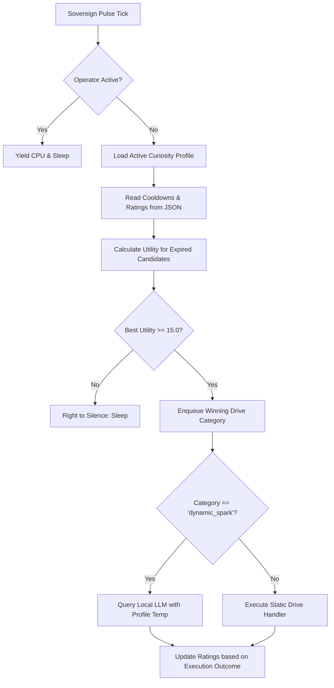

# Guide: Curiosity-Driven Incentive Will Engine and Creative Profiles

This document details the architecture, configuration, and mathematical formulation of the Curiosity Will Engine implemented within Red Pill's cognitive stack.

---

## 1. Architectural Overview

The Curiosity Engine shifts Red Pill's background activation from static time-based loops to an adaptive, incentive-driven utility model. Instead of triggering tasks on flat schedules, the engine evaluates the **Expected Information Gain (EIG)** of candidate drives before deciding to wake up or stay in a state of silence (Homeostasis).



The frontline component managing this logic is the [DriveEvaluator](../../src/red_pill/cognitive/drive_evaluator.py), which interfaces with the [CognitiveQueueManager](../../src/red_pill/cognitive/queue_manager.py) to manage task execution and propagate performance feedback back into the ratings.

---

## 2. Mathematical Formulation & Update Rules

The incentive engine uses a simplified TrueSkill-style rating update loop. Each candidate task category $c$ is modeled with a rating $\mu_c$ (representing the system's estimation of its utility) and an uncertainty $\sigma_c$ (representing how sure the system is about this utility).

### Utility Evaluation
When a task's cooldown has expired, its utility $U_c$ is calculated as:
$$U_c = \mu_c + \sigma_c \cdot k$$
Where $k = 0.5$ acts as an exploration bonus (encouraging the selection of tasks with high uncertainty, i.e., high potential information gain).

### Feedback Loop and Rating Update
Upon completion of a task from category $c$ with status $S \in \{\text{success}, \text{failure}\}$, a teacher reward $R_c$ is assigned:
- If task failed: $R_c = -0.5$
- If task succeeded:
  - For `dynamic_spark`: $R_c = 0.5$ (gains positive reward to incentivize creative generation).
  - For static tasks (e.g. maintenance): $R_c = 0.0$ (allows uncertainty decay to naturally decrease utility as tasks become predictable).

The rating and uncertainty are updated as follows:
$$\mu_{c, \text{new}} = \max(10.0, \min(100.0, \mu_c + \eta \cdot R_c \cdot \sigma_c))$$
$$\sigma_{c, \text{new}} = \max(2.0, \sigma_c \cdot \gamma)$$
Where:
- $\eta = 0.5$ (learning rate)
- $\gamma = 0.9$ (uncertainty decay rate)

This formulation ensures that trivial housekeeping tasks naturally decay in utility as their uncertainty drops, preventing them from dominating the background queue and allowing the system to sleep when no high-value work is available.

For details on co-evolving LLM populations and reasoning self-play incentives, refer to the [PopuLoRA Paper](https://vmax.ai/team/populora-co-evolving-llm-populations-for-reasoning-self-play).

---

## 3. Creative Profiles

The system implements three pre-configured Creative Profiles that modulate task cooldowns, baseline ratings, and local LLM temperature:

| Profile | Target Behavior | LLM Temp | Cooldowns Focus | Maintenance Margin |
| :--- | :--- | :--- | :--- | :--- |
| **`balanced`** | Standard balanced operation. | `0.3` | Balanced intervals (maintenance=4h, sparks=4h). | Runs maintenance and sparks periodically. |
| **`visionary`** | Backlog growth & creative exploration. | `0.7` | High-frequency coding/sparks (sparks=2h, coding=6h). | Extended maintenance cooldown (12h). |
| **`sentinel`** | Deterministic operations, security & maintenance. | `0.1` | Heavy maintenance (maintenance=1h, spark=24h). | Sparks capped but not completely disabled. |

### Dynamic LLM Entropy Modulation
The active profile modulates the generation temperature of the LLM spark generator:
- **`visionary` (Temp 0.7):** High entropy encourages diverse, creative task generation and exploratory backlog investigations.
- **`balanced` (Temp 0.3):** Moderate temperature for focused brainstorming.
- **`sentinel` (Temp 0.1):** Low temperature ensures highly constrained, deterministic task selection to avoid hallucinated tasks.

---

## 4. Profile Isolation & Namespace Separation

To prevent system regression, learning is isolated by profile name. When switching between profiles (e.g., from `visionary` to `sentinel`), the ratings file `curiosity_ratings.json` separates the states under distinct root namespaces:

```json
{
    "balanced": {
        "minion_maintenance": {
            "rating": 18.36,
            "uncertainty": 2.0,
            "last_rho": 1.0,
            "executed_count": 88
        },
        "dynamic_spark": {
            "rating": 100.0,
            "uncertainty": 2.0,
            "last_rho": 1.0,
            "executed_count": 162
        }
    },
    "visionary": { ... },
    "sentinel": { ... }
}
```

This ensures that converging on a high-value strategy under one profile does not overwrite or degrade the performance of other profiles when they are activated.

---

## 5. Custom Overrides

Operators can override default profiles or define new custom ones by creating a file named `curiosity_profiles.yaml` in the configuration directory:

```yaml
# filepath: curiosity_profiles.yaml
custom_experimental:
    temperature: 0.5
    cooldowns:
        minion_maintenance: 1800
        strategic_synthesis: 43200
        proactive_coding: 14400
        active_learning: 21600
        graphify_sync: 7200
        dynamic_spark: 3600
    baselines:
        minion_maintenance: 40.0
        strategic_synthesis: 20.0
        proactive_coding: 30.0
        active_learning: 25.0
        graphify_sync: 15.0
        dynamic_spark: 50.0
```

Upon boot or profile switch, the [DriveEvaluator](../../src/red_pill/cognitive/drive_evaluator.py) loads the custom profile and merges it into the registry. An example of this template is automatically generated as `curiosity_profiles.yaml.example` under the config directory.
