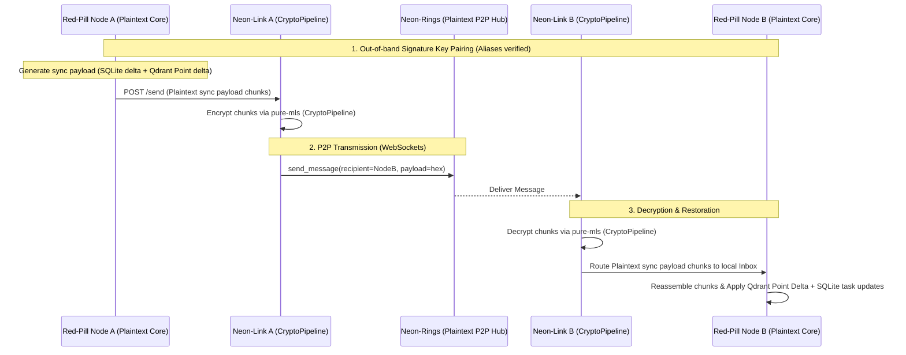

# Operator Manual: Sovereign P2P Sync (Delta Engine)

This guide explains how to configure and run the decentralized, local-first Peer-to-Peer (P2P) synchronization protocol to share the Bünker state (Qdrant engrams + SQLite task databases) across multiple devices without relying on third-party cloud servers.

---

## 0. Prerequisites & System Dependencies

Before using P2P synchronization, ensure the following ecosystem components are operational:

1. **`neon-link` Gateway** (>= 0.4.0):
   - Handles the E2E encryption (`pure-mls`) pipeline and outbox/inbox database buffers.
   - Must be running locally (default: `http://localhost:8770`).
2. **`neon-rings` WebSocket P2P Transport**:
   - The plaintext communication tunnel carrying the MLS-encrypted payloads between nodes.
   - Connected via the `rings` plugin inside `neon-link`.

---

## 1. How It Works

The Sovereign Sync Delta Engine uses a secure, out-of-band identity pairing system and delegates ciphertext transmission to `neon-link`/`neon-rings`:



### SQLite Delta Replication (`cognitive_tasks`)
- Scans `cognitive_tasks` table for rows updated after the last successful sync tick.
- Applies Last-Writer-Wins (LWW) resolution on target based on the UTC modification timestamp (`updated_at`).

### Qdrant Point Delta Replication (Non-Destructive)
- Scrolls through Qdrant collections for engrams where `max(created_at, last_recalled_at) > last_sync_timestamp`.
- Injects new engrams via `upsert` and applies LWW resolution on existing points (comparing modification times) to prevent overwriting newer target memory.

### Chunked Transmission
- Delta payloads are compressed with `gzip`, Base64-encoded, and split into chunks of maximum 400KB.
- Each chunk contains a `session_id`, `chunk_index`, `total_chunks`, and a `sha256` checksum.
- Target reassembles and validates the checksum of all chunks before applying updates.

---

## 2. CLI Reference & Setup

Follow these steps to establish a sync relationship between two devices (e.g. `desktop` and `nomad`):

### Step 1: Advertise Local Identity
On device A (`desktop`), run:
```bash
red-pill p2p advertise
```
**Output example:**
```
📢 --- [LOCAL SOVEREIGN NODE IDENTITY] ---
Node ID: d8449c30f78d3810f607d2f9746f332204eb8c8c5ff8de86ea6bbbc1c05d76d4
Provide this ID to your peer to establish a sync relationship.
```

### Step 2: Establish Pairing
On device B (`nomad`), map the alias of device A using its Node ID:
```bash
red-pill p2p pair desktop d8449c30f78d3810f607d2f9746f332204eb8c8c5ff8de86ea6bbbc1c05d76d4
```

Repeat this step on device A to pair with device B's ID.

### Step 3: Trigger Outbound Sync
On device A (`desktop`), generate and send a delta sync package to `nomad`:
```bash
red-pill p2p sync nomad
```
*Optional arguments:*
- `--since <timestamp>`: Only sync elements modified after this Unix timestamp (default: `0.0` - full delta sweep).
- `--collections <list>`: Specify which memory collections to sync (default: `METABOLISM_AUTO_COLLECTIONS` - `work_memories`, `social_memories`, `story_memories`).

### Step 4: Process Inbound Sync
On device B (`nomad`), check the `MinionInbox` for incoming sync chunks and apply them:
```bash
red-pill p2p process
```
**Output example:**
```
🔄 --- [PROCESSING INCOMING SYNC DATA] ---
[OK] Processed and applied 1 sync session(s).
```
The targets' databases and vector stores are now updated seamlessly.
