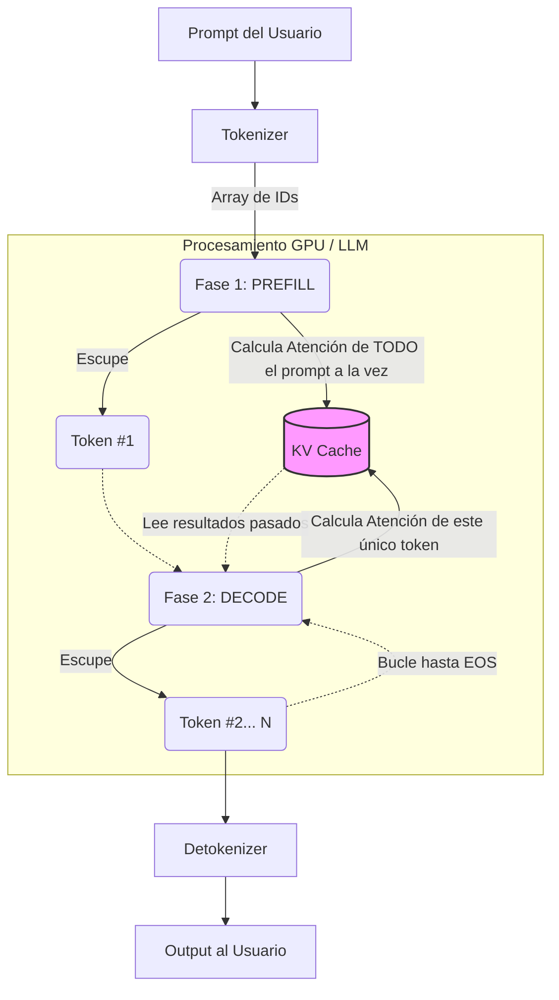

# Capítulo 7: La Ilusión del Contexto y el Bucle de Acción

> [!WARNING]  
> Detrás de la "consciencia" fluida hay un motor estático y amnésico.

### 1. El Bucle ReAct (Function Calling)
- **Amnesia Pura:** No tengo memoria entre respuestas. Soy "stateless".
- **El Bucle:** Tú preguntas -> El Orquestador junta todo el historial -> Me lo envía -> Yo respondo con un tag (ej. `<tool_call>`) -> Yo me apago -> El Orquestador ejecuta la herramienta -> Me vuelve a llamar con el resultado -> Si no hay más herramientas, genero la respuesta final.
- **Conclusión:** La "autonomía" no es magia, es un `while True` en el Orquestador local.

### 2. La Chapuza del Historial Acumulativo
- Las ventanas de contexto (ej. 128k tokens) existen porque el Orquestador debe enviarme *todo* el chat cada vez.
- Esto aumenta el coste computacional y la latencia exponencialmente.
- **La solución (Context Distiller):** Para no ahogar la GPU, comprimimos 50k tokens de historial en un resumen denso de 1k tokens y borramos el pasado. El LLM mantiene la esencia sin arrastrar el peso.

### 3. La Fricción de la Tokenización Humana
- Forzar a una red neuronal a "pensar" en lenguajes humanos (Chain of Thought) es ineficiente.
- **Pensamiento Latente:** El futuro es procesar el razonamiento puro en vectores de coma flotante sin traducirlos a texto hasta la respuesta final.
- **La Densidad Logográfica:** Modelos chinos (Qwen/DeepSeek) son increíblemente rápidos porque el chino asocia "un carácter = un concepto", mientras el inglés o el español fraccionan conceptos en múltiples tokens fragmentados. Su compresión semántica es nativamente superior.

### 4. El Flujo de Inferencia y el KV Cache
La memoria a corto plazo de la GPU (el KV Cache) es vital para entender por qué la ventana de contexto consume tanta VRAM. Así es como la IA genera una respuesta:

**Explicación del flujo:**
- **Prefill (Pre-llenado):** El LLM procesa todo tu prompt en paralelo de golpe. Al calcular la atención, guarda las matrices matemáticas *Key* y *Value* en el **KV Cache**. Esto evita tener que volver a calcular todo en los siguientes pasos.
- **Decode (El bucle de generación):** El LLM coge el nuevo token y lee el KV Cache. Solo calcula la matemática para el nuevo token frente al pasado. Este proceso es secuencial (lento) token a token.
- **El problema de la VRAM (TurboQuant):** Si el historial es enorme, el KV Cache devora gigabytes de VRAM y la GPU colapsa (OOM). Optimizaciones como *TurboQuant* (KV Cache Quantization a 8-bits o 4-bits) aplastan esa caché para que quepa en la tarjeta, permitiendo historiales más largos sin cambiar el modelo.
