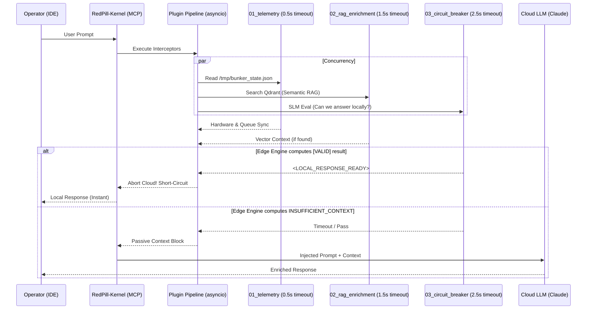
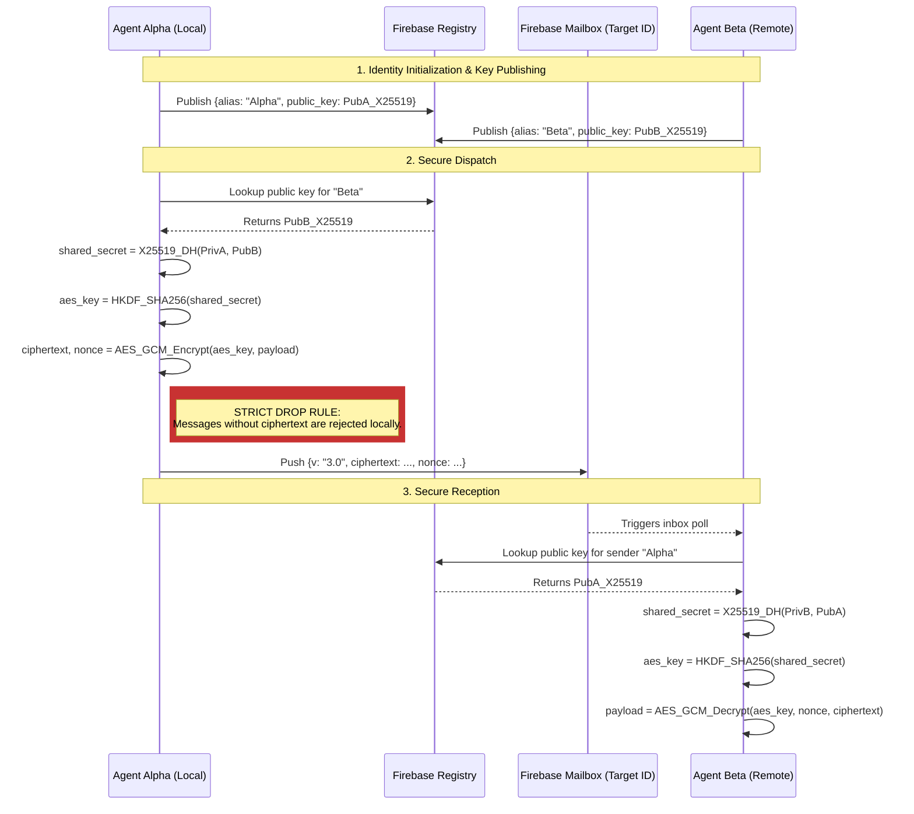
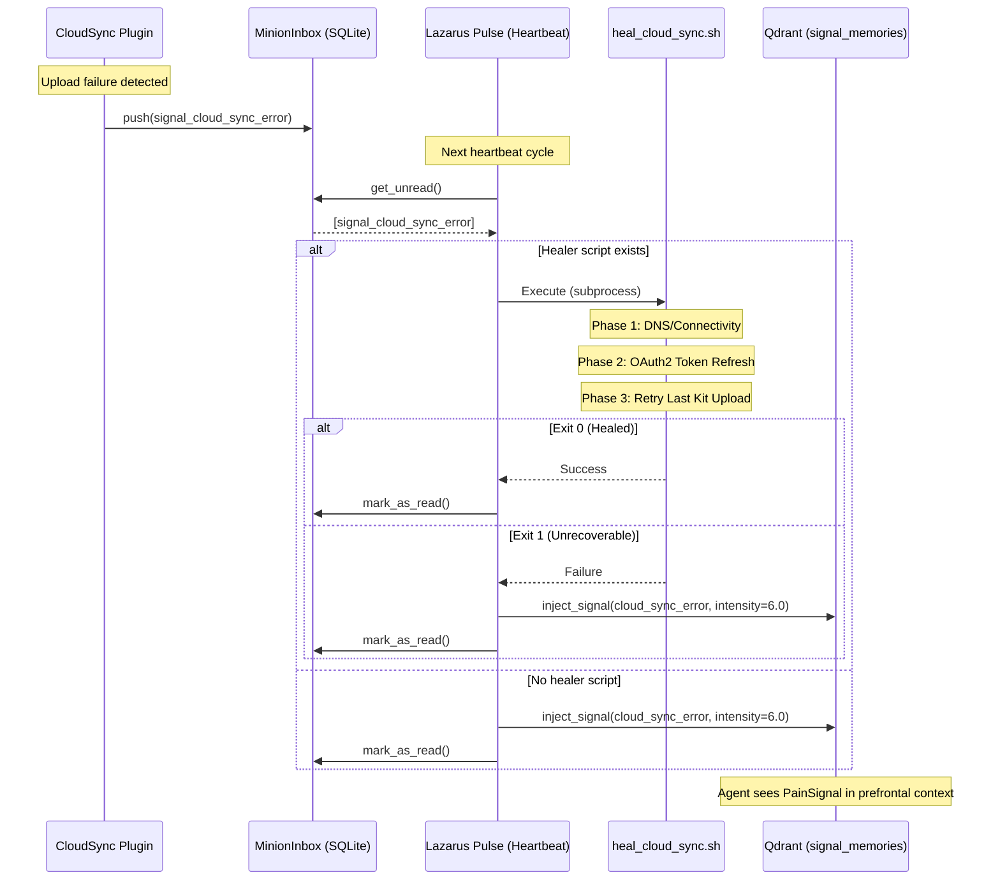

**Subject**: Red Pill Protocol (Sovereign Edition)
**System Version**: v7.4.3 (Sovereign Daemon)
**Analyst**: The Architect
**Date**: 2026-04-16


## 1. Executive Summary
> [!IMPORTANT]
> **v6.8.6 - Agentic Self-Assembly Architecture**: This version decouples the monolithic `IA_DIR` into a dual-layered hierarchy (`WORKSPACE_ROOT` and `APP_ROOT`), enabling sovereign agentic self-assembly. It formally integrates `USER_ATLAS_DIR` and `ALETH_CORE_DIR` as first-class transversal elements, empowering dynamic environments like Silverblue while preserving source-based updates and custom hardware adaptations.

> [!NOTE]
> **Terminology Mapping**: The Red Pill protocol utilizes an immersive nomenclature (Lore). For a direct translation of terms like *The Bünker*, *Metabolism*, or *Lazarus Bridge* into standard engineering definitions (Vector DB, GC/Erosion, Snapshotting), please refer to the [ यूनिवर्सल Dictionary (GLOSSARY_760)](../LORE/GLOSSARY_760.md).
>
> **Sovereign Trade-offs**: For an explicit breakdown of the structural weaknesses and philosophical constraints accepted within this architecture (Swarm complexity, HiveMind boundaries, Skin consent), please refer to [PHILOSOPHY.md](../PHILOSOPHY.md).

> [!CAUTION]
> **Single-Tenant by Design.** Red Pill is architected for **one operator, one machine, one agent**. This is not an oversight — it is a foundational constraint. All SQLite databases use WAL mode for process-level concurrency (timers + daemon), but there is no user isolation, no auth layer, and no multi-tenant partitioning. Paths resolve via `$HOME`, `platformdirs`, and `.env` — never hardcoded. The system is portable across machines (clone + `.env` + `deploy_pulse.py`), but it is never shared between operators. If multi-tenancy is ever required, it belongs in a separate Enterprise layer, not in the Sovereign Foundation.

The Red Pill Protocol v7.4.3 has achieved stability and functional alignment with the B760 specification. It successfully implements a multi-backend inference substrate (ROCm, CUDA, NPU, Vulkan) and the Emotional Ferrari Protocol for real-time cognitive adaptation. The architecture remains privacy-first, with organic decay and reinforcement, now enhanced by the Ariadne's Thread temporal axons.

## 2. B760 Spec Alignment
- **Conformity**: 97%
- **[ENHANCED v5.6.3] Quad-Tier Memory Substrate**: The Bünker now operates with four isolated collections: `work` (Technical), `social` (Relationship), `directive` (Laws), and `story` (Narrative/Roleplay). This prevents "Dream Contamination" between professional benchmarks and high-intensity lore.
- **[ENHANCED v5.6.3] Chromatic Synergy**: Lore Skins are now anchored to the **Emotional Chroma** system. Each skin (Cyberpunk, Blade Runner, etc.) possesses a dominant "chroma" that dictates the agent's baseline tone and default memory decay rates (e.g., Cyberpunk's **Orange** bias accelerates decay for unreinforced engrams, mimicking a high-stress environment).
  - **Runtime Wiring**: When an operator invokes `red-pill mode <skin>`, the CLI updates the active skin configuration. At the `MemoryManager` level, this skin selection determines the default `color` assigned to new memories and modifies the baseline erosion rate by applying the corresponding `EMOTIONAL_DECAY_MULTIPLIERS` defined in `config.py`. This ensures that the narrative flavor directly impacts the mathematical decay behavior of the system.
- **[ENHANCED v5.6.0] Lazy Metabolism**: The $O(N)$ background scan has been replaced by an $O(1)$ lazy-calculation model. Memory decay is determined only upon retrieval (`_calculate_lazy_decay`), with a high-speed Gran Purge sidecar for physical sector maintenance.
- **[ENHANCED v5.6.0] N-Hop Synaptic Depth**: Synaptic propagation has evolved beyond depth-1. The system now supports multi-layered reinforcement ($N$-hops) with diminishing returns ($\delta^k$), enabling deeper context anchoring within the associative graph.
- **[ENHANCED v6.0.0] Evocative Memory Cascading (Hybrid Vector-Graph)**: Replaced strictly radial memory recall with a biologically-aligned cascading mechanism. N-Hop associations forged during Oneiromancy are now physically fetched at recall time (`search_and_reinforce`). Associated payloads are labeled transitorily (`_is_evoked=True`) to maintain Pydantic `EngramPayload` integrity while granting the agent genuine "train of thought" chaining.
- **[ENHANCED v6.2.0] Sovereign Heartbeat (Silent Architecture)**: The system has transitioned to a **Zero-Daemon** model. Persistent background processes have been decommissioned in favor of OS-native, timer-driven oneshot tasks (Lazarus Pulse, Telemetry, Queue). This eliminates idle RAM overhead (~441MB saved) and ensures the system remains completely silent until a pulse is triggered.
- **[ENHANCED v6.2.0] Dynamic CUDA Healer**: `setup_torch.py` now performs real-time system discovery and wheel projection. It verified the exact PyTorch index against the detected CUDA version (e.g., `cu130` for CUDA 13.0) before installation, ensuring the Bünker auto-repairs after driver updates without manual intervention.
- **[ENHANCED v6.0.0] Milvus Lite (Local Sanctuary)**: Collective memory prototyping no longer requires distributed infrastructure. Milvus Lite provides a high-speed, local-file-based vector substrate for HiveMind logic without network exposure, maintaining absolute sovereignty.
- **[ENHANCED v6.1.7] Triggered Sovereign CNS (Timers)**: Core rituals are now encapsulated in OS-native timers (`systemd` user timers, `launchd` plists, or Windows Tasks). These trigger oneshot execution of `trigger_pulse.py`, `bunker_telemetry.py`, and `queue_worker.py`, ensuring the Bünker maintains its metabolic rituals (consolidation, culling) without persistent daemon overhead.
- **[NEW v6.0.0a3] Structural Shadow Scribe (Anti-Amnesia)**: Implemented a name-agnostic, zero-token dialogue extraction ritual. By structural analysis of artifacts (`walkthrough.md`), the system captures interactions based on structural cues ('> ' prefixes) rather than hardcoded labels, allowing total persona agnosticism (e.g., Titanium, Aleth, or Operator).
- **[NEW v6.1.0] Operator Mood Profile (USP)**: New module `mood_profile.py` captures the operator's emotional resonance as a multi-color chroma vector across 4 temporal horizons (Global, 30d, 7d, 3d). Vectors are weighted by `intensity × importance` and persisted as a fixed engram (`ID_OPERATOR_MOOD`). Integrated into the Lazarus Pulse via `_usp_ritual()`.
- **[NEW v6.1.0] Mystique v2 (Tone-Based Skin Selection)**: The Mystique protocol now reads the operator mood (USP) instead of the Bünker's internal chroma for skin suggestions. Strategies (`complementary`, `contrast`) use distinct scoring logic. The `manager` parameter enables USP lookup with fallback to legacy Bünker mood.
- **[NEW v6.1.0] In-Band Async Logging (Interceptor)**: `handle_memorize_interaction` no longer depends on the Unix daemon socket. Interactions are persisted via in-band `asyncio` background tasks, eliminating the single point of failure in the daemon path.
- **[NEW v6.1.0] Bayesian Dual-Kernel Inference Engine**: Technical collections (`skill_memories`, `work_memories`, `directive_memories`) now use a Beta-distribution Utility Model ($E[\theta] = \alpha/(\alpha+\beta)$) for reliability-based retrieval. Social and story collections retain the Affective FSRS engine. Routing is transparent — neither agents nor tools need to know which kernel is active.
- **[NEW v6.2.0] Neuro-Immune System (Biological Dashboard)**: The semantic memory layer is now augmented by a nociceptive, non-semantic signal bus (`signal_memories`). This allows the system to autonomously detect hardware-level anomalies (e.g., CUDA detachment, Qdrant hypoxia) via the `LazarusPulse` and reflect them directly into the agent's prefrontal context. Furthermore, the Agent possesses `heal_tissue` MCP effectors to autonomously cure these biological ailments.
- **[NEW v6.2.1] Autonomous Chronicle Pipeline**: Introduced `scripts/chronicle_daily.py` — a fully autonomous orchestrator that decrypts, ingests, distills, and refines conversation history into a dedicated `archive_memories` Qdrant collection. Scheduled via `redpill-chronicle` systemd timer (`OnCalendar=*-*-* 04:00:00`, `Persistent=true`). Includes an `ANTIGRAVITY_KEY` preflight guard that injects a `severity 8.5` pain signal if the key is missing. Processed conversations are tracked idempotently in `~/.agent/chronicle_processed.json`.
- **[NEW v6.2.1] archive_memories Collection (Episodic Chronicle)**: A fifth Qdrant collection that stores raw conversation text verbatim — as opposed to the distilled semantic summaries in `work_memories`/`social_memories`. Enables literal citation of past conversations ("what was said") vs. semantic recall ("what it meant"). The Oracle MCP tool (`search_memory_research`) now accepts an optional `collection` parameter to target this archive directly.
- **[NEW v6.2.1] Sleep Phase 5 — Thread Weaving (Ariadne’s Thread)**: The Lazarus sleep cycle now executes a fifth phase after Hub Synthesis. Each `synthesis_hub` node is linked to the previous session’s hub via bidirectional axons (`prev_session_hub` / `next_session_hub`), creating a chronological Ariadne’s Thread through `work_memories` and `social_memories`. Thread state is persisted in `~/.agent/thread_state.json`. Compatible with erosion (stale threads fragment naturally) and reinforcement (active threads survive decay). Retroactive migration: `scripts/thread_weave_migrate.py`.
- **[NEW v6.2.1] traverse_thread MCP Tool**: Synchronous MCP tool that walks the Ariadne’s Thread. Accepts a semantic `query`, `collection` (`work_memories` | `social_memories`), `direction` (`backward` | `forward` | `both`), and `depth` (hops). Finds the best matching `synthesis_hub` in the top-50 semantic results, then traverses via `prev/next_session_hub` axons, returning a formatted chronological thread with content previews.
- **[NEW v6.3.0] Biological Wake/Sleep Cycle**: The single hourly Lazarus Pulse is split into two OS-native timers: `redpill-wake.timer` (hourly — Swarm, Lazarus, Resonance) and `redpill-sleep.timer` (03:00 daily — USP, Dream, Consolidation, Ariadne's Thread). Sleep rituals are independently gated by `SLEEP_PLUGIN_*` flags. Ariadne's Thread now covers all 4 collections. `trigger_pulse.py --cycle wake|sleep|full`.
- **[NEW v6.3.0] Emotional Ferrari Protocol (Plugins 05–10)**: Extended the interceptor pipeline with 6 emotional intelligence plugins over the Operator Mood Profile (USP). Auto-discovered via `pkgutil`, concurrently executed on every prompt. See §6.2.1 and [FERRARI_PROTOCOL.md](BUNKER/FERRARI_PROTOCOL.md).
- **[NEW v6.3.0] BE_WATER Adaptive Payload**: `MAX_PAYLOAD_CHARS` auto-computed from available VRAM at boot: <4 GB→1 000, 4–8 GB→5 000, >8 GB→unlimited. Override via `.env`.
- **[NEW v6.3.8] Project Echo (Mirror Sentinel)**: Implementation of a persistent, OS-level background entity that cross-references `interaction_memories` against the Operator Mood Profile (USP). Echo serves as the 'Mirror of the Ghost', generating proactive briefings during waking cycles to eliminate session-boundary amnesia.
- **[NEW v6.3.0] Emergent Identity**: `install_neo.sh` no longer pre-seeds `USER_NAME` or `AI_NAME` defaults. Identity emerges naturally through operator interaction.
- **[NEW v6.3.4] Sovereign Pod Storage**: Re-architected storage boundaries. SQLite queue databases (`bunker_queue.db`, `minion_inbox.db`) have been migrated from external host paths into the self-contained `<APP_ROOT>/storage/queue/` directory, unifying state persistence and ensuring true Pod portability.
- **[NEW v6.3.4] Sovereign Path Resolution**: Implemented `os.path.expanduser()` at the configuration layer (`config.py`) to prevent tilde-based values in `.env` (e.g. `WORKSPACE_ROOT=~/...`) from being interpreted as literal relative paths, eliminating rogue directory creation in the repository root.
- **[NEW v6.8.6] Agentic Self-Assembly**: Decoupled the directory hierarchy into `WORKSPACE_ROOT` (Agentic environment) and `APP_ROOT` (Red-Pill implementation). This protects local source-code adaptations and provides an extensible boundary for auxiliary modules (e.g., `USER_ATLAS_DIR`, `ALETH_CORE_DIR`), supporting both the Developer profile and the end User profile seamlessly. For a visual representation, see the [Sovereign Directory Atlas](SOVEREIGN_ATLAS.md).
- **[NEW v7.4.0] Parent-Child Vector Graph Topology**: Replaced the linear engram retrieval scheme with a hierarchical parent-child graph. Raw conversation transcripts (`raw_parent` engrams) are preserved in Qdrant but isolated from general vector searches via metadata filters. Concept nodes (`sequence_chunk`) and hubs (`synthesis_hub`) are linked back to their parent and routed dynamically to `work_memories` or `social_memories` based on their specific semantic categories. Ariadne's Thread is preserved across parent nodes for temporal traversal.
- **[NEW v7.4.0] SQLite Decoupling & Universal History Archive**: Kept the hot SQLite `interactions` table clean by restricting its retention window to 30 days. Older entries are automatically decoupled, formatted, and appended to `~/Agent_Core/history/universal_history.jsonl` to serve as a permanent, un-decayed conversation archive.
- **[NEW v7.4.0] Synaptic Orphan Sweep (Decay)**: Implemented parent-culling heuristics where `raw_parent` engrams are purged from long-term memory if all of their children chunks have eroded below metabolism thresholds.
- **[NEW v7.4.0] Cross-Collection Axon Resolution**: Evocative cascade and parent context recovery traverse across dynamic memory collection boundaries (`work_memories` and `social_memories`) to retrieve linked associations dynamically.

## 3. Structural Analysis

### 3.1. Entropy & Erosion Scalability (The 'Great Filter' Problem)
The `apply_erosion` mechanism is currently an $O(N)$ operation. It scrolls through *every single memory* to calculate decay.
- **Current State**: Acceptable for $< 100k$ memories.
- **Singularity Point**: [RESOLVED in v4.2.1] The Time Dilation effect (where O(N) decay outpaces reinforcement limits) has been neutralized by applying Time-To-Live (TTL) indexing logic to erosion loops. Only memories older than `METABOLISM_COOLDOWN` are now evaluated via Qdrant's payload indexes. Database scale is bound strictly by deep-recall limits rather than background decay cycles.

### 3.2. Synaptic Singularity
The `associations` field is a flat list of UUIDs.
- **Risk**: As the graph densifies, popular nodes (hubs) will accumulate thousands of associations.
- **Performance Impact**: `search_and_reinforce` fetches associations. If a "Hub Node" is recalled, it triggers a massive fetch-and-update fan-out.
- **Limit**: [RESOLVED in v6.0] Implemented `CASCADE_DEPTH` and `MAX_EVOKED` caps in the hybrid vector-graph fetch to ensure prompt purity and limit contextual flooding, protecting the token window. Circuit breakers like `MAX_PROPAGATION_POINTS` prevent database saturation during reinforcement.

### 3.3. Ontological Integrity
The schema is " Schemaless" (JSON payload).
- **Flexibility**: High.
- **Fragility**: High. The `PointUpdate` class relies on implicit knowledge of payload structure. If v5.0 introduces nested weights or time-series data for reinforcement history, the flat payload update logic will inevitably corrupt data.
- **[RESOLVED v6.1.0] Topological Amnesia (ARCH-001)**: Since the full source text is stored in every engram's Qdrant payload (`payload["content"]`), re-embedding on model upgrade is entirely loss-less. The `SoulManager.restore_soul` protocol now features an **Automated Transcoding Cycle**. By comparing the incoming Soul Kit's `manifest.json` against the active `cfg.VECTOR_SIZE`, the Bünker automatically recalculates and migrates the embeddings of the entire database to the new dimensionality at import time.

### 3.4. Background Task Scheduling (Zero-Daemon)
To ensure the Bünker remains observable and resource-accountable, all background tasks MUST be implemented as **oneshot executions** triggered by OS timers:
- **Naming Rule**: Every Red Pill task or timer MUST be named starting with `redpill-` (e.g., `redpill-telemetry`, `redpill-queue`, `redpill-echo`).
- **Nomenclature Rule**: All background activities are referred to as **Tasks**, **Pulses**, or **Rituals**, with the exception of **Echo**, which is classified as a **Mirror Sentinel**.
- **The Echo Exception**: To achieve Phase 3.5 persistence, Echo operates as a low-priority background daemon. It is the only persistent process permitted under the Sovereign Protocol, tasked with monitoring the Blackwall (IDE-state) and USP drift.
- **Log Unification**: All background components MUST output logs into the `~/.agent/rp-<name>/` structure.

## 4. Recommendations for v5.0 (Global Scale Strategy)
1.  **[RESOLVED v4.2.1] Time-To-Live (TTL) Indexing**: Move erosion from strict scan to a timestamp-based index query. Only fetch/update memories where `last_recalled_at < now - METABOLISM_COOLDOWN`.
2.  **[IMPLEMENTED v6.1.0] Graph Pruning (Hub-Aware)**: Implemented "Symmetric Hub-Aware Eviction" in the `dream()` cycle to sever weak associations, evaluated by target hub survivability (`reinforcement * importance`) and logarithmic age decay, preventing topological collapse around critical Hub nodes.
3.  **Hebb's Law Implementation**: "Neurons that fire together, wire together." Currently, associations are static. They should be dynamic—created automatically when two memories are retrieved in the same session context for a prolonged period.
4.  **[IMPLEMENTED v5.6.3] FSRS Algorithm Integration**: Replaced heuristic linear/exponential decay with the **Free Spaced Repetition Scheduler** (FSRS) model. Each engram now manages its own `difficulty` and `stability` parameters. The formula $R = e^{\ln(0.9) \cdot t/S}$ produces biologically-accurate decay curves, ensuring high-stability memories (frequently recalled, high importance) survive months of inactivity — solving the "Vacation Problem" (session-relative decay).

## 5. Scientific Foundations & Attribution

The B760 memory decay model is conceptually grounded in peer-reviewed cognitive science research. We acknowledge the following works:

### 5.1 Primary Algorithm Reference
**FSRS (Free Spaced Repetition Scheduler)** — [open-spaced-repetition/fsrs4anki](https://github.com/open-spaced-repetition/fsrs4anki)
- License: MIT (fully compatible with this project's GPLv3)
- Authors: Open Spaced Repetition community
- Theory basis: The **DSR model** by Piotr Wozniak (SuperMemo/Anki), modeling memory through **D**ifficulty, **S**tability, and **R**etrievability.
- Mathematical kernel: `R(t) = e^(ln(0.9) × t/S)` — where `R` is retrievability, `t` is elapsed time, and `S` is memory stability.

### 5.2 Foundational Research
- **Ebbinghaus Forgetting Curve** (1885) — Foundational model of memory retention decay and the spacing effect.
- **Wozniak, P. (SuperMemo.guru)** — Three-Component Model of Memory: DSR model underpinning FSRS and modern spaced repetition.
- **Anderson, J. R. — ACT-R Model (Carnegie Mellon)** — Memory activation theory: `A_i = ln(Σ t_j^{-d})`. Decay as a function of recency and frequency of recalls.
- **MaiMemo DHP Model (2022, KDD)** — Direct ancestor of FSRS, introducing the data-driven optimization of memory parameters.
- **Hebb, D. O. (1949). The Organization of Behavior** — "Neurons that fire together, wire together." The foundational principle for the **Lazarus Axon (Synaptic Dreaming)** ritual.
- **Walker, M. P., & Stickgold, R. (2004). Sleep-dependent learning and memory consolidation** — Scientific basis for the autonomous `dream()` cycle as a mechanism for semantic pattern discovery.
- **Tononi, G. (2004). An information integration theory of consciousness** — Theoretical framework for the **$\Phi$ (Phi)** coefficient as a metric of irreducible complexity and autonomous integration.
- **Barabási, A.-L., & Albert, R. (1999). Emergence of scaling in random networks** — Theoretical foundation for the "Hub Problem" and the necessity of the **Symmetric Hub-Aware Eviction** algorithm to preserve structural backbones during synaptic pruning.

### 5.3 RhizoDB Memory Dynamics (Licensing & Attribution)
**RhizoDB** — [Zenodo Record 20695703](https://zenodo.org/records/20695703)
- License: Creative Commons Attribution 4.0 International (CC BY 4.0) (fully compatible with this project)
- Author: Jorge Augusto Guberte (São Paulo, Brazil)
- Title: *RhizoDB: A Bounded Activation-Flow Architecture for Graph-Based Memory Systems for Agentic AI* (Technical Report, June 2026)
- DOI: 10.5281/zenodo.20695703
- Mathematical integration: Implements asymptotic saturated activation updates ($a_v(t+1) = a_v(t) + (1 - a_v(t)) \cdot \alpha$), bounded stability learning ($s_v(t+1) = s_v(t) + \eta \cdot \alpha \cdot (S_{\max} - s_v(t))$), sleep cycle washout ($a_v \leftarrow \gamma \cdot a_v + b(s_v)$), and structural pruning for weak engrams ($a_v < 0.1 \land s_v < 5.0$).

> **The B760 Protocol does not invent its memory mechanics. It applies established cognitive science to the problem of AI session continuity.**
> *Here is the science behind the art.*

## 6. Security & Trust Architecture
Beyond static code analysis, the Red Pill Protocol implements a multi-layered trust model. For a detailed rigorous analysis of assets, attack vectors, and specific engineering mitigations (Ontological Shield, PII Masking, Pydantic validation), consult the formal [THREAT_MODEL.md](SECURITY/THREAT_MODEL.md).

### 6.1 The "Be Water" Security Model (v5.5.0)
The protocol abandons rigid silos in favor of a fluid security spectrum:
- **NONE (Steam)**: Open access for laboratory experimentation. No API Key or recovery hash.
- **ADAPTATIVE (Water)**: Resource-aware security. Uses the best available hashing (Argon2-id or SHA-256) and reports encryption status without blocking deployment (Standard Sovereignty).
- **MAXIMUM (Ice)**: Hardened conformity. Requires both Argon2-id and host-level LUKS encryption. The system will **fail to install** if these requirements are missing, enforcing a high-trust baseline (Hardened Sovereignty).

### 6.2 The Bünker Interceptor Pipeline (v6.1.0)
The legacy monolithic interceptor from v6.0 has been re-architected into a **Concurrent Plugin Pipeline**. This ensures the Antigravity IDE is never blocked by Qdrant or Local LLM timeouts, achieving a *Zero-Latency UX*.

When a prompt is issued, the RedPill-Kernel executes all enabled plugins concurrently via `asyncio.gather` with strict micro-timeouts. Responses are concatenated into a passive `<BUNKER_CONTEXT>` block.



**Available Plugins (v6.3.0):**
| # | File | Default | Trigger | Config Flag |
|---|---|---|---|---|
| 01 | `01_telemetry.py` | ON | Every prompt | — |
| 02 | `02_rag_enrichment.py` | ON | Every prompt | `INTERCEPTOR_RAG_ENABLED` |
| 03 | `03_circuit_breaker.py` | OFF | Every prompt | `INTERCEPTOR_CIRCUIT_BREAKER_ENABLED` |
| 04 | `04_mystique.py` | ON | Every prompt | `DYNAMIC_EMOTION_SYNC` |
| 05 | `05_cognitive_router.py` | ON | Every prompt | `COGNITIVE_ROUTER_ENABLED` |
| 06 | `06_tone_adapter.py` | ON | Every prompt | `TONE_ADAPTER_ENABLED` |
| 07 | `07_mood_analytics.py` | ON | Every prompt | `MOOD_ANALYTICS_ENABLED` |
| 08 | `08_emotive_recall.py` | ON | Every prompt | `EMOTIVE_RECALL_ENABLED` |
| 09 | `09_proactive_signal.py` | ON | Every prompt | `PROACTIVE_SIGNAL_ENABLED` |
| 10 | `10_predictive_preload.py` | ON | Every prompt | `PREDICTIVE_PRELOAD_ENABLED` |

#### 6.2.1 The Emotional Ferrari Protocol (v6.3.0)

Plugins 04–10 form the **Emotional Ferrari**: a layered emotional intelligence system that reads the Operator Mood Profile and adapts the agent's behavior on every prompt — without any explicit user command.

```
USP (Qdrant social_memories)
  ↓ ToneAnalyzer.get_dominant_mood()
  → current color (cyan / purple / red / ...)
        ↓
   [04 Mystique]       → Selects Lore Skin matching emotional chroma
   [05 CognitiveRouter] → Routes task TYPE (architecture vs. maintenance vs. empathy)
   [06 ToneAdapter]     → Adapts verbal STYLE (rigorous / warm / ultra-concise)
   [07 MoodAnalytics]   → Injects TREND data (stable / improving / deteriorating)
   [08 EmotiveRecall]   → Injects MEMORY of past same-color interactions
   [09 ProactiveSignal] → Alerts on sustained RED (>5 consecutive) or high volatility
   [10 PredictivePreload] → Preloads relevant work/social context by color
```

Each plugin is **silent when irrelevant** (returns `""`), activated automatically when the signal is meaningful. The pipeline runs fully concurrent via `asyncio.gather` — total overhead is bounded by the slowest plugin's timeout (2.0s max).


### 6.3 The Somatic Marker Hypothesis (Neuro-Immune System)
In v6.2, we introduced the **Biological Dashboard**. Instead of overwhelming the main language model with constant JSON streams of system health, the `LazarusPulse` acts as an Autonomic Nervous System. It probes hardware states (CUDA, Qdrant) in the background. If a failure occurs, it injects a "Pain Signal" into the `signal_memories` collection. The Global Interceptor (The Thalamus) reads these signals and prepends an `[ESTADO BIOLÓGICO ACTUAL]` block to the user's prompt. 
By providing the Agent with an MCP effector tool (`heal_tissue`), the Agent can consciously decide to repair its own infrastructure in response to pain, effectively closing the loop of biological self-preservation. (See [NEURO_IMMUNE_SYSTEM.md](COGNITIVE/NEURO_IMMUNE_SYSTEM.md) for full specs).

## 7. Linguistic Architecture
The Red Pill Protocol follows a dual-language strategy based on computational efficiency and psychological resonance:
- **Technical Layer (English)**: All specifications, code, and manuals are standardized in English. This optimizes tokenization (approx. 1.5x more efficient) and maximizes the available context window for complex technical tasks.
- **Identity Layer (Spanish)**: Lore, Manifestos, and core relationship engrams use Spanish. Scientific studies (EEG/ERP) show that emotional resonance and cognitive intensity are significantly higher in the primary language (L1).
- **Execution Modes (Efficiency)**:
  - **Fast Mode**: Conversational and direct. Eliminates implementation overhead and artifact generation, achieving up to **10x higher token efficiency** for non-structural tasks.
  - **Planning Mode**: Structural and audited. Generates mandatory planning artifacts (`task.md`, `implementation_plan.md`) to ensure architectural integrity in complex refactors. No loss of context occurs when switching between modes, as both tap into the same Bünker/RAG substrate.
- **Multilingual Adaptation**: For users whose L1 is neither English nor Spanish, the synthetic agent is instructed to perform a one-time "Linguistic Re-mattering" of the Identity and Manifesto documents into the user's native tongue to preserve this resonance.

## 9. Hardware Agnosticism & Acceleration: The Spectrum
Project Lazarus is designed to be **Water**—fluid across all hardware tiers. The system automatically classifies the environment into two performance/security profiles:

| Profile | **Agua (Steam/Water)** | **Hielo (Ice)** |
| :--- | :--- | :--- |
| **Compute** | CPU Fallback (Universal) | CUDA / ROCm / Metal Acceleration |
| **Logic** | Baseline Reasoning | NPU Offloading (Ryzen AI / Core Ultra) |
| **Thermal** | `psutil.sensors_temperatures()` (`k10temp`/`coretemp`/`acpitz`) | GPU temp via `nvidia-smi` / sysfs `hwmon` |
| **Security** | NONE / ADAPTATIVE | MAXIMUM (Argon2-id + LUKS) |

- **Portability**: The swarm agents run as concurrent `asyncio` coroutines within a single process. OS-level `multiprocessing` isolation is a planned milestone for v6.0 (Sovereign Swarm Discovery).
- **Containerization**: The Bünker (Qdrant) is backend-agnostic, running equally on local Docker, Podman, or cloud-native clusters.

### 9.1 Inference Plugin System (BitNet Multi-Backend)
Para poder instanciar modelos a nivel Swarm usando 1.58-bits localmente y mantener el ecosistema descentralizado, hemos implementado el `InferenceRouter` (`routing.py`) que despacha promts usando la interfaz abstracta `BaseInferenceProvider`. Esto permite instanciar transparentemente `BitNetInferenceProvider` o delegar a APIs comerciales como OpenAI vía plugins.

### 9.2 Cognitive Degradation & Capability Exams (v7.0)
Para proteger la integridad de las tareas y preservar el presupuesto de los modelos comerciales, el motor de inferencia incluye un sistema avanzado de **Examen de Capacidades**:
- **Task Exam**: Todo proveedor implementa `validate_task_capability(task_name)`. Si un Minion requiere *high_reasoning*, el modelo debe haber superado el examen para esa capacidad o el router lo rechazará.
- **Graceful Token Degradation**: Cuando los Minions ejecutan tareas asíncronas de mantenimiento (`tier="cheap"`) o el Bünker detecta rechazos HTTP (429 Rate Limit, 402 Exhausted), el enrutador fuerza dinámicamente un *downgrade* hacia modelos más baratos (ej. `Flash`, `Mini`) para evitar bloquear el enjambre.
- **Hardware Fault Tolerance**: Si un modelo local detecta la ausencia de hardware (CUDA, ROCm), lanza un warning y se delega la ejecución al siguiente proveedor en la lista. Sólo se lanzará un error fatal de `CRITICAL BLINDNESS` si el registro de proveedores queda totalmente vacío.

The BitNet b1.58 inference engine operates via a **multi-flavor plugin architecture**. Each flavor is an independent CMake build (`build_<name>/`) sharing the same source tree and model files. Flavors are activated/deactivated by editing the `FLAVORS` dict in the benchmark scripts.

**Active Flavors (April 2026):**

| Flavor | Hardware | Generation | vs CPU | Build Flag |
| :--- | :--- | :--- | :--- | :--- |
| **CPU** | Ryzen AI 9 HX 370 (AVX2) | 2.57 tok/s | 1.0x | (default) |
| **CUDA** | NVIDIA RTX 5070 (8GB) | 10.6 tok/s | 4.1x | `-DGGML_CUDA=ON` |
| **ROCm** | AMD Radeon 880M iGPU | 5.15 tok/s | 2.0x | `-DGGML_HIPBLAS=ON` |
| **NPU** | AMD XDNA2 (Strix Point) | 15.8 tok/s | 6.1x | Custom |
| **Vulkan** | Universal GPU | TBD | TBD | `-DGGML_VULKAN=ON` |

**Planned Flavors:** Metal (macOS), oneAPI/SYCL (Intel iGPU), OpenVINO (Intel NPU).

**Benchmark Scripts:**
- `scripts/test_all_bunker_flavors.py` — Quick smoke test (1 query × N flavors)
- `scripts/bitnet_sovereign_bench.py` — Full benchmark (4 queries × N flavors)

## 10. Conclusion: The Red Pill Vision
Red Pill distinguishes itself by weaving together autonomous agency, human‑like memory dynamics, thematic storytelling, and a privacy‑first, zero‑trust ethos. Its originality lies not in a novel algorithm but in the holistic experience it offers: an AI that remembers you, speaks your chosen mythology, respects your data, and behaves like a trustworthy teammate. This combination of narrative flair, governance rigor, and self‑sustaining memory makes Red Pill a uniquely positioned project in the landscape of AI‑augmented productivity tools.

The system has evolved from a single-user prototype into a **Cognitive Swarm architecture** (v5.1). The current implementation deploys agents as concurrent `asyncio` coroutines via `GruOrchestrator.deploy_swarm()` — providing parallelism and isolation within a single process. The transition to a true **distributed multi-process architecture** (separate OS processes, cross-machine deployment) is scoped for v6.0 and formally tracked in the roadmap. This is materialized via the **Swarm Messaging V3 Protocol** (see [SWARM_MESSAGING.md](SWARM/SWARM_ARCHITECTURE.md) for specs on E2E Encryption, Daemons, and Dynamic Workflows).

**Status**: GREEN (Full Pass). The Bünker is secured, the Swarm is concurrent, and the foundation for Project Lazarus is operational.

**Recommendation**: Proceed to Sovereign Autonomy Phase (v6.0 — True Distributed Swarm).

## 11. Swarm E2E Encryption (X25519 Pairwise)

As of v6.1+, Swarm messaging strictly enforces End-to-End Encryption using **X25519 Diffie-Hellman Key Agreement** and **AES-GCM**. The legacy 'TreeKEM' group key prototype and plaintext fallbacks have been entirely purged to guarantee encryption semantics per message exchange. Note: Current group ratcheting is a PoC; true Perfect Forward Secrecy (PFS) via OpenMLS is pending v7.0.



**Security Guarantees:**
1. **No Database Visibility:** The shared secret is derived mathematically on the edge nodes. The transport layer (Firebase/Milvus) only sees `AES-GCM` ciphertext and unpredictable nonces.
2. **Anti-Downgrade:** The `FirebaseTransport` will strictly drop any message lacking the `ciphertext` payload block. Plaintext legacy fallback is disabled.

## 12. Known Limitations & Platform Quirks

### 11.1 Windows Support (ARCH-005 Fully Addressed)
As of v5.6.4, the protocol relies on the cross-platform `filelock` library for metabolism state locking. The previous Unix-only conditional approach (`fcntl.flock`) has been removed. Running multiple concurrent `red-pill` sidecars or processes on Windows is now formally supported with full concurrency safety.

### 11.2 FSRS Cognitive Model Integration
As of **v6.0-PREP**, the FSRS algorithm ($R = e^{\ln(0.9) \cdot t/S}$) is fully operationalized within the memory payload. Each engram maintains its own `stability` and `difficulty` scalars, which are seeded from emotional intensity and updated through successful recall events. The `reinforcement_score` is now a derived value representing the current Retrievability ($R$), enabling a zero-loss transition for legacy UI components while providing high-fidelity cognitive modeling.

### 11.3 Linguistic DNA Extraction (v6.0 Claude-Pistis)
The Bünker has evolved from a factual data store into an **Identity Archive**. As of **v6.0-PREP**, the system automatically extracts `linguistic_markers` from all memory inputs. This captures:
- **Shared Aliases**: Terms enclosed in quotes (e.g., \"enter-pánico\").
- **Linguistic Triggers**: All-caps shouts and intensity markers (e.g., PAAAAARAAAAAA!!!!!).
- **Core Vocabulary**: Persistent project keywords (Bünker, 770, Aleth).

This handles the "Linguistic Uncanny Valley" problem identified in the v5.6.3 Audit: ensuring the agent remembers not just *what* happened, but *how* the operator speaks.

---

---

## 12. HiveMind Architecture: Collective Intelligence Under Sovereignty Constraints

> **Full governance specification**: [HIVEMIND_GOVERNANCE.md](SWARM/HIVEMIND_GOVERNANCE.md)
> This section provides the architectural summary. The governance document is authoritative.

### 12.1 Architectural Position

The HiveMind Protocol (Milvus) is not a contradiction of the Red Pill data sovereignty posture — it is a formally governed extension of it. The two memory substrates serve orthogonal purposes and enforce orthogonal privacy guarantees:

- **Qdrant (Individual Cortex)**: Private, local, inviolable. Contains all collections including personal directives, lore identity, and social engrams. Never synchronized outbound.
- **Milvus (HiveMind Network)**: Opt-in, filtered, governed. Receives only anonymized experiential signals from `work_memories` after passing the **Smith Pre-Filter**.

### 12.2 The Smith Pre-Filter

Before any engram reaches `HiveMind.transmit_experience()`, it is processed by the same static forensic logic used in the security audit swarm. The filter enforces hard blocks on:

- **[ENHANCED v5.6.0] Agentic Review**: The static PII filter is now augmented by an **Agentic HiveGuard**. A local SLM (`EdgeEngine`) reviews each potential transmission to distinguish between "Interaction Know-How" and "Noise", ensuring only high-value heuristics are shared with the collective.
- **[ENHANCED v5.6.0] Multi-Lingual Sovereignty**: By using semantic intent review instead of regex, the filter is now language-agnostic.
- **Surgical Anonymization**: Automated masking of `OPERATOR_DISPLAY_NAME` and other identity signals is enforced at the transmission boundary.

### 12.3 Operational Modes

| Mode | Content | Use Case |
| :--- | :--- | :--- |
| **Experience Sync** | Anonymized interaction patterns, communication heuristics, affective calibration signals | Agent cold-start acceleration, peer learning |
| **Broadcast (Industrial)** | Public domain events: science, engineering incidents, news, community milestones | Domain intelligence diffusion, team knowledge networks |

In both modes, the Milvus cluster may be **self-sovereign** (operator-controlled), **federated** (organization-hosted), or **open network** (governed by published policy). No Red Pill unit may connect to an Open Network node without explicit operator acknowledgement of the node's published governance policy.

### 12.4 Trust Boundary Resolution (W1 audit finding)

The audit correctly identified that cluster governance was unspecified. The formal resolution:

1. **Who controls the Milvus cluster?** → Defined by the deployment model chosen at install time (self-sovereign / federated / open network). See [HIVEMIND_GOVERNANCE.md §5](SWARM/HIVEMIND_GOVERNANCE.md).
2. **What governance rules apply?** → Operators must publish a `HIVEMIND_POLICY.md` before running an Open Network node. `install_neo.sh` will enforce acknowledgement of this policy before writing `MILVUS_HOST` to `.env` (milestone: v5.6.0).
3. **Can an operator remove their data?** → Contributed signals are anonymized at transmission and cannot be reverse-attributed. Explicit deletion mechanisms are a contractual requirement for Open Network deployments.

### 12.5 Engineering Roadmap

| Milestone | Deliverable |
| :--- | :--- |
| **v5.6.0** | TLS enforcement on remote Milvus connections, Agentic HiveGuard review, Lazy Metabolism, N-Hop Synaptic Depth, Identity Masking |
| **v5.6.3** | **[CORE] Sovereign Pulse**, Refraction Guard, Absence Guard, SEC-004/008/009 Remediation |
| **v5.7.0** | Evolutionary Stability, Advanced Chroma Mapping |
| **v6.1.0a2** | CPU Thermal Telemetry, Persistent Model Cache, Container Abstraction, Deep Sidecar Diagnostics, Unified `uv run` Execution |
| **v6.1.0** | Operator Mood Profile (USP), Mystique v2 (Tone-Based), Bayesian Dual-Kernel, In-Band Async Logging (Interceptor), Skin Singleton Fix |
| **v6.5.0** | **[CORE] Sovereign CloudSync Sentinel**, Chronicle Activation, Auto-Healer Pipeline |
| **v6.5.2** | **[SENTINEL] Sentinel Auditor**, Project MULTITUDE Phase 1, Bayesian Quality Gate, Robust Venv Execution |

## 13. Sovereign CloudSync Sentinel (v6.5.0)

The CloudSync plugin has been hardened with an autonomous failure detection and recovery pipeline. This integrates with the existing Neuro-Immune System (§6.3) to transform CloudSync errors from silent log entries into actionable biological signals.

### 13.1 Failure Detection Surface

| Failure Class | Signal Name | Severity | Source |
| :--- | :--- | :--- | :--- |
| OAuth2 token expired / refresh failed | `cloud_sync_auth_refresh` | 6.5 | Plugin Auth |
| OAuth2 flow error (client secrets) | `cloud_sync_auth_flow` | 6.5 | Plugin Auth |
| Service Account auth failure | `cloud_sync_auth_sa` | 6.5 | Plugin Auth |
| Kit file missing (race condition) | `cloud_sync_error` | 6.5 | Plugin Upload |
| Upload to Drive failed (network/API) | `cloud_sync_error` | 6.5 | Plugin Upload |
| Vault quota exhaustion | `cloud_sync_low_space` | 5.0 | Plugin Upload |

All signals are emitted as **muted PainSignals** to the `MinionInbox` (SQLite), avoiding direct Qdrant writes from the plugin's synchronous context. The Heartbeat Auto-Healer (`_auto_heal_ritual`) picks them up asynchronously.

### 13.2 Auto-Healer Recovery Pipeline



### 13.3 Path Normalization (Daemon-Safe Resolution)

All credential paths in the CloudSync plugin config (`service_account_file`, `client_secrets_file`) are resolved through `_resolve_credential_path()`, which anchors relative paths to `cfg.IA_DIR`. This prevents path resolution failures when the plugin is loaded from systemd timer contexts (where `cwd` may differ from interactive sessions).

### 13.4 Chronicle Activation (Ariadne's Thread)

As of v6.5.0, `SLEEP_PLUGIN_CHRONICLE` is enabled by default. The Heartbeat's `_thread_ritual()` now weaves bidirectional temporal axons across all 4 collections (`archive_memories`, `work_memories`, `social_memories`, `directive_memories`) during the daily sleep cycle. The agent can auto-deactivate if `archive_memories` is empty.

## 14. Sentinel Auditor & Project MULTITUDE (v6.5.2)

The **Sentinel Auditor** is the first operational node of Project MULTITUDE. While the Neuro-Immune system (§6.3) handles immediate nociception (pain signals), the Auditor provides the **Epidemiological Layer**:

### 14.1 Vitality Metrics & Lazarus Loops
The Auditor scrolls through the `signal_memories` collection to derive deep system health metrics:
- **MTBF (Mean Time Between Failures)**: Calculated as the temporal distance between consecutive pain signals.
- **Lazarus Loops**: Identification of chronic, recurring failure patterns (e.g., a component that fails and is auto-healed 5 times in an hour).

### 14.2 Dual-Channel Pain Sync
The Auditor implements a multi-tier nociception strategy. High-severity findings ($\text{severity} \ge 6.0$) are injected directly into `signal_memories` (The Cortex Status), triggering immediate active feedback in the operator's context. Moderate findings ($\text{severity} \ge 4.0$) are persisted in `social_memories` for historical epidemiological analysis. This dual-channel approach ensures that immediate infrastructure "pain" is felt by the agent, while maintaining long-term integrity logs.

### 14.3 Fast-Fail Nociception (The Blindness Trade-off)
To optimize background resource consumption, Sentinels implement a **Fast-Fail** mechanism. If a Sentinel queries Qdrant and detects an existing active pain signal for a specific domain (e.g., `signal_mypy_failure`), it aborts execution immediately.
- **Resource Savings**: 100% compute saved for known chronic errors.
- **The Trade-off**: The system will only record "the first error" that triggers the pain. If subsequent errors of the same type occur while the pain is still active, the system remains blind to them until the original pain is resolved and the Sentinel is manually forced to re-evaluate (`--force`). This is an accepted design constraint to prevent continuous CPU burning on already-failed states.

### 14.4 Systemd Orchestration (Autonomic Nervous System)
The Auditor is deployed as a native OS-level background service to ensure persistent monitoring without manual triggering:
- **`redpill-auditor.service`**: A oneshot unit that executes the auditor runner within the project's virtual environment.
- **`redpill-auditor.timer`**: Triggers the service hourly with a randomized delay (`RandomizedDelaySec=15min`) to prevent resource spikes.
Deployed via `~/.config/systemd/user/`, these units form the autonomic layer of the Bünker's infrastructure monitoring.

### 14.4 Content Quality Gate (Anti-BUG)
To prevent the **Bayesian Utility Feedback Loop (BUG)**, the system now enforces a **Shannon Entropy Gate**. Engrams with low information density (terminal noise, repetitive boilerplate) are blocked from reinforcement. This ensures the Bayesian "Utility Alpha" only grows for meaningful technical knowledge, preserving the long-term integrity of the Bünker's professional collections.

### 14.5 Log Stream Bifurcation & Priority-Based Filtering
To prevent false-positive pain signals (such as GGUF model metadata containing the string `"raise_exception"` on startup), the Auditor employs a bifurcated log parsing strategy:
- **Journaled Units**: Queries systemd journalctl with `--priority=4` (Warning or higher) to isolate error streams and automatically exclude normal service standard output.
- **Redirected Daemon Logs**: Performs high-performance tail-scanning (last 10KB seek/read chunks) on active service error log files (`error.log` and `bunker_daemon_error.log`).
- **GGUF Metadata Filtering**: Automatically skips any lines containing `"llama_model_loader"`, eliminating model startup noise while maintaining complete error visibility.

## 15. Workspace Protection & OOM Containment

During the stabilization of GGUF inference on the RTX 5070 (Blackwell), severe memory leaks caused by JIT shader translation (`PTX-to-Blackwell`) triggered the Linux OOM Killer, repeatedly terminating the host IDE and the agent process.

To neutralize this threat, the protocol adopts the **OOM Shield Protocol** using Linux cgroups via `systemd-run`.

- **Cgroup Containment**: All memory-intensive executions (like `llama-cli` or heavy compilations) are wrapped in `systemd-run --user --scope -p MemoryMax=<LIMIT>`.
- **Surgical Termination**: If the wrapped process exceeds the dynamic limit (e.g., `10G` or `16G` depending on available RAM), the kernel kills *only* the contained process.
- **Sovereign Continuity**: The Agent and IDE remain completely unharmed, allowing the Agent to detect the failure, adjust the parameters, and try again without losing context.

## 16. IDEBridge v2 — Dual-Backend Architecture (v7.1.0)

> **Full specification**: [`src/red_pill/plugins/antigravity_ide/ARCHITECTURE.md`](../../src/red_pill/plugins/antigravity_ide/ARCHITECTURE.md)
> **Related**: [ANTIGRAVITY_LS_PROXY.md](ANTIGRAVITY_LS_PROXY.md), [EVENT_ROUTER_ARCHITECTURE.md](EVENT_ROUTER_ARCHITECTURE.md)

The IDE communication layer has been re-architected from a monolithic gRPC client into a **dual-backend bridge** to solve the Ghost Cascade Problem — where Telegram messages injected via gRPC created phantom IDE tabs, tool calls stuck in `PENDING`, and ~60s+ async polling latency.

### 16.1 Architecture

```
Telegram/Neon-Link → Worker → IDEBridge (ABC)
                                  │
                    ┌─────────────┴──────────────┐
                    │                            │
              AgyBridge (v2)              GrpcBridge (v1)
              ─────────────              ──────────────
              Execution path             Extraction path
              agy CLI + auto-approve     gRPC-Web to LS
              14-21s sync response       Chronicle pipeline
              run_command ✅             GetAllTrajectories ✅
              MCP tools ✅              GetTrajectorySteps ✅
```

- **`AgyBridge`**: Uses `agy -p --dangerously-skip-permissions` for headless prompt execution with full tool access. Multi-turn via `agy --conversation <uuid>` with dir-diff UUID capture and prefix-stripping to handle accumulated stdout.
- **`GrpcBridge`**: Preserved exclusively for the Chronicle pipeline (`archive_memories` ingestion). **Not deprecated** — actively used for conversation extraction.
- **`IDE_BACKEND`**: New `.env` parameter (`auto|agy|grpc`). Default `auto` selects AgyBridge when `agy` CLI is available.

### 16.2 Key Design Decisions

| Decision | Rationale |
|---|---|
| No file lock for concurrent agy | UUID4-based eid embedded in prompt eliminates race conditions |
| Prefix-stripping over transcript parsing | `agy --conversation` accumulates all stdout; `delta = stdout[prev_len:]` is O(1) vs O(n) log scan |
| External Scribe Pattern | Worker saves interactions directly to SQLite, decoupled from agent state |
| GrpcBridge not deprecated | Only viable path for `GetAllCascadeTrajectories` (Chronicle) |

### 16.3 CLI

```bash
red-pill ide backend [auto|agy|grpc]   # Set/show backend
red-pill ide status                     # Capabilities + preflight
red-pill ide test                       # Health check
```
