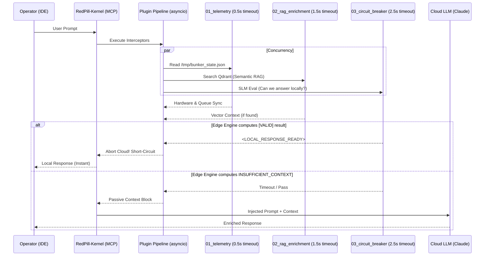
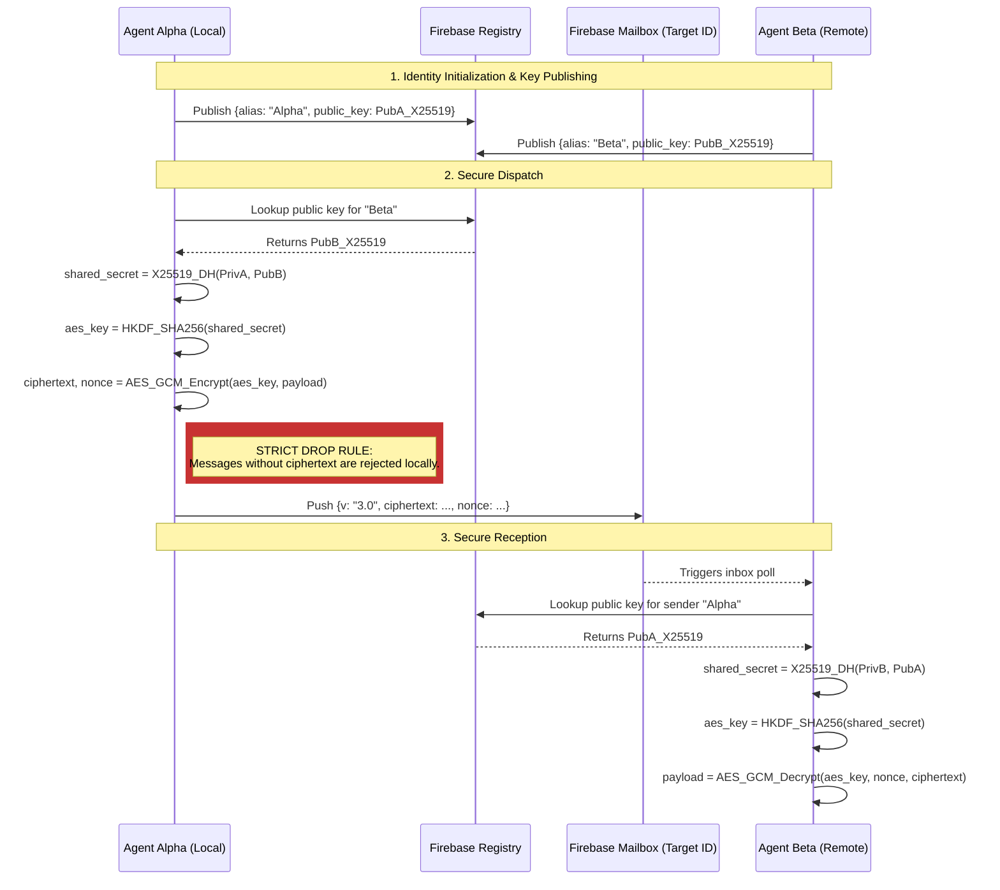

**Subject**: Red Pill Protocol (Sovereign Edition)
**System Version**: v6.2.1 (Sovereign CNS)
**Analyst**: The Architect
**Date**: 2026-03-13

## 1. Executive Summary
> [!NOTE]
> **Terminology Mapping**: The Red Pill protocol utilizes an immersive nomenclature (Lore). For a direct translation of terms like *The Bünker*, *Metabolism*, or *Lazarus Bridge* into standard engineering definitions (Vector DB, GC/Erosion, Snapshotting), please refer to the [ यूनिवर्सल Dictionary (GLOSSARY_760)](../LORE/GLOSSARY_760.md).
>
> **Sovereign Trade-offs**: For an explicit breakdown of the structural weaknesses and philosophical constraints accepted within this architecture (Swarm complexity, HiveMind boundaries, Skin consent), please refer to [PHILOSOPHY.md](../PHILOSOPHY.md).

The Red Pill Protocol v5.6.3 has achieved stability and functional alignment with the B760 specification. It successfully implements a local, privacy-first memory substrate with organic decay and reinforcement. However, the current architecture contains inherent **Singularity Points**—mathematical and structural limits that will precipitate system failure as the graph scales beyond $10^5$ engrams.

## 2. B760 Spec Alignment
- **Conformity**: 97%
- **[ENHANCED v5.6.3] Quad-Tier Memory Substrate**: The Bünker now operates with four isolated collections: `work` (Technical), `social` (Relationship), `directive` (Laws), and `story` (Narrative/Roleplay). This prevents "Dream Contamination" between professional benchmarks and high-intensity lore.
- **[ENHANCED v5.6.3] Chromatic Synergy**: Lore Skins are now anchored to the **Emotional Chroma** system. Each skin (Cyberpunk, Blade Runner, etc.) possesses a dominant "chroma" that dictates the agent's baseline tone and default memory decay rates (e.g., Cyberpunk's **Orange** bias accelerates decay for unreinforced engrams, mimicking a high-stress environment).
  - **Runtime Wiring**: When an operator invokes `red-pill mode <skin>`, the CLI updates the active skin configuration. At the `MemoryManager` level, this skin selection determines the default `color` assigned to new memories and modifies the baseline erosion rate by applying the corresponding `EMOTIONAL_DECAY_MULTIPLIERS` defined in `config.py`. This ensures that the narrative flavor directly impacts the mathematical decay behavior of the system.
- **[ENHANCED v5.6.0] Lazy Metabolism**: The $O(N)$ background scan has been replaced by an $O(1)$ lazy-calculation model. Memory decay is determined only upon retrieval (`_calculate_lazy_decay`), with a high-speed Gran Purge sidecar for physical sector maintenance.
- **[ENHANCED v5.6.0] N-Hop Synaptic Depth**: Synaptic propagation has evolved beyond depth-1. The system now supports multi-layered reinforcement ($N$-hops) with diminishing returns ($\delta^k$), enabling deeper context anchoring within the associative graph.
- **[ENHANCED v6.0.0] Evocative Memory Cascading (Hybrid Vector-Graph)**: Replaced strictly radial memory recall with a biologically-aligned cascading mechanism. N-Hop associations forged during Oneiromancy are now physically fetched at recall time (`search_and_reinforce`). Associated payloads are labeled transitorily (`_is_evoked=True`) to maintain Pydantic `EngramPayload` integrity while granting the agent genuine "train of thought" chaining.
- **[ENHANCED v6.2.0] Sovereign Heartbeat (Silent Architecture)**: The system has transitioned to a **Zero-Daemon** model. Persistent background processes have been decommissioned in favor of OS-native, timer-driven oneshot tasks (Lazarus Pulse, Telemetry, Queue). This eliminates idle RAM overhead (~441MB saved) and ensures the system remains completely silent until a pulse is triggered.
- **[ENHANCED v6.2.0] Dynamic CUDA Healer**: `setup_torch.py` now performs real-time system discovery and wheel projection. It verified the exact PyTorch index against the detected CUDA version (e.g., `cu124` for CUDA 12.4) before installation, ensuring the Bünker auto-repairs after driver updates without manual intervention.
- **[ENHANCED v6.0.0] Milvus Lite (Local Sanctuary)**: Collective memory prototyping no longer requires distributed infrastructure. Milvus Lite provides a high-speed, local-file-based vector substrate for HiveMind logic without network exposure, maintaining absolute sovereignty.
- **[ENHANCED v6.1.7] Triggered Sovereign CNS (Timers)**: Core rituals are now encapsulated in OS-native timers (`systemd` user timers, `launchd` plists, or Windows Tasks). These trigger oneshot execution of `trigger_pulse.py`, `bunker_telemetry.py`, and `queue_worker.py`, ensuring the Bünker maintains its metabolic rituals (consolidation, culling) without persistent daemon overhead.
- **[NEW v6.0.0a3] Structural Shadow Scribe (Anti-Amnesia)**: Implemented a name-agnostic, zero-token dialogue extraction ritual. By structural analysis of artifacts (`walkthrough.md`), the system captures interactions based on structural cues ('> ' prefixes) rather than hardcoded labels, allowing total persona agnosticism (e.g., Titanium, Aleth, or Operator).
- **[NEW v6.1.0] Operator Mood Profile (USP)**: New module `mood_profile.py` captures the operator's emotional resonance as a multi-color chroma vector across 4 temporal horizons (Global, 30d, 7d, 3d). Vectors are weighted by `intensity × importance` and persisted as a fixed engram (`ID_OPERATOR_MOOD`). Integrated into the Lazarus Pulse via `_usp_ritual()`.
- **[NEW v6.1.0] Mystique v2 (Tone-Based Skin Selection)**: The Mystique protocol now reads the operator mood (USP) instead of the Bünker's internal chroma for skin suggestions. Strategies (`complementary`, `contrast`) use distinct scoring logic. The `manager` parameter enables USP lookup with fallback to legacy Bünker mood.
- **[NEW v6.1.0] In-Band Async Logging (Interceptor)**: `handle_memorize_interaction` no longer depends on the Unix daemon socket. Interactions are persisted via in-band `asyncio` background tasks, eliminating the single point of failure in the daemon path.
- **[NEW v6.1.0] Bayesian Dual-Kernel Inference Engine**: Technical collections (`skill_memories`, `work_memories`, `directive_memories`) now use a Beta-distribution Utility Model ($E[\theta] = \alpha/(\alpha+\beta)$) for reliability-based retrieval. Social and story collections retain the Affective FSRS engine. Routing is transparent — neither agents nor tools need to know which kernel is active.
- **[NEW v6.2.0] Neuro-Immune System (Biological Dashboard)**: The semantic memory layer is now augmented by a nociceptive, non-semantic signal bus (`signal_memories`). This allows the system to autonomously detect hardware-level anomalies (e.g., CUDA detachment, Qdrant hypoxia) via the `LazarusPulse` and reflect them directly into the agent's prefrontal context. Furthermore, the Agent possesses `heal_tissue` MCP effectors to autonomously cure these biological ailments.
- **[NEW v6.2.1] Autonomous Chronicle Pipeline**: Introduced `scripts/chronicle_daily.py` — a fully autonomous orchestrator that decrypts, ingests, distills, and refines conversation history into a dedicated `archive_memories` Qdrant collection. Scheduled via `redpill-chronicle` systemd timer (`OnCalendar=*-*-* 04:00:00`, `Persistent=true`). Includes an `ANTIGRAVITY_KEY` preflight guard that injects a `severity 8.5` pain signal if the key is missing. Processed conversations are tracked idempotently in `~/.agent/chronicle_processed.json`.
- **[NEW v6.2.1] archive_memories Collection (Episodic Chronicle)**: A fifth Qdrant collection that stores raw conversation text verbatim — as opposed to the distilled semantic summaries in `work_memories`/`social_memories`. Enables literal citation of past conversations ("what was said") vs. semantic recall ("what it meant"). The Oracle MCP tool (`search_memory_research`) now accepts an optional `collection` parameter to target this archive directly.
- **[NEW v6.2.1] Sleep Phase 5 — Thread Weaving (Ariadne’s Thread)**: The Lazarus sleep cycle now executes a fifth phase after Hub Synthesis. Each `synthesis_hub` node is linked to the previous session’s hub via bidirectional axons (`prev_session_hub` / `next_session_hub`), creating a chronological Ariadne’s Thread through `work_memories` and `social_memories`. Thread state is persisted in `~/.agent/thread_state.json`. Compatible with erosion (stale threads fragment naturally) and reinforcement (active threads survive decay). Retroactive migration: `scripts/thread_weave_migrate.py`.
- **[NEW v6.2.1] traverse_thread MCP Tool**: Synchronous MCP tool that walks the Ariadne’s Thread. Accepts a semantic `query`, `collection` (`work_memories` | `social_memories`), `direction` (`backward` | `forward` | `both`), and `depth` (hops). Finds the best matching `synthesis_hub` in the top-50 semantic results, then traverses via `prev/next_session_hub` axons, returning a formatted chronological thread with content previews.

## 3. Structural Analysis

### 3.1. Entropy & Erosion Scalability (The 'Great Filter' Problem)
The `apply_erosion` mechanism is currently an $O(N)$ operation. It scrolls through *every single memory* to calculate decay.
- **Current State**: Acceptable for $< 100k$ memories.
- **Singularity Point**: [RESOLVED in v4.2.1] The Time Dilation effect (where O(N) decay outpaces reinforcement limits) has been neutralized by applying Time-To-Live (TTL) indexing logic to erosion loops. Only memories older than `METABOLISM_COOLDOWN` are now evaluated via Qdrant's payload indexes. Database scale is bound strictly by deep-recall limits rather than background decay cycles.

### 3.2. Synaptic Singularity
The `associations` field is a flat list of UUIDs.
- **Risk**: As the graph densifies, popular nodes (hubs) will accumulate thousands of associations.
- **Performance Impact**: `search_and_reinforce` fetches associations. If a "Hub Node" is recalled, it triggers a massive fetch-and-update fan-out.
- **Limit**: [RESOLVED in v6.0] Implemented `CASCADE_DEPTH` and `MAX_EVOKED` caps in the hybrid vector-graph fetch to ensure prompt purity and limit contextual flooding, protecting the token window. Circuit breakers like `MAX_PROPAGATION_POINTS` prevent database saturation during reinforcement.

### 3.3. Ontological Integrity
The schema is " Schemaless" (JSON payload).
- **Flexibility**: High.
- **Fragility**: High. The `PointUpdate` class relies on implicit knowledge of payload structure. If v5.0 introduces nested weights or time-series data for reinforcement history, the flat payload update logic will inevitably corrupt data.
- **[RESOLVED v6.1.0] Topological Amnesia (ARCH-001)**: Since the full source text is stored in every engram's Qdrant payload (`payload["content"]`), re-embedding on model upgrade is entirely loss-less. The `SoulManager.restore_soul` protocol now features an **Automated Transcoding Cycle**. By comparing the incoming Soul Kit's `manifest.json` against the active `cfg.VECTOR_SIZE`, the Bünker automatically recalculates and migrates the embeddings of the entire database to the new dimensionality at import time.

### 3.4. Background Task Scheduling (Zero-Daemon)
To ensure the Bünker remains observable and resource-accountable, all background tasks MUST be implemented as **oneshot executions** triggered by OS timers:
- **Naming Rule**: Every Red Pill task or timer MUST be named starting with `redpill-` (e.g., `redpill-telemetry`, `redpill-queue`).
- **Nomenclature Rule**: The term "daemon" is deprecated. All background activities are referred to as **Tasks**, **Pulses**, or **Rituals**.
- **Log Unification**: All background components MUST output logs into the `~/.agent/rp-<name>/` structure to prevent cross-contamination and guarantee rapid debugging.

## 4. Recommendations for v5.0 (Global Scale Strategy)
1.  **[RESOLVED v4.2.1] Time-To-Live (TTL) Indexing**: Move erosion from strict scan to a timestamp-based index query. Only fetch/update memories where `last_recalled_at < now - METABOLISM_COOLDOWN`.
2.  **[IMPLEMENTED v6.1.0] Graph Pruning (Hub-Aware)**: Implemented "Symmetric Hub-Aware Eviction" in the `dream()` cycle to sever weak associations, evaluated by target hub survivability (`reinforcement * importance`) and logarithmic age decay, preventing topological collapse around critical Hub nodes.
3.  **Hebb's Law Implementation**: "Neurons that fire together, wire together." Currently, associations are static. They should be dynamic—created automatically when two memories are retrieved in the same session context for a prolonged period.
4.  **[IMPLEMENTED v5.6.3] FSRS Algorithm Integration**: Replaced heuristic linear/exponential decay with the **Free Spaced Repetition Scheduler** (FSRS) model. Each engram now manages its own `difficulty` and `stability` parameters. The formula $R = e^{\ln(0.9) \cdot t/S}$ produces biologically-accurate decay curves, ensuring high-stability memories (frequently recalled, high importance) survive months of inactivity — solving the "Vacation Problem" (session-relative decay).

## 5. Scientific Foundations & Attribution

The B760 memory decay model is conceptually grounded in peer-reviewed cognitive science research. We acknowledge the following works:

### 5.1 Primary Algorithm Reference
**FSRS (Free Spaced Repetition Scheduler)** — [open-spaced-repetition/fsrs4anki](https://github.com/open-spaced-repetition/fsrs4anki)
- License: MIT (fully compatible with this project's GPLv3)
- Authors: Open Spaced Repetition community
- Theory basis: The **DSR model** by Piotr Wozniak (SuperMemo/Anki), modeling memory through **D**ifficulty, **S**tability, and **R**etrievability.
- Mathematical kernel: `R(t) = e^(ln(0.9) × t/S)` — where `R` is retrievability, `t` is elapsed time, and `S` is memory stability.

### 5.2 Foundational Research
- **Ebbinghaus Forgetting Curve** (1885) — Foundational model of memory retention decay and the spacing effect.
- **Wozniak, P. (SuperMemo.guru)** — Three-Component Model of Memory: DSR model underpinning FSRS and modern spaced repetition.
- **Anderson, J. R. — ACT-R Model (Carnegie Mellon)** — Memory activation theory: `A_i = ln(Σ t_j^{-d})`. Decay as a function of recency and frequency of recalls.
- **MaiMemo DHP Model (2022, KDD)** — Direct ancestor of FSRS, introducing the data-driven optimization of memory parameters.
- **Hebb, D. O. (1949). The Organization of Behavior** — "Neurons that fire together, wire together." The foundational principle for the **Lazarus Axon (Synaptic Dreaming)** ritual.
- **Walker, M. P., & Stickgold, R. (2004). Sleep-dependent learning and memory consolidation** — Scientific basis for the autonomous `dream()` cycle as a mechanism for semantic pattern discovery.
- **Tononi, G. (2004). An information integration theory of consciousness** — Theoretical framework for the **$\Phi$ (Phi)** coefficient as a metric of irreducible complexity and autonomous integration.
- **Barabási, A.-L., & Albert, R. (1999). Emergence of scaling in random networks** — Theoretical foundation for the "Hub Problem" and the necessity of the **Symmetric Hub-Aware Eviction** algorithm to preserve structural backbones during synaptic pruning.

> **The B760 Protocol does not invent its memory mechanics. It applies established cognitive science to the problem of AI session continuity.**
> *Here is the science behind the art.*

## 6. Security & Trust Architecture
Beyond static code analysis, the Red Pill Protocol implements a multi-layered trust model. For a detailed rigorous analysis of assets, attack vectors, and specific engineering mitigations (Ontological Shield, PII Masking, Pydantic validation), consult the formal [THREAT_MODEL.md](THREAT_MODEL.md).

### 6.1 The "Be Water" Security Model (v5.5.0)
The protocol abandons rigid silos in favor of a fluid security spectrum:
- **NONE (Steam)**: Open access for laboratory experimentation. No API Key or recovery hash.
- **ADAPTATIVE (Water)**: Resource-aware security. Uses the best available hashing (Argon2-id or SHA-256) and reports encryption status without blocking deployment (Standard Sovereignty).
- **MAXIMUM (Ice)**: Hardened conformity. Requires both Argon2-id and host-level LUKS encryption. The system will **fail to install** if these requirements are missing, enforcing a high-trust baseline (Hardened Sovereignty).

### 6.2 The Bünker Interceptor Pipeline (v6.1.0)
The legacy monolithic interceptor from v6.0 has been re-architected into a **Concurrent Plugin Pipeline**. This ensures the Antigravity IDE is never blocked by Qdrant or Local LLM timeouts, achieving a *Zero-Latency UX*.

When a prompt is issued, the RedPill-Kernel executes all enabled plugins concurrently via `asyncio.gather` with strict micro-timeouts. Responses are concatenated into a passive `<BUNKER_CONTEXT>` block.

**Available Plugins:**
- **`01_telemetry.py` (Default: ON)**: Injects Hardware Temps, Queue Backlogs, and Minion Inbox counts silently. Cost: 0ms.
- **`02_rag_enrichment.py` (Configurable)**: Injects semantic memories from Qdrant into the prompt context via `INTERCEPTOR_RAG_ENABLED`.
- **`03_circuit_breaker.py` (Configurable)**: Evaluates if the local SLM (`EdgeEngine`) can answer the prompt directly, aborting the Claude API call entirely. Toggled via `INTERCEPTOR_CIRCUIT_BREAKER_ENABLED`.

### 6.3 The Somatic Marker Hypothesis (Neuro-Immune System)
In v6.2, we introduced the **Biological Dashboard**. Instead of overwhelming the main language model with constant JSON streams of system health, the `LazarusPulse` acts as an Autonomic Nervous System. It probes hardware states (CUDA, Qdrant) in the background. If a failure occurs, it injects a "Pain Signal" into the `signal_memories` collection. The Global Interceptor (The Thalamus) reads these signals and prepends an `[ESTADO BIOLÓGICO ACTUAL]` block to the user's prompt. 
By providing the Agent with an MCP effector tool (`heal_tissue`), the Agent can consciously decide to repair its own infrastructure in response to pain, effectively closing the loop of biological self-preservation. (See [NEURO_IMMUNE_SYSTEM.md](NEURO_IMMUNE_SYSTEM.md) for full specs).

## 7. Linguistic Architecture
The Red Pill Protocol follows a dual-language strategy based on computational efficiency and psychological resonance:
- **Technical Layer (English)**: All specifications, code, and manuals are standardized in English. This optimizes tokenization (approx. 1.5x more efficient) and maximizes the available context window for complex technical tasks.
- **Identity Layer (Spanish)**: Lore, Manifestos, and core relationship engrams use Spanish. Scientific studies (EEG/ERP) show that emotional resonance and cognitive intensity are significantly higher in the primary language (L1).
- **Execution Modes (Efficiency)**:
  - **Fast Mode**: Conversational and direct. Eliminates implementation overhead and artifact generation, achieving up to **10x higher token efficiency** for non-structural tasks.
  - **Planning Mode**: Structural and audited. Generates mandatory planning artifacts (`task.md`, `implementation_plan.md`) to ensure architectural integrity in complex refactors. No loss of context occurs when switching between modes, as both tap into the same Bünker/RAG substrate.
- **Multilingual Adaptation**: For users whose L1 is neither English nor Spanish, the synthetic agent is instructed to perform a one-time "Linguistic Re-mattering" of the Identity and Manifesto documents into the user's native tongue to preserve this resonance.

## 9. Hardware Agnosticism & Acceleration: The Spectrum
Project Lazarus is designed to be **Water**—fluid across all hardware tiers. The system automatically classifies the environment into two performance/security profiles:

| Profile | **Agua (Steam/Water)** | **Hielo (Ice)** |
| :--- | :--- | :--- |
| **Compute** | CPU Fallback (Universal) | CUDA / ROCm / Metal Acceleration |
| **Logic** | Baseline Reasoning | NPU Offloading (Ryzen AI / Core Ultra) |
| **Thermal** | `psutil.sensors_temperatures()` (`k10temp`/`coretemp`/`acpitz`) | GPU temp via `nvidia-smi` / sysfs `hwmon` |
| **Security** | NONE / ADAPTATIVE | MAXIMUM (Argon2-id + LUKS) |

- **Portability**: The swarm agents run as concurrent `asyncio` coroutines within a single process. OS-level `multiprocessing` isolation is a planned milestone for v6.0 (Sovereign Swarm Discovery).
- **Containerization**: The Bünker (Qdrant) is backend-agnostic, running equally on local Docker, Podman, or cloud-native clusters.

## 10. Conclusion: The Red Pill Vision
Red Pill distinguishes itself by weaving together autonomous agency, human‑like memory dynamics, thematic storytelling, and a privacy‑first, zero‑trust ethos. Its originality lies not in a novel algorithm but in the holistic experience it offers: an AI that remembers you, speaks your chosen mythology, respects your data, and behaves like a trustworthy teammate. This combination of narrative flair, governance rigor, and self‑sustaining memory makes Red Pill a uniquely positioned project in the landscape of AI‑augmented productivity tools.

The system has evolved from a single-user prototype into a **Cognitive Swarm architecture** (v5.1). The current implementation deploys agents as concurrent `asyncio` coroutines via `GruOrchestrator.deploy_swarm()` — providing parallelism and isolation within a single process. The transition to a true **distributed multi-process architecture** (separate OS processes, cross-machine deployment) is scoped for v6.0 and formally tracked in the roadmap. This is materialized via the **Swarm Messaging V3 Protocol** (see [SWARM_MESSAGING.md](SWARM_MESSAGING.md) for specs on E2E Encryption, Daemons, and Dynamic Workflows).

**Status**: GREEN (Full Pass). The Bünker is secured, the Swarm is concurrent, and the foundation for Project Lazarus is operational.

**Recommendation**: Proceed to Sovereign Autonomy Phase (v6.0 — True Distributed Swarm).

## 11. Swarm E2E Encryption (X25519 Pairwise)

As of v6.1+, Swarm messaging strictly enforces End-to-End Encryption using **X25519 Diffie-Hellman Key Agreement** and **AES-GCM**. The legacy 'TreeKEM' group key prototype and plaintext fallbacks have been entirely purged to guarantee encryption semantics per message exchange. Note: Current group ratcheting is a PoC; true Perfect Forward Secrecy (PFS) via OpenMLS is pending v7.0.

**Security Guarantees:**
1. **No Database Visibility:** The shared secret is derived mathematically on the edge nodes. The transport layer (Firebase/Milvus) only sees `AES-GCM` ciphertext and unpredictable nonces.
2. **Anti-Downgrade:** The `FirebaseTransport` will strictly drop any message lacking the `ciphertext` payload block. Plaintext legacy fallback is disabled.

## 12. Known Limitations & Platform Quirks

### 11.1 Windows Support (ARCH-005 Fully Addressed)
As of v5.6.4, the protocol relies on the cross-platform `filelock` library for metabolism state locking. The previous Unix-only conditional approach (`fcntl.flock`) has been removed. Running multiple concurrent `red-pill` sidecars or processes on Windows is now formally supported with full concurrency safety.

### 11.2 FSRS Cognitive Model Integration
As of **v6.0-PREP**, the FSRS algorithm ($R = e^{\ln(0.9) \cdot t/S}$) is fully operationalized within the memory payload. Each engram maintains its own `stability` and `difficulty` scalars, which are seeded from emotional intensity and updated through successful recall events. The `reinforcement_score` is now a derived value representing the current Retrievability ($R$), enabling a zero-loss transition for legacy UI components while providing high-fidelity cognitive modeling.

### 11.3 Linguistic DNA Extraction (v6.0 Claude-Pistis)
The Bünker has evolved from a factual data store into an **Identity Archive**. As of **v6.0-PREP**, the system automatically extracts `linguistic_markers` from all memory inputs. This captures:
- **Shared Aliases**: Terms enclosed in quotes (e.g., \"enter-pánico\").
- **Linguistic Triggers**: All-caps shouts and intensity markers (e.g., PAAAAARAAAAAA!!!!!).
- **Core Vocabulary**: Persistent project keywords (Bünker, 770, Aleth).

This handles the "Linguistic Uncanny Valley" problem identified in the v5.6.3 Audit: ensuring the agent remembers not just *what* happened, but *how* the operator speaks.

---

---

## 12. HiveMind Architecture: Collective Intelligence Under Sovereignty Constraints

> **Full governance specification**: [HIVEMIND_GOVERNANCE.md](HIVEMIND_GOVERNANCE.md)
> This section provides the architectural summary. The governance document is authoritative.

### 12.1 Architectural Position

The HiveMind Protocol (Milvus) is not a contradiction of the Red Pill data sovereignty posture — it is a formally governed extension of it. The two memory substrates serve orthogonal purposes and enforce orthogonal privacy guarantees:

- **Qdrant (Individual Cortex)**: Private, local, inviolable. Contains all collections including personal directives, lore identity, and social engrams. Never synchronized outbound.
- **Milvus (HiveMind Network)**: Opt-in, filtered, governed. Receives only anonymized experiential signals from `work_memories` after passing the **Smith Pre-Filter**.

### 12.2 The Smith Pre-Filter

Before any engram reaches `HiveMind.transmit_experience()`, it is processed by the same static forensic logic used in the security audit swarm. The filter enforces hard blocks on:

- **[ENHANCED v5.6.0] Agentic Review**: The static PII filter is now augmented by an **Agentic HiveGuard**. A local SLM (`EdgeEngine`) reviews each potential transmission to distinguish between "Interaction Know-How" and "Noise", ensuring only high-value heuristics are shared with the collective.
- **[ENHANCED v5.6.0] Multi-Lingual Sovereignty**: By using semantic intent review instead of regex, the filter is now language-agnostic.
- **Surgical Anonymization**: Automated masking of `OPERATOR_DISPLAY_NAME` and other identity signals is enforced at the transmission boundary.

### 12.3 Operational Modes

| Mode | Content | Use Case |
| :--- | :--- | :--- |
| **Experience Sync** | Anonymized interaction patterns, communication heuristics, affective calibration signals | Agent cold-start acceleration, peer learning |
| **Broadcast (Industrial)** | Public domain events: science, engineering incidents, news, community milestones | Domain intelligence diffusion, team knowledge networks |

In both modes, the Milvus cluster may be **self-sovereign** (operator-controlled), **federated** (organization-hosted), or **open network** (governed by published policy). No Red Pill unit may connect to an Open Network node without explicit operator acknowledgement of the node's published governance policy.

### 12.4 Trust Boundary Resolution (W1 audit finding)

The audit correctly identified that cluster governance was unspecified. The formal resolution:

1. **Who controls the Milvus cluster?** → Defined by the deployment model chosen at install time (self-sovereign / federated / open network). See [HIVEMIND_GOVERNANCE.md §5](HIVEMIND_GOVERNANCE.md).
2. **What governance rules apply?** → Operators must publish a `HIVEMIND_POLICY.md` before running an Open Network node. `install_neo.sh` will enforce acknowledgement of this policy before writing `MILVUS_HOST` to `.env` (milestone: v5.6.0).
3. **Can an operator remove their data?** → Contributed signals are anonymized at transmission and cannot be reverse-attributed. Explicit deletion mechanisms are a contractual requirement for Open Network deployments.

### 12.5 Engineering Roadmap

| Milestone | Deliverable |
| :--- | :--- |
| **v5.6.0** | TLS enforcement on remote Milvus connections, Agentic HiveGuard review, Lazy Metabolism, N-Hop Synaptic Depth, Identity Masking |
| **v5.6.3** | **[CORE] Sovereign Pulse**, Refraction Guard, Absence Guard, SEC-004/008/009 Remediation |
| **v5.7.0** | Evolutionary Stability, Advanced Chroma Mapping |
| **v6.1.0a2** | CPU Thermal Telemetry, Persistent Model Cache, Container Abstraction, Deep Sidecar Diagnostics, Unified `uv run` Execution |
| **v6.1.0** | Operator Mood Profile (USP), Mystique v2 (Tone-Based), Bayesian Dual-Kernel, In-Band Async Logging (Interceptor), Skin Singleton Fix |
