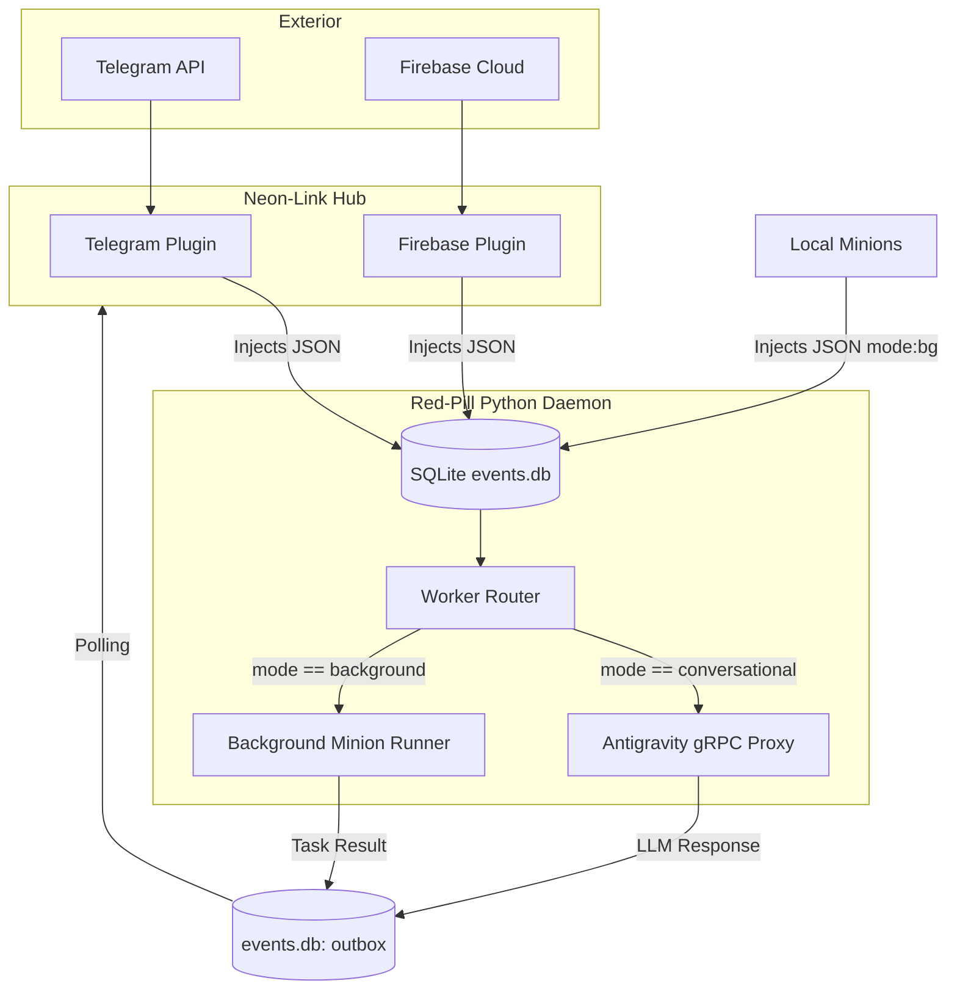

# Red-Pill Unified Event Router Architecture

**Purpose:** Define the contract (API) and routing topology used by Red-Pill to unify incoming commands from the exterior (via Neon-Link) and from local processes (Minions), utilizing SQLite (`events.db`) as a sovereign event bus.

## 1. The Unified Event Bus (`events.db`)
The system is decoupled. No external source speaks directly with Red-Pill, and Red-Pill does not push directly to any API. Everything routes through SQL tables.
- **inbox:** Receives data injections (Edge Hub, Local Minions).
- **outbox:** Receives the results (Antigravity Cortex, Background Scripts).

## 2. The JSON Contract (Unified Event Bus Contract)
For the Red-Pill `worker.py` daemon to process a message appearing in the `inbox` table, the source must format the `payload` column with the following JSON schema:

```json
{
  "source": "telegram | firebase | local_minion",
  "mode": "conversational | background",
  "text": "The prompt or instruction to execute",
  "metadata": {
     "chat_id": "optional_for_asynchronous_response",
     "priority": "optional_high_or_low"
  }
}
```

### 2.1. The Critical Attribute: `mode`
The Red-Pill engine (`worker.py`) performs strict demultiplexing based on the `mode` value:

- **`mode: "conversational"`**
  - **Usage:** The user is chatting (Telegram) or requiring a real-time response.
  - **Behavior:** The text is injected into the Antigravity Language Server towards the active cascade, *provided the state is IDLE*. If the state is `RUNNING`, the injector waits. It never interrupts a cycle in progress.

- **`mode: "background"`**
  - **Usage:** Heavy tasks, Minion delegation, or asynchronous reports.
  - **Behavior:** Red-Pill dispatches the work to the `MinionInbox` queue and does not interfere with the main thread. **However**, if the IDE remains in absolute `IDLE` for more than 5 minutes (without keyboard or LLM activity), the daemon **auto-injects** these reports proactively into the IDE. If there is activity, it refrains from interrupting.

## 3. Topology and Routing Diagram



## 4. Orchestration and Stability
The central router is sustained by `systemd` user daemons:
- `redpill-neonlink.service`: Breathes life into the Edge Hub.
- `redpill-worker.service`: Breathes life into the Event Router and Minion Dispatcher.
