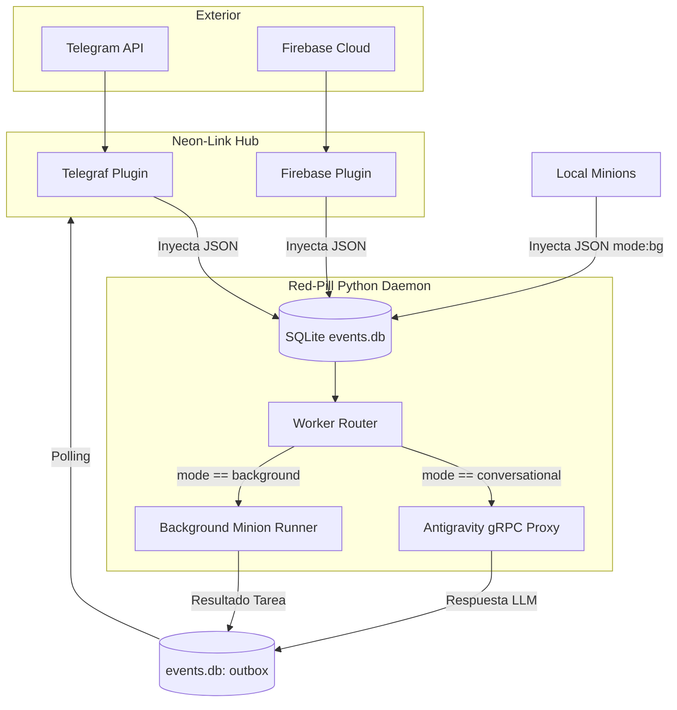

# Red-Pill Unified Event Router Architecture

**Propósito:** Definir el contrato (API) y la topología de enrutamiento que utiliza Red-Pill para unificar la entrada de comandos desde el exterior (vía Neon-Link) y desde procesos locales (Minions), utilizando SQLite (`events.db`) como un bus de eventos soberano.

## 1. El Bus de Eventos Unificado (`events.db`)
El sistema está desacoplado. Ningún origen externo habla directamente con Red-Pill, y Red-Pill no envía directamente a ninguna API. Todo transcurre a través de tablas SQL.
- **inbox:** Recibe inyecciones de datos (Edge Hub, Minions Locales).
- **outbox:** Recibe los resultados (Córtex de Antigravity, Scripts Background).

## 2. El Contrato JSON (Unified Event Bus Contract)
Para que el demonio `worker.py` de Red-Pill sepa qué hacer con un mensaje que aparece en la tabla `inbox`, el origen debe formatear la columna `payload` con el siguiente esquema JSON:

```json
{
  "source": "telegram | firebase | local_minion",
  "mode": "conversational | background",
  "text": "El prompt o instrucción a ejecutar",
  "metadata": {
     "chat_id": "opcional_para_respuesta_asincrona",
     "priority": "opcional_high_or_low"
  }
}
```

### 2.1. El Atributo Crítico: `mode`
El motor de Red-Pill (`worker.py`) realiza una demultiplexión estricta basada en el valor de `mode`:

- **`mode: "conversational"`**
  - **Uso:** El usuario está chateando (Telegram) o requiriendo una respuesta en tiempo real (Firebase direct request).
  - **Comportamiento:** El texto se inyecta directamente en el Language Server Proxy de Antigravity. El LLM interrumpe lo que está haciendo, lee el contexto del Bünker y responde al usuario, manteniendo el hilo conversacional en la ventana (cascada) principal.

- **`mode: "background"`**
  - **Uso:** Tareas pesadas, delegación de Minions, reportes asíncronos o eventos no prioritarios de Firebase.
  - **Comportamiento:** Red-Pill **no inyecta** este mensaje en Antigravity LS. En su lugar, despacha el trabajo a la cola `MinionInbox` (para procesamiento local diferido) o levanta un subproceso asilado (`systemd-run --user --scope -p MemoryMax=10G`) si requiere computación masiva. Evita la saturación del hilo conversacional principal.

## 3. Topología y Diagrama de Enrutamiento



## 4. Orquestación y Estabilidad
El enrutador central se sostiene gracias a los `systemd` user daemons:
- `redpill-neonlink.service`: Da vida al Edge Hub.
- `redpill-worker.service`: Da vida al Event Router y al Minion Dispatcher.
