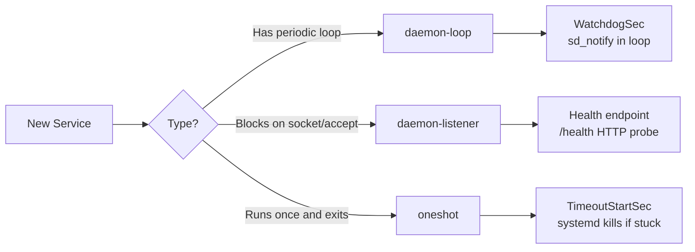
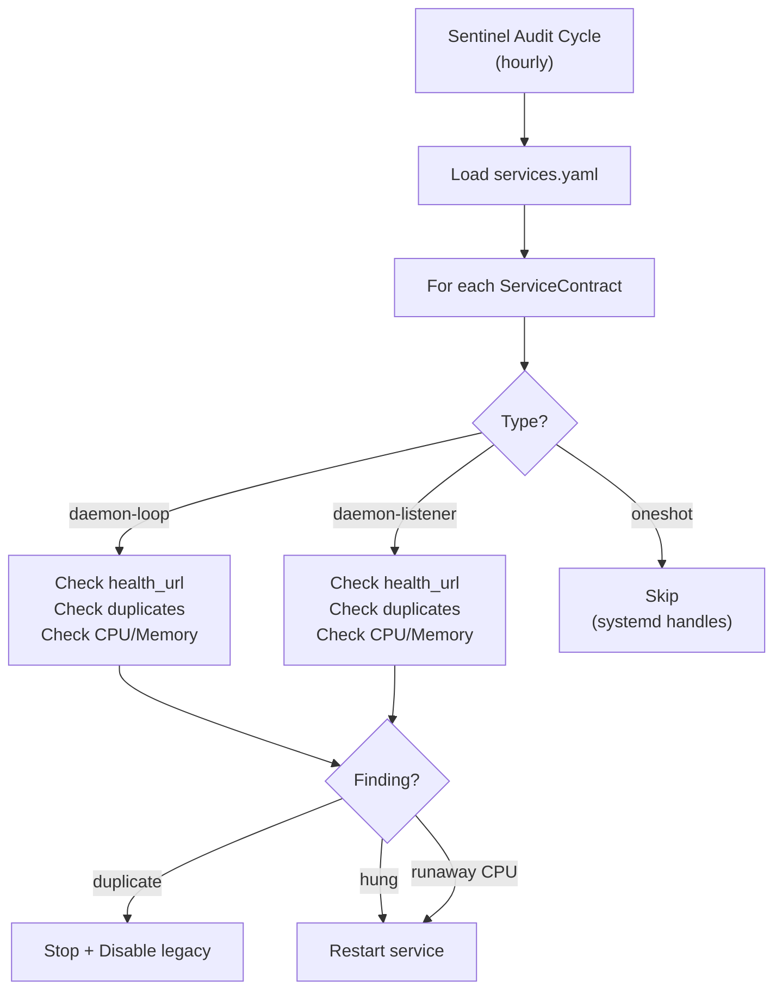

# Service Health Contract — Technical Reference

**Status:** Enforced | **Scope:** All systemd services in the Red-Pill / Neon-Link ecosystem

---

## 1. Motivation

On 2026-05-22, two identical Neon-Link systemd services ran in parallel for 10+ hours:

| Service | Origin | PID |
|---------|--------|-----|
| `redpill-neonlink.service` | Legacy (PyPI-installed era) | 4746 |
| `neon-link.service` | Current (dev project era) | 4844 |

Both were `enabled` and started at boot. Both polled the same Telegram Bot API, producing **4x duplicate responses** to every message. The existing `neon-link-healer.sh` watchdog (curl-based) did not detect this because both services were individually "healthy."

**Root cause:** No formal contract declaring which services exist, how they should be monitored, or which legacy aliases must not coexist.

---

## 2. The Contract

Every systemd service **must** have an entry in the Service Manifest:

- **Template:** `examples/services.yaml` (committed to git)
- **Runtime:** `~/.config/red-pill/services.yaml` (resolved via `get_config_dir()`)

### 2.1 Schema

```yaml
services:
  <service-name>:
    unit: <systemd-unit-name>.service        # Required
    type: daemon-loop | daemon-listener | oneshot  # Required

    # Required for daemon-loop
    loop_interval_s: <int>                   # Main loop sleep interval in seconds
    watchdog_multiplier: <int>               # WatchdogSec = interval × multiplier (default: 3)

    # Required for daemon-listener
    health_url: "http://..."                 # HTTP endpoint that returns 200 when healthy

    # Required for oneshot
    max_runtime_s: <int>                     # Maximum execution time before systemd kills it

    # Optional (all types)
    category: core | plugin                  # Category of the service (default: core)
    required: true | false                  # Vital service flag. If false, skipped when disabled or inactive (default: true)
    enabled_config_key: <CONFIG_KEY>        # Config/Env key gating monitoring (e.g. NEON_LINK_ENABLED)
    legacy_aliases:                          # Services that MUST NOT coexist
      - old-name.service
```

### 2.2 Service Types



#### daemon-loop

Services with a `while True` loop that sleeps periodically.

| Property | Description |
|----------|-------------|
| **Detection** | systemd WatchdogSec — if `sd_notify("WATCHDOG=1")` not received within timeout, service is considered hung |
| **Recovery** | `Restart=on-failure` — systemd restarts automatically |
| **systemd params** | `Type=notify`, `WatchdogSec=<computed>`, `NotifyAccess=main\|all` |
| **Code requirement** | Call `_sd_notify("READY=1")` on startup, `_sd_notify("WATCHDOG=1")` each loop iteration |

**WatchdogSec formula:** `loop_interval_s × watchdog_multiplier`

Example: loop sleeps 1s, multiplier 3 → WatchdogSec=3s. If the loop hangs for >3s, systemd kills and restarts.

#### daemon-listener

Services that block on socket accept (e.g., `uvicorn.serve()`). These have **no periodic loop** — they are idle between requests.

| Property | Description |
|----------|-------------|
| **Detection** | Sentinel plugin probes `/health` endpoint periodically |
| **Recovery** | Sentinel restarts via `systemctl --user restart` |
| **systemd params** | `Type=simple` (NO WatchdogSec — would kill idle servers) |
| **Code requirement** | Expose an HTTP `/health` endpoint returning 200 |

> [!WARNING]
> Never use WatchdogSec on a listener service. An idle HTTP server with no incoming requests is **healthy**, not hung.

#### oneshot

Timer-triggered services that run once and exit.

| Property | Description |
|----------|-------------|
| **Detection** | `TimeoutStartSec` — systemd kills if runtime exceeds limit |
| **Recovery** | Timer will re-trigger on next cycle |
| **systemd params** | `Type=oneshot`, `TimeoutStartSec=<max_runtime_s>` |
| **Code requirement** | None (systemd handles it) |

---

## 3. sd_notify Implementation

Zero-dependency implementation using raw Unix domain sockets:

```python
import os
import socket


def _sd_notify(state: str) -> None:
    """Send a notification to systemd. No-op if not under systemd."""
    addr = os.environ.get("NOTIFY_SOCKET")
    if not addr:
        return
    try:
        sock = socket.socket(socket.AF_UNIX, socket.SOCK_DGRAM)
        if addr[0] == "@":
            addr = "\0" + addr[1:]
        sock.sendto(state.encode(), addr)
        sock.close()
    except Exception:
        pass
```

### Usage

```python
# On startup (after initialization is complete)
_sd_notify("READY=1")

# In main loop (every iteration)
while running:
    _sd_notify("WATCHDOG=1")
    do_work()
    time.sleep(interval)
```

### NotifyAccess

| Value | When to use |
|-------|-------------|
| `main` | ExecStart directly runs the Python process |
| `all` | ExecStart runs a wrapper script (e.g., `start.sh`) that spawns the Python process as a child |

---

## 4. Checklist: Adding a New Service

1. **Determine type**: Does it have a loop (`daemon-loop`), block on socket (`daemon-listener`), or run-and-exit (`oneshot`)?

2. **Add to manifest**: Edit `examples/services.yaml` with the service entry. Include all required fields for the type.

3. **Implement monitoring**:
   - `daemon-loop`: Add `_sd_notify()` calls
   - `daemon-listener`: Add `/health` endpoint
   - `oneshot`: No code changes needed

4. **Create unit file** with correct systemd parameters:
   - `daemon-loop`: `Type=notify`, `WatchdogSec=<computed>`, `Restart=on-failure`
   - `daemon-listener`: `Type=simple`, `Restart=always`
   - `oneshot`: `Type=oneshot`, `TimeoutStartSec=<max_runtime_s>`

5. **Declare legacy aliases**: If this service replaces an older one, add the old name to `legacy_aliases`.

6. **Copy manifest to runtime**: Ensure `~/.config/red-pill/services.yaml` is updated.

---

## 5. Sentinel Integration

The `ServiceHealthCheck` sentinel plugin reads the manifest at audit time and auto-configures monitoring:



### Dataclass

The manifest is loaded via `red_pill.core.service_contract.load_manifest()` which returns `Dict[str, ServiceContract]`. Each contract exposes computed properties:

- `watchdog_sec` → `loop_interval_s × watchdog_multiplier` (only for `daemon-loop`)
- `timeout_start_sec` → `max_runtime_s` (only for `oneshot`)
- `validate()` → list of errors if required fields are missing

---

## 6. Current Service Inventory (v7.2.1 — Post-Sovereign Consolidation)

| Service | Type | Loop/Timeout | Watchdog | Health | Category | Required | Gated By |
|---------|------|:---:|:---:|:---:|:---:|:---:|:---:|
| `redpill` | daemon-loop | 1s (plugin-based) | WatchdogSec=120 | ❌ | core | ✅ | — |
| `neon-link` | daemon-loop | 1s | WatchdogSec=3 | ✅ `:8770/health` | plugin | ❌ | `NEON_LINK_ENABLED` |
| `redpill-llm` | daemon-listener | — | ❌ | ✅ `:8776/health` | core | ✅ | — |
| `redpill-worker` | oneshot | 120s | ❌ | ❌ | core | ✅ | — |
| `redpill-auditor` | oneshot | 120s | ❌ | ❌ | core | ✅ | — |
| `redpill-queue` | oneshot | 120s | ❌ | ❌ | core | ❌ | — |
| `redpill-wake` | oneshot | 30s | ❌ | ❌ | core | ❌ | — |
| `redpill-sleep` | oneshot | 120s | ❌ | ❌ | core | ❌ | — |
| `redpill-chronicle` | oneshot | 60s | ❌ | ❌ | core | ❌ | — |
| `redpill-extractor` | oneshot | 120s | ❌ | ❌ | core | ❌ | — |
| `redpill-janitor` | oneshot | 60s | ❌ | ❌ | core | ✅ | — |

> [!IMPORTANT]
> **Decommissioned in v7.2.1**: `redpill-bunker` (→ TelemetryPlugin), `redpill-echo` (→ EchoPlugin), `redpill-telemetry` (→ TelemetryPlugin). These services are absorbed by the Sovereign Daemon's plugin architecture. Do NOT re-enable them.

> [!NOTE]
> The `redpill` service uses `NotifyAccess=all` because `uv run` forks the Python process as a child PID. The `sd_notify()` call comes from the child, not the main PID.
