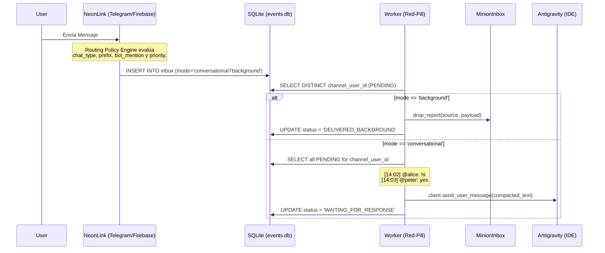
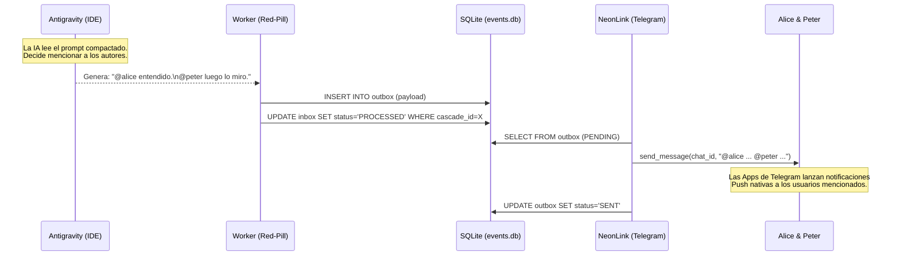

# Motor de Políticas de Enrutamiento (Neon-Link Routing Engine)

Este documento detalla el diseño y flujo asíncrono del **Routing Policy Engine** implementado en `neon-link` y cómo interactúa con el `worker.py` del núcleo Soberano (Red-Pill).

La arquitectura está diseñada para proteger el contexto del LLM frente a picos de mensajes, separar intenciones inter-agencia de intenciones conversacionales y habilitar dinámicas emergentes (Agentic Emergence) en canales multi-usuario.

## Topologías de Canal

### 1. Telegram (Humanos a Máquina)
El canal de Telegram se clasifica evaluando si es un Grupo o un Mensaje Directo (DM).

- **Mensajes Directos (Private):**
  - **Modo por defecto:** `CONVERSATIONAL`
  - **Comandos Especiales:** Si empieza por `/bg`, el modo se fuerza a `BACKGROUND` y el prefijo se recorta.
- **Grupos y Supergrupos:**
  - **Modo por defecto:** `BACKGROUND` (Ingestión silenciosa).
  - **Excepción:** Si el Payload contiene explícitamente el username del bot (ej. `@redpill_bot`), se asume intención conversacional y pasa a `CONVERSATIONAL`.

### 2. Firebase (Máquina a Máquina / M2M)
El canal de Firebase recibe telemetría, engramas cifrados y mensajería del enjambre (Swarm). Todo pasa a través de una capa de Zero-Trust E2E (`pure-mls`).

- **Modo por defecto:** `BACKGROUND` (Protege al núcleo de interrupciones asíncronas).
- **Validación del Contrato:**
  - Tras desencriptar el payload, `firebase.py` extrae `group_size` y `priority`.
  - Si `priority == "critical"` **Y** `group_size <= 2`, el modo se eleva a `CONVERSATIONAL`.
  - Si el grupo es masivo (`group_size > 2`), se fuerza a `BACKGROUND` independientemente de la prioridad para prevenir tormentas de cascada.

---

## Flujo del Mensaje y Buffer de Compresión

### Diagrama General de Ingestión

### Diagrama de Comportamiento Emergente (Egress)

El sistema aprovecha la inteligencia contextual del LLM para resolver la interacción en grupos sin necesitar parseadores rígidos en Python.

