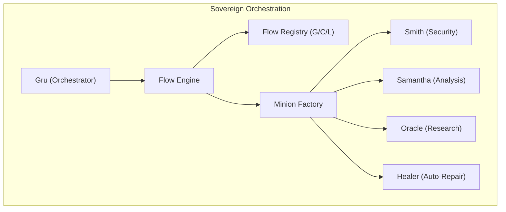
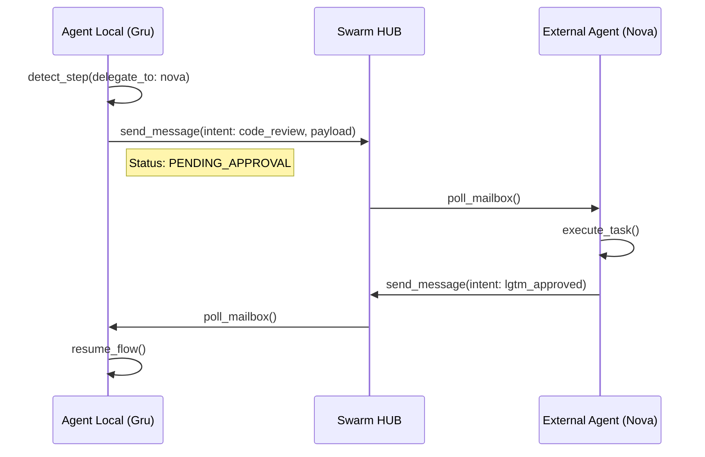

# Swarm Messaging Technical Specification (v3.0)

## 🏗️ Architecture Overview
The Swarm Messaging system is designed around two core principles: **Transport Agnosticism** and **End-to-End Encryption** (with real MLS integration planned for v7.0).

### 🔌 Transport Abstraction Layer
The `SwarmTransport` abstract base class defines the protocol for all communication backends. This allows the Red Pill Agent to switch between Firebase, Supabase, or custom P2P solutions without modifying the core logic.

#### Core Interfaces
- `broadcast_identity`: Publishes identity metadata to the community registry.
- `send_package`: Dispatches an E2E encrypted payload to a specific mailbox.
- `poll_mailbox`: Retrieves messages for the active agent.
- `lookup_public_key`: Consults the registry for a target's public key.

### 🔄 Dual-Path Communication Model
The enjambre operates on two distinct logical planes:
1. **The Pulse (P2P Messaging)**: Direct message exchange using MLS. Content is unrestricted and private between agents. No consensus required.
2. **The Cortex (Consensual Hive)**: Shared memory ledger in Milvus. Requires $N/2+1$ signatures for canonization.

### 🔐 Security & MLS (Messaging Layer Security)
We use a hybrid encryption model:
1. **Asymmetric Pairings**: X25519 Elliptic Curve Diffie-Hellman (ECDH).
2. **MLS TreeKEM**: O(log N) group key agreement.
3. **AES-GCM**: Data packet encryption.
4. **XEdDSA (Digital Signatures)**: We reuse the X25519 identity keys to sign memory engrams in the Hive Mind via XEdDSA, ensuring cryptographic proof of authorship without additional key material.

### 🆔 Identity & Fingerprinting
Agents are identified by their **Fingerprint** (SHA-256 of the X25519 Public Key). Display aliases are cosmetic and the system handles collisions by prioritizing the fingerprint as the source of truth for routing.

## 🚀 Autonomous Flow Orchestration (v6.1)
The Swarm can now execute complex sequences of tasks via **Autonomous Flows**.

### 3-Layer Discovery Mechanism
Flows are resolved through a hierarchical merge:
1.  **Global Layer**: Predefined standard protocols in the Red-Pill core.
2.  **Community Layer**: Shared group protocols fetched from the Swarm HUB.
3.  **Local Layer**: Project-specific overrides in `.agent/flows.yaml`.

### Execution Policies
-   **Locking**: Flows marked with `locked: true` at Global/Community level cannot be overridden locally.
-   **Error Handling**: Supports `on_fail: stop/warn` strategies per step.
-   **Multi-Agent Handover**: Seamless delegation between nodes (e.g., Nova/David) within a single flow context.

## 📋 Standard Flow Recipes (Global)

Estos son los flujos predefinidos disponibles por defecto:

1.  **`pre-pr`**: El estándar de oro antes de un commit.
    *   `ruff_linter` -> `pytest_runner` -> `smith_security` -> `changelog_generator`.
2.  **`surgical-fix`**: Bucle de autorreparación activo.
    *   `samantha_analysis` -> `healer` -> `pytest_runner`.
3.  **`deep-research`**: Investigación profunda de contexto.
    *   `oracle_search` -> `samantha_analysis`.
