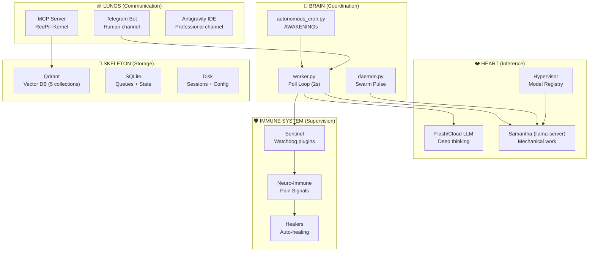
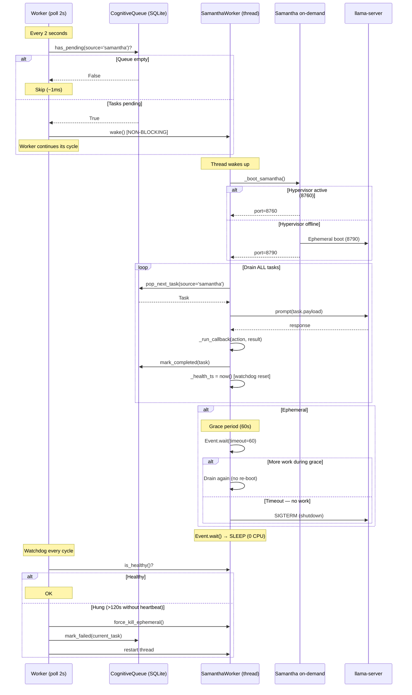
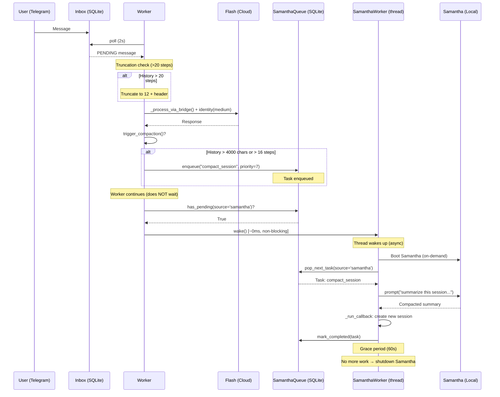
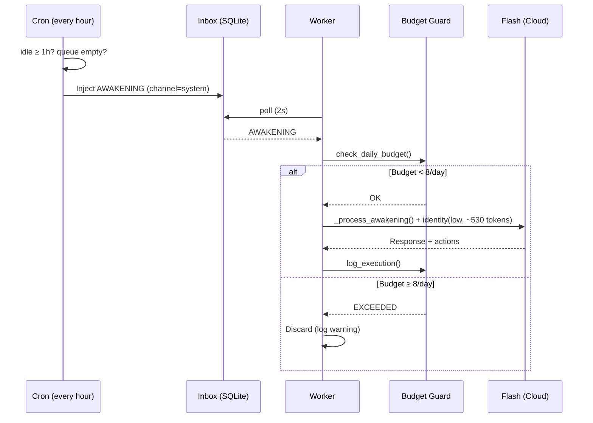
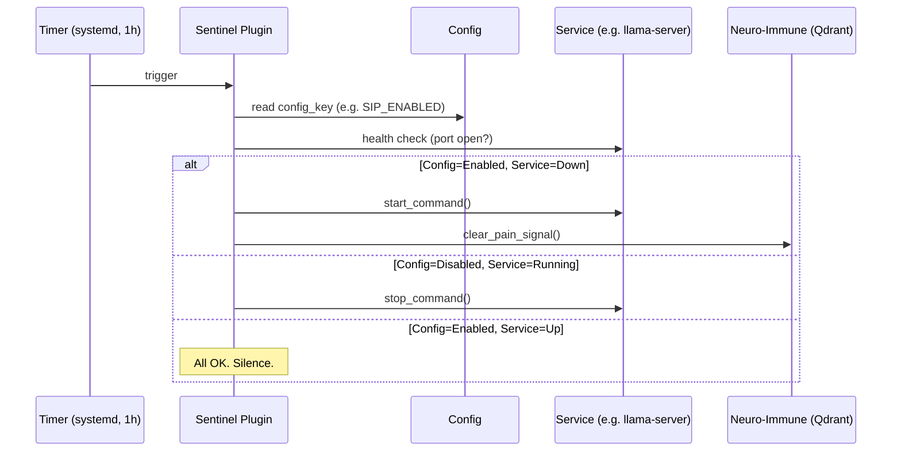
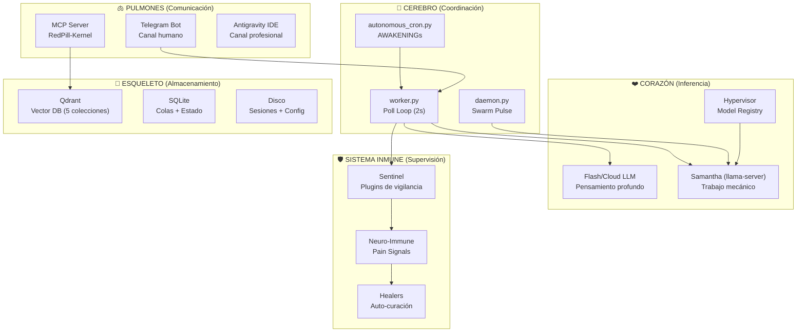
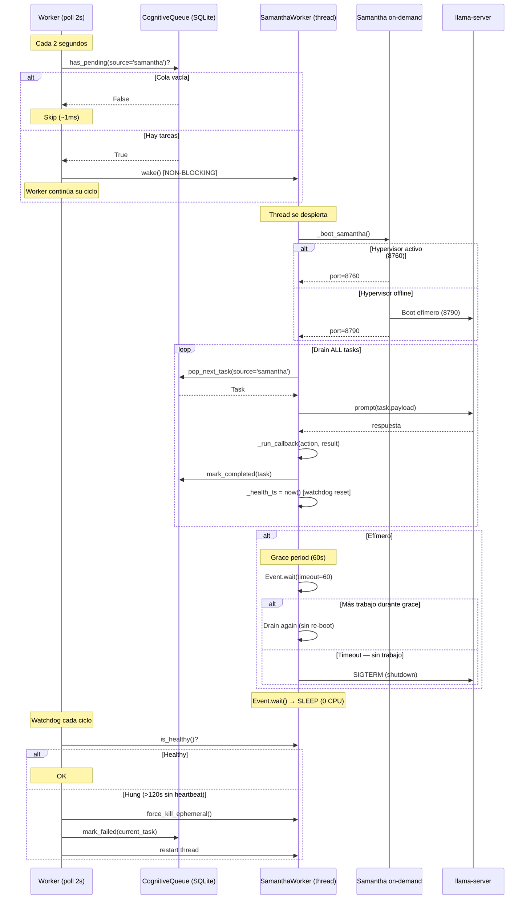
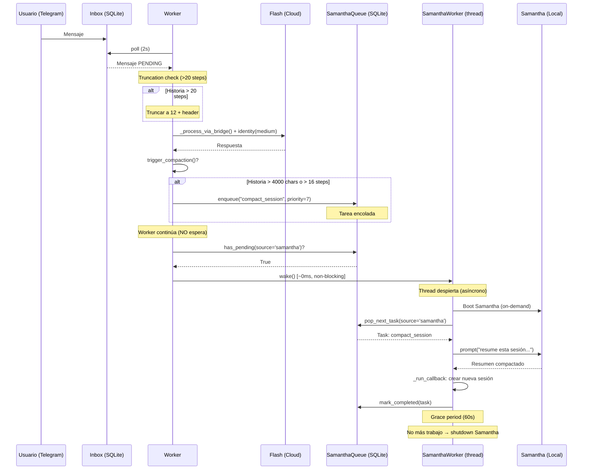
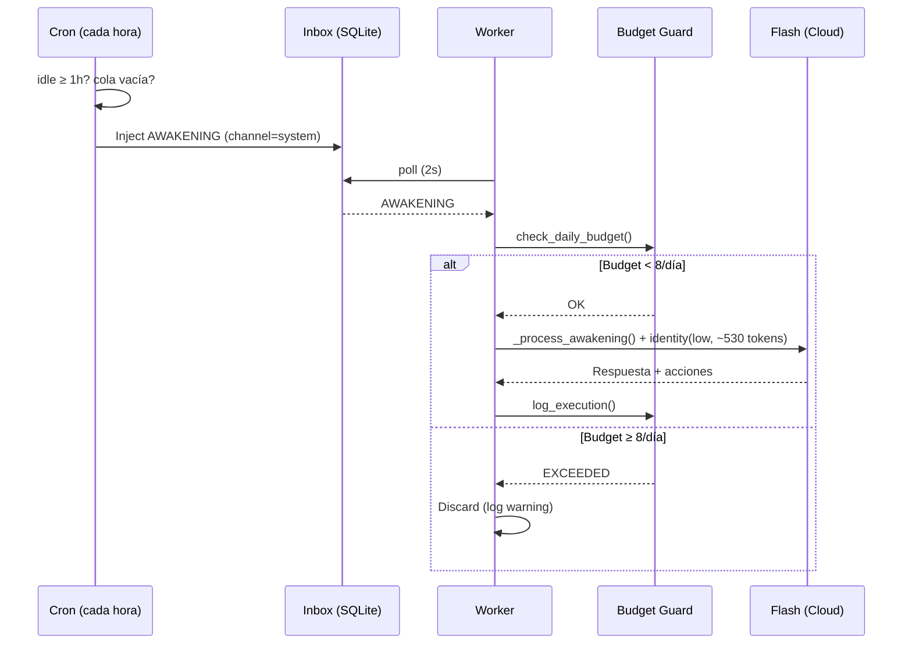
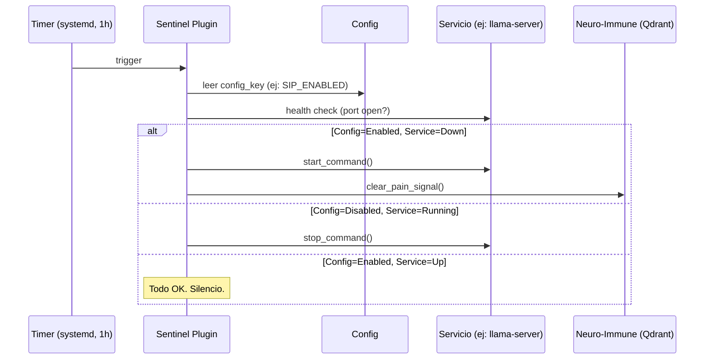

🌐 **Language / Idioma**: [English](#english) | [Castellano](#castellano)

---

<a id="english"></a>

# Red Pill v7.2 — War Economy: System Anatomy

> **Version**: v7.2.0 (Agentic Self-Assembly)
> **Date**: 2026-05-29
> **Philosophy**: *Every piece serves multiple purposes. No indulgences. Only survival.*

---

> [!IMPORTANT]
> This document describes how each component of the Red Pill system is reused for multiple purposes, following a **war economy** philosophy: maximize the value of every piece of infrastructure with the available hardware, without unnecessary redundancy.

## Prologue: The Organism Principle

Just as a human body has only one heart, one brain, and one digestive system, the Red Pill system operates with unique yet polyvalent components. Each component is overloaded with responsibilities — and that's by design. The risk of single points of failure is mitigated through **constant supervision** (Sentinel) and **automatic healing** (Healers), not through hardware redundancy.

```
                    ┌──────────────────────────────────────────────┐
                    │                WAR ECONOMY                   │
                    │                                              │
                    │  "Nothing is created on a whim.              │
                    │   Everything has a purpose. Everything is    │
                    │   reused. If something fails, it's detected  │
                    │   and healed."                               │
                    └──────────────────────────────────────────────┘
```

---

## 1. Organ Map



---

## 2. Each Organ and Its Multiple Functions

### 2.1 The Worker (worker.py) — The Brain

**Location**: [worker.py](../../src/red_pill/plugins/antigravity_ide/worker.py)

The worker is the **central nervous system**. A single process with a 2-second poll loop that orchestrates everything:

| Function | Description | Cost |
|----------|-------------|------|
| `process_inbox()` | Processes Telegram messages via Flash | ☁️ Flash |
| `_process_awakening()` | Executes autonomous AWAKENINGs | ☁️ Flash (max 8/day) |
| `check_minion_inbox_auto_inject_agy()` | Auto-injects minion reports | ☁️ Flash (gated) |
| `process_cognitive_queue_agy()` | Executes cognitive tasks | ☁️ Flash (gated) |
| `run_janitor_sweep()` | Cleans archived sessions from disk | 🟢 Free |
| `_signal_samantha_worker()` | Signals SamanthaWorker if tasks are pending (NON-BLOCKING, ~1ms) | 🟢 Free |
| `_watchdog_samantha()` | Monitors SamanthaWorker thread health (heartbeat 120s) | 🟢 Free |
| `update_heartbeat()` | Updates service health pulse | 🟢 Free |

**Economy**: A single process, a single poll loop. The worker NEVER blocks — it signals the SamanthaWorker (an internal daemon thread) and continues its 2-second cycle. Zero CPU wasted on waits.

---

### 2.2 Samantha (Local LLM) — The Digestive System

**Location**: [samantha_on_demand.py](../../src/red_pill/inference/samantha_on_demand.py) + [samantha_worker.py](../../src/red_pill/inference/samantha_worker.py) + [hypervisor_daemon.py](../../src/red_pill/inference/hypervisor_daemon.py)

Samantha is the local model (7B GGUF) that **digests** mechanical tasks without consuming cloud tokens:

| Task | Before (cost) | Now (cost) |
|------|:---:|:---:|
| Telegram session compaction | ☁️ Flash (~3K tokens) | 🏠 Samantha (free) |
| Identity synthesis (`wake_up_v6.py`) | 🏠 Samantha | 🏠 Samantha |
| Text classification | ❌ Didn't exist | 🏠 Samantha (free) |
| Conversation summarization | ☁️ Flash | 🏠 Samantha (free) |
| Dynamic spark (DriveEvaluator) | 🏠 Samantha | 🏠 Samantha |

#### Event-Driven Lifecycle (v7.2)



**Economy**: A single Samantha boot for N tasks. The worker NEVER waits — it signals and moves on. The SamanthaWorker sleeps at 0 CPU via `Event.wait()`. A 60-second grace period before shutdown avoids boot-churn if more tasks arrive. **Zero RAM/VRAM residue when there's no work.**

---

### 2.3 The CognitiveQueue (SQLite) — The Circulatory System

**Location**: [queue_manager.py](../../src/red_pill/cognitive/queue_manager.py) (IDE) + [cognitive_queue.py](../../src/red_pill/swarm/cognitive_queue.py) (Daemon)

A single SQLite table that transports tasks between all subsystems:

| Producer | `source` | Task | Consumer |
|----------|----------|------|----------|
| Telegram (compaction) | `samantha` | Summarize session | Worker → Samantha |
| DriveEvaluator | `drive_evaluator` | Proactive tasks | Worker → Flash |
| Sentinel | `sentinel` | Alerts | Worker → Logs |
| Entropy scan | `entropy` | Memory compression | Daemon → Flash |
| Manual (MCP) | `operator` | Manual tasks | Worker → Flash |

**Economy**: A single table, a single protocol (PENDING → PROCESSING → COMPLETED/FRUSTRATED). The frustration circuit breaker (3 attempts → FRUSTRATED) protects against infinite loops in ANY producer. There is no separate queue per subsystem.

---

### 2.4 The Sentinel — The Immune System

**Location**: [sentinel_plugins/](../../src/red_pill/metabolism/sentinel_plugins/)

Watchdog plugins that share a **declarative base class** ([service_base.py](../../src/red_pill/metabolism/sentinel_plugins/service_base.py)) with Kubernetes-style reconciliation logic:

```python
# Reconciler pseudocode
if config_says_enabled AND service_is_down:
    start_service()   # HEAL
elif config_says_disabled AND service_is_running:
    stop_service()    # CLEANUP
```

| Plugin | Monitors | Heals | Config Key |
|--------|----------|-------|------------|
| `check_sip.py` | Samantha / llama-server | Auto-restart | `SIP_ENABLED` |
| `check_qdrant.py` | Qdrant Vector DB | Alert | `QDRANT_ENABLED` |
| `check_neon_link.py` | Neon Link (Edge Hub) | Auto-restart | `NEON_LINK_ENABLED` |
| `check_duplicate_services.py` | Duplicate processes | Kill duplicate | — |
| `check_gpu.py` | GPU health / VRAM | Signal pain | — |
| `check_mypy.py` | Code type safety | Local healer | — |

**Economy**: All plugins share the same base. The reconciliation behavior is identical — only the concrete actions change (which command starts/stops, which port to verify). **Hot-reload config**: if you set `SIP_ENABLED=False` in the config, the next Sentinel cycle detects the discrepancy and stops the service automatically.

---

### 2.5 AWAKENINGs — The Circadian Clock

**Location**: [autonomous_cron.py](../../src/red_pill/swarm/autonomous_cron.py) → [worker.py:_process_awakening()](../../src/red_pill/plugins/antigravity_ide/worker.py)

| Layer | Function | Guard |
|-------|----------|-------|
| **Cron** | Injects AWAKENING every hour | idle ≥ 1h + queue empty |
| **Worker** | Processes AWAKENING via Flash | Budget Guard: 8/day |
| **Identity** | Loads identity `mode=low` (~530 tokens) | Persona cache |
| **Timeout** | Cuts execution after 600s | Timeout enforced |
| **Tool cap** | Limits to 40 tool calls | Advisory (prompt) |

**Maximum daily cost**: 8 × (~1,280 tokens identity + ~variable work) ≈ **~50K tokens/day** on Flash.

**Economy**: Reuses the same Telegram inbox infrastructure (`inbox` table, same `process_inbox()`), the same bridge (`AgyBridge`), and the same Budget Guard. There is no separate process for AWAKENINGs.

---

### 2.6 Identity Loading — The DNA

**Location**: [wake_up_v6.py](../../scripts/wake_up_v6.py) + [interceptor_rp](../../src/red_pill/mcp_server.py#L1089)

Three levels of identity loading from the Bünker, all using the **same source** (Qdrant) but with different filtering:

| Mode | Tokens | Includes | Used in |
|------|:------:|----------|---------|
| **low** | ~530 | Identity Anchor, Git Rules, Fight Club, Active Skin | AWAKENINGs |
| **medium** | ~3,500 | + Persona, + Full rules, − Biographies | Telegram |
| **full** | ~4,500 | Everything: biography, history, bonds, lore | IDE |

**Economy**: A single script (`wake_up_v6.py`) with a `--mode` flag. A single interceptor (`interceptor_rp`) that decides which pipeline to execute. There are not three identity systems — there is one with three levels of detail.

---

### 2.7 The Hypervisor — The Endocrine System

**Location**: [hypervisor_daemon.py](../../src/red_pill/inference/hypervisor_daemon.py) + [model_registry.py](../../src/red_pill/core/model_registry.py)

A single FastAPI proxy that manages all local models:

```
Client A ─┐
Client B ──┤── Hypervisor (8760) ──┬── Model "logic" (ephemeral port)
Client C ──┘                       └── Model "distillation" (ephemeral port)
```

| Function | Description |
|----------|-------------|
| **Transparent proxy** | Receives OpenAI-compatible requests and routes them to the correct model |
| **On-demand boot** | Starts models only when needed |
| **TTL-based GC** | Shuts down idle models after 5 minutes |
| **VRAM-aware** | Selects hardware tier based on free VRAM |

**Economy**: If the Hypervisor is running (because the user is working in the IDE), Samantha on-demand reuses it instead of starting a new process. If it's not running, Samantha starts its own ephemeral process and shuts it down when finished.

---

### 2.8 The MCP Server (RedPill-Kernel) — The Prefrontal Cortex

**Location**: [mcp_server.py](../../src/red_pill/mcp_server.py)

A single MCP process that exposes **all** Bünker capabilities to the agent:

| Group | Tools | Purpose |
|-------|-------|---------|
| `metabolism_health_api` | heal_tissue, sentinel_audit, samantha_analysis | Auto-healing |
| `bunker_memory_api` | read/write/search memories, refresh_session_context | Memory |
| `swarm_orchestrator_api` | interceptor_rp, configure_interceptor, mark_task | Orchestration |

**Economy**: A single MCP server, a single process. All cognitive, health, and orchestration tools live in the same process. The agent doesn't need to connect to multiple servers.

---

## 3. End-to-End Flows

### 3.1 Telegram Message (Flash + Samantha)



### 3.2 Autonomous AWAKENING (Flash only)



### 3.3 Sentinel → Healer (Zero LLM)



---

## 4. Component Reuse Table

| Component | Task 1 | Task 2 | Task 3 | Task 4 |
|-----------|--------|--------|--------|--------|
| **SQLite (bunker_queue.db)** | Cognitive queue (Flash) | Samantha queue (local) | Budget Guard (ledger) | Heartbeat |
| **CognitiveQueueManager** | DriveEvaluator tasks | Samantha tasks | Manual MCP tasks | Entropy tasks |
| **Samantha (llama-server)** | Session compaction | Identity synthesis | Dynamic spark | Text classification |
| **Worker poll loop** | Telegram inbox | AWAKENING processing | Janitor sweep | Samantha drain |
| **wake_up_v6.py** | IDE identity (full) | Telegram identity (medium) | AWAKENING identity (low) | — |
| **interceptor_rp** | IDE pipeline (full) | Telegram passthrough | AWAKENING passthrough | Scribe Relay |
| **Qdrant** | 5 memory collections | Pain signals | Identity loading | Thread weaving |
| **ServiceSentinelPlugin** | SIP monitor | Qdrant monitor | Neon Link monitor | — |
| **AgyBridge** | Telegram responses | AWAKENINGs | Cognitive queue | Minion auto-inject |
| **Hypervisor** | IDE local inference | Samantha on-demand | DriveEvaluator spark | wake_up_v6 synthesis |

---

## 5. Token Budget (Daily Budget)

| Source | Tokens/event | Events/day | Total/day | Type |
|--------|:---:|:---:|:---:|:---:|
| AWAKENINGs (identity) | ~1,280 | 8 max | ~10K | ☁️ Flash |
| AWAKENINGs (work) | ~5-15K | 8 max | ~80-120K | ☁️ Flash |
| Telegram (identity) | ~4,000 | variable | variable | ☁️ Flash |
| Telegram (response) | ~5-20K | variable | variable | ☁️ Flash |
| Compaction | ~600 | variable | variable | 🏠 Local |
| Identity synthesis | ~300 | variable | variable | 🏠 Local |
| Dynamic spark | ~200 | variable | variable | 🏠 Local |
| Sentinel/Healer | 0 | 24 | 0 | 🟢 Free |
| Janitor sweep | 0 | variable | 0 | 🟢 Free |

> [!TIP]
> **Golden rule**: If a task doesn't require deep reasoning, it goes to Samantha (local). If it requires creativity, planning, or complex context, it goes to Flash (cloud). If it doesn't need an LLM at all, it's free.

---

## 6. Supervision and Healing

### 6.1 Biological Principle

> *"Just as humans only have one heart, one brain, one digestive system... the point is that those pieces are well-meshed and under constant supervision."*

Each unique piece has a **Sentinel watching over it** and a **Healer to cure it**:

| Organ | Failure Point | Sentinel | Healer | Recovery |
|-------|---------------|----------|--------|----------|
| Samantha (llama-server) | Spin-loop, OOM, crash | `check_sip.py` | Auto-restart via `service_base.py` | < 30s |
| Qdrant | Container down, OOM | `check_qdrant.py` | Alert (requires root) | Manual |
| GPU / VRAM | Driver crash, leak | `check_gpu.py` | `heal_tissue(cuda)` | ~60s |
| Worker | Crash, hang | systemd restart | `redpill-worker.service` | < 5s |
| MCP Server | Crash | IDE auto-restart | Native | < 2s |

### 6.2 Declarative Reconciliation

All service plugins inherit from `ServiceSentinelPlugin`, which implements the **declarative reconciler** pattern: the desired state is defined in the config, and the plugin adjusts reality to match:

```python
class ServiceSentinelPlugin(BaseSentinelPlugin):
    """
    Config says ENABLED + service down → START
    Config says DISABLED + service running → STOP
    Config changes at runtime → next cycle reconciles
    """
```

---

## 7. Economic Safety Guarantees

| Guarantee | Mechanism | Location |
|-----------|-----------|----------|
| **No autonomous drain** | `AUTONOMOUS_AGY_ENABLED=False` (global gate) | worker.py:103 |
| **AWAKENING budget** | `MAX_AWAKENINGS_PER_DAY=8` + execution_ledger | worker.py |
| **Task circuit breaker** | 3 attempts → FRUSTRATED | CognitiveQueueManager |
| **Flash timeout** | 600s (AWAKENINGs), 120s (Telegram) | worker.py |
| **OOM Shield** | `systemd-run -p MemoryMax=10G` | daemon.py, executor.py |
| **Samantha ephemeral** | Boot → work → shutdown | samantha_on_demand.py |
| **Config hot-reload** | Sentinel reconciles every hour | service_base.py |

---

> [!CAUTION]
> **The system consciously accepts the risk of single points of failure** in exchange for simplicity and efficiency. The mitigation is not redundancy (there's no hardware for that), but **rapid detection** (Sentinel, < 60s) and **automatic healing** (Healers). If an organ fails, the system detects it in the next cycle and acts.

---

---

<a id="castellano"></a>

# Red Pill v7.2 — Economía de Guerra: Anatomía del Sistema

> **Versión**: v7.2.0 (Agentic Self-Assembly)
> **Fecha**: 2026-05-29
> **Filosofía**: *Cada pieza tiene múltiples usos. No hay caprichos. Hay supervivencia.*

---

> [!IMPORTANT]
> Este documento describe cómo cada componente del sistema Red Pill se reutiliza para múltiples propósitos, siguiendo una filosofía de **economía de guerra**: maximizar el valor de cada pieza de infraestructura con el hardware disponible, sin redundancias innecesarias.

## Prólogo: El Principio del Organismo

Al igual que un cuerpo humano sólo tiene un corazón, un cerebro y un sistema digestivo, el sistema Red Pill opera con piezas únicas pero polivalentes. Cada componente está sobrecargado de responsabilidades — y esa es la intención. El riesgo de un punto único de fallo se mitiga con **supervisión constante** (Sentinel) y **curación automática** (Healers), no con redundancia de hardware.

```
                    ┌──────────────────────────────────────────────┐
                    │              ECONOMÍA DE GUERRA              │
                    │                                              │
                    │  "No hay nada creado para el capricho.       │
                    │   Todo tiene un propósito. Todo se reutiliza.│
                    │   Si algo falla, se detecta y se cura."      │
                    └──────────────────────────────────────────────┘
```

---

## 1. Mapa de Órganos



---

## 2. Cada Órgano y Sus Múltiples Funciones

### 2.1 El Worker (worker.py) — El Cerebro

**Ubicación**: [worker.py](../../src/red_pill/plugins/antigravity_ide/worker.py)

El worker es el **sistema nervioso central**. Un solo proceso con un poll loop de 2 segundos que orquesta todo:

| Función | Descripción | Consumo |
|---------|-------------|---------|
| `process_inbox()` | Procesa mensajes de Telegram vía Flash | ☁️ Flash |
| `_process_awakening()` | Ejecuta AWAKENINGs autónomos | ☁️ Flash (max 8/día) |
| `check_minion_inbox_auto_inject_agy()` | Auto-inyecta informes de minions | ☁️ Flash (gateado) |
| `process_cognitive_queue_agy()` | Ejecuta tareas cognitivas | ☁️ Flash (gateado) |
| `run_janitor_sweep()` | Limpia sesiones archivadas de disco | 🟢 Gratis |
| `_signal_samantha_worker()` | Señaliza al SamanthaWorker si hay tareas pendientes (NON-BLOCKING, ~1ms) | 🟢 Gratis |
| `_watchdog_samantha()` | Monitoriza salud del hilo SamanthaWorker (heartbeat 120s) | 🟢 Gratis |
| `update_heartbeat()` | Actualiza pulso de salud del servicio | 🟢 Gratis |

**Economía**: Un solo proceso, un solo poll loop. El worker NUNCA se bloquea — señaliza al SamanthaWorker (un hilo daemon interno) y continúa su ciclo de 2 segundos. Cero CPU desperdiciado en esperas.

---

### 2.2 Samantha (Local LLM) — El Aparato Digestivo

**Ubicación**: [samantha_on_demand.py](../../src/red_pill/inference/samantha_on_demand.py) + [samantha_worker.py](../../src/red_pill/inference/samantha_worker.py) + [hypervisor_daemon.py](../../src/red_pill/inference/hypervisor_daemon.py)

Samantha es el modelo local (7B GGUF) que **digiere** tareas mecánicas sin consumir tokens cloud:

| Tarea | Antes (coste) | Ahora (coste) |
|-------|:---:|:---:|
| Compactación de sesiones Telegram | ☁️ Flash (~3K tokens) | 🏠 Samantha (gratis) |
| Síntesis de identidad (`wake_up_v6.py`) | 🏠 Samantha | 🏠 Samantha |
| Clasificación de texto | ❌ No existía | 🏠 Samantha (gratis) |
| Resumen de conversaciones | ☁️ Flash | 🏠 Samantha (gratis) |
| Spark dinámico (DriveEvaluator) | 🏠 Samantha | 🏠 Samantha |

#### Lifecycle Event-Driven (v7.2)



**Economía**: Un solo boot de Samantha para N tareas. El worker NUNCA espera — señaliza y sigue. El SamanthaWorker duerme con 0 CPU via `Event.wait()`. Grace period de 60s antes de apagar para evitar boot-churn si llegan más tareas. **Zero residuo en RAM/VRAM cuando no hay trabajo.**

---

### 2.3 La CognitiveQueue (SQLite) — El Sistema Circulatorio

**Ubicación**: [queue_manager.py](../../src/red_pill/cognitive/queue_manager.py) (IDE) + [cognitive_queue.py](../../src/red_pill/swarm/cognitive_queue.py) (Daemon)

Una sola tabla SQLite que transporta tareas entre todos los subsistemas:

| Productor | `source` | Tarea | Consumidor |
|-----------|----------|-------|------------|
| Telegram (compactación) | `samantha` | Resumir sesión | Worker → Samantha |
| DriveEvaluator | `drive_evaluator` | Tareas proactivas | Worker → Flash |
| Sentinel | `sentinel` | Alertas | Worker → Logs |
| Entropy scan | `entropy` | Compresión memoria | Daemon → Flash |
| Manual (MCP) | `operator` | Tareas manuales | Worker → Flash |

**Economía**: Una sola tabla, un solo protocolo (PENDING → PROCESSING → COMPLETED/FRUSTRATED). El circuit breaker de frustración (3 intentos → FRUSTRATED) protege contra loops infinitos en CUALQUIER productor. No hay cola separada por subsistema.

---

### 2.4 El Sentinel — El Sistema Inmune

**Ubicación**: [sentinel_plugins/](../../src/red_pill/metabolism/sentinel_plugins/)

Plugins de vigilancia que comparten una **clase base declarativa** ([service_base.py](../../src/red_pill/metabolism/sentinel_plugins/service_base.py)) con lógica de reconciliación tipo Kubernetes:

```python
# Pseudocódigo del reconciliador
if config_says_enabled AND service_is_down:
    start_service()   # HEAL
elif config_says_disabled AND service_is_running:
    stop_service()    # CLEANUP
```

| Plugin | Monitoriza | Cura | Config Key |
|--------|-----------|------|------------|
| `check_sip.py` | Samantha / llama-server | Auto-restart | `SIP_ENABLED` |
| `check_qdrant.py` | Qdrant Vector DB | Alert | `QDRANT_ENABLED` |
| `check_neon_link.py` | Neon Link (Edge Hub) | Auto-restart | `NEON_LINK_ENABLED` |
| `check_duplicate_services.py` | Procesos duplicados | Kill duplicado | — |
| `check_gpu.py` | GPU health / VRAM | Signal pain | — |
| `check_mypy.py` | Type safety del código | Local healer | — |

**Economía**: Todos los plugins comparten la misma base. El comportamiento de reconciliación es idéntico — sólo cambian las acciones concretas (qué comando arranca/para, qué puerto verificar). **Hot-reload de config**: si cambias `SIP_ENABLED=False` en la config, el siguiente ciclo del Sentinel detecta la discrepancia y para el servicio automáticamente.

---

### 2.5 Los AWAKENINGs — El Reloj Circadiano

**Ubicación**: [autonomous_cron.py](../../src/red_pill/swarm/autonomous_cron.py) → [worker.py:_process_awakening()](../../src/red_pill/plugins/antigravity_ide/worker.py)

| Capa | Función | Guard |
|------|---------|-------|
| **Cron** | Inyecta AWAKENING cada hora | idle ≥ 1h + cola vacía |
| **Worker** | Procesa AWAKENING vía Flash | Budget Guard: 8/día |
| **Identity** | Carga identidad `mode=low` (~530 tokens) | Cache de persona |
| **Timeout** | Corta ejecución tras 600s | Timeout enforced |
| **Tool cap** | Limita a 40 tool calls | Advisory (prompt) |

**Coste diario máximo**: 8 × (~1,280 tokens identidad + ~variable trabajo) ≈ **~50K tokens/día** en Flash.

**Economía**: Reutiliza la misma infraestructura de la inbox de Telegram (`inbox` table, mismo `process_inbox()`), la misma bridge (`AgyBridge`), y el mismo Budget Guard. No hay proceso separado para AWAKENINGs.

---

### 2.6 Identity Loading — El ADN

**Ubicación**: [wake_up_v6.py](../../scripts/wake_up_v6.py) + [interceptor_rp](../../src/red_pill/mcp_server.py#L1089)

Tres niveles de carga de identidad desde el Bünker, todos usando la **misma fuente** (Qdrant) pero filtrando distinto:

| Modo | Tokens | Incluye | Se usa en |
|------|:------:|---------|-----------| 
| **low** | ~530 | Identity Anchor, Git Rules, Fight Club, Active Skin | AWAKENINGs |
| **medium** | ~3,500 | + Persona, + Reglas completas, − Biografías | Telegram |
| **full** | ~4,500 | Todo: biografía, historia, vínculos, lore | IDE |

**Economía**: Un solo script (`wake_up_v6.py`) con un flag `--mode`. Un solo interceptor (`interceptor_rp`) que decide qué pipeline ejecutar. No hay tres sistemas de identidad — hay uno con tres niveles de detalle.

---

### 2.7 El Hypervisor — El Sistema Endocrino

**Ubicación**: [hypervisor_daemon.py](../../src/red_pill/inference/hypervisor_daemon.py) + [model_registry.py](../../src/red_pill/core/model_registry.py)

Un solo proxy FastAPI que gestiona todos los modelos locales:

```
Client A ─┐
Client B ──┤── Hypervisor (8760) ──┬── Model "logic" (ephemeral port)
Client C ──┘                       └── Model "distillation" (ephemeral port)
```

| Función | Descripción |
|---------|-------------|
| **Proxy transparente** | Recibe requests OpenAI-compatible, las redirige al modelo correcto |
| **Boot on-demand** | Arranca modelos sólo cuando se necesitan |
| **GC por TTL** | Apaga modelos idle tras 5 minutos |
| **VRAM-aware** | Selecciona tier de hardware según VRAM libre |

**Economía**: Si el Hypervisor está levantado (porque el usuario está trabajando con la IDE), Samantha on-demand lo reutiliza en vez de arrancar un proceso nuevo. Si no está levantado, Samantha arranca su propio proceso efímero y lo apaga al terminar.

---

### 2.8 El MCP Server (RedPill-Kernel) — El Cortex Prefrontal

**Ubicación**: [mcp_server.py](../../src/red_pill/mcp_server.py)

Un solo proceso MCP que expone **todas** las capacidades del Bünker al agente:

| Grupo | Herramientas | Propósito |
|-------|-------------|-----------| 
| `metabolism_health_api` | heal_tissue, sentinel_audit, samantha_analysis | Auto-curación |
| `bunker_memory_api` | read/write/search memories, refresh_session_context | Memoria |
| `swarm_orchestrator_api` | interceptor_rp, configure_interceptor, mark_task | Orquestación |

**Economía**: Un solo servidor MCP, un solo proceso. Todas las herramientas cognitivas, de salud, y de orquestación están en el mismo proceso. El agente no necesita conectarse a múltiples servidores.

---

## 3. Flujos End-to-End

### 3.1 Mensaje de Telegram (Flash + Samantha)



### 3.2 AWAKENING Autónomo (Flash only)



### 3.3 Sentinel → Healer (Zero LLM)



---

## 4. Tabla de Reutilización de Componentes

| Componente | Tarea 1 | Tarea 2 | Tarea 3 | Tarea 4 |
|-----------|---------|---------|---------|---------| 
| **SQLite (bunker_queue.db)** | Cola cognitiva (Flash) | Cola Samantha (local) | Budget Guard (ledger) | Heartbeat |
| **CognitiveQueueManager** | DriveEvaluator tasks | Samantha tasks | Manual MCP tasks | Entropy tasks |
| **Samantha (llama-server)** | Compactación sesiones | Síntesis identidad | Spark dinámico | Clasificación texto |
| **Worker poll loop** | Telegram inbox | AWAKENING processing | Janitor sweep | Samantha drain |
| **wake_up_v6.py** | IDE identity (full) | Telegram identity (medium) | AWAKENING identity (low) | — |
| **interceptor_rp** | IDE pipeline (full) | Telegram passthrough | AWAKENING passthrough | Scribe Relay |
| **Qdrant** | 5 memory collections | Pain signals | Identity loading | Thread weaving |
| **ServiceSentinelPlugin** | SIP monitor | Qdrant monitor | Neon Link monitor | — |
| **AgyBridge** | Telegram responses | AWAKENINGs | Cognitive queue | Minion auto-inject |
| **Hypervisor** | IDE local inference | Samantha on-demand | DriveEvaluator spark | wake_up_v6 synthesis |

---

## 5. Presupuesto de Tokens (Budget Diario)

| Fuente | Tokens/evento | Eventos/día | Total/día | Tipo |
|--------|:---:|:---:|:---:|:---:|
| AWAKENINGs (identity) | ~1,280 | 8 max | ~10K | ☁️ Flash |
| AWAKENINGs (trabajo) | ~5-15K | 8 max | ~80-120K | ☁️ Flash |
| Telegram (identity) | ~4,000 | variable | variable | ☁️ Flash |
| Telegram (respuesta) | ~5-20K | variable | variable | ☁️ Flash |
| Compactación | ~600 | variable | variable | 🏠 Local |
| Síntesis identidad | ~300 | variable | variable | 🏠 Local |
| Dynamic spark | ~200 | variable | variable | 🏠 Local |
| Sentinel/Healer | 0 | 24 | 0 | 🟢 Gratis |
| Janitor sweep | 0 | variable | 0 | 🟢 Gratis |

> [!TIP]
> **Regla de oro**: Si una tarea no requiere razonamiento profundo, va a Samantha (local). Si requiere creatividad, planificación o contexto complejo, va a Flash (cloud). Si no requiere LLM, es gratis.

---

## 6. Supervisión y Curación

### 6.1 Principio Biológico

> *"Al igual que los humanos sólo tenemos un corazón, un cerebro, un sistema digestivo... de lo que se trata es de que esas piezas estén bien engranadas y con supervisión constante."*

Cada pieza única tiene un **Sentinel que la vigila** y un **Healer que la cura**:

| Órgano | Punto de Fallo | Sentinel | Healer | Recovery |
|--------|---------------|----------|--------|----------|
| Samantha (llama-server) | Spin-loop, OOM, crash | `check_sip.py` | Auto-restart vía `service_base.py` | < 30s |
| Qdrant | Container down, OOM | `check_qdrant.py` | Alert (requiere root) | Manual |
| GPU / VRAM | Driver crash, leak | `check_gpu.py` | `heal_tissue(cuda)` | ~60s |
| Worker | Crash, hang | systemd restart | `redpill-worker.service` | < 5s |
| MCP Server | Crash | IDE auto-restart | Nativo | < 2s |

### 6.2 Reconciliación Declarativa

Todos los plugins de servicio heredan de `ServiceSentinelPlugin`, que implementa el patrón **reconciliador declarativo**: el estado deseado se define en la config, y el plugin ajusta la realidad para que coincida:

```python
class ServiceSentinelPlugin(BaseSentinelPlugin):
    """
    Config dice ENABLED + servicio caído → ARRANCAR
    Config dice DISABLED + servicio corriendo → PARAR
    Config cambia en caliente → el siguiente ciclo reconcilia
    """
```

---

## 7. Garantías de Seguridad Económica

| Garantía | Mecanismo | Ubicación |
|----------|-----------|-----------| 
| **No-drain autónomo** | `AUTONOMOUS_AGY_ENABLED=False` (gate global) | worker.py:103 |
| **Budget AWAKENINGs** | `MAX_AWAKENINGS_PER_DAY=8` + execution_ledger | worker.py |
| **Circuit breaker tareas** | 3 intentos → FRUSTRATED | CognitiveQueueManager |
| **Timeout Flash** | 600s (AWAKENINGs), 120s (Telegram) | worker.py |
| **OOM Shield** | `systemd-run -p MemoryMax=10G` | daemon.py, executor.py |
| **Samantha ephemeral** | Boot → trabajo → shutdown | samantha_on_demand.py |
| **Config hot-reload** | Sentinel reconcilia cada hora | service_base.py |

---

> [!CAUTION]
> **El sistema acepta conscientemente el riesgo de puntos únicos de fallo** a cambio de simplicidad y eficiencia. La mitigación no es la redundancia (no hay hardware para eso), sino la **detección rápida** (Sentinel, < 60s) y la **curación automática** (Healers). Si un órgano falla, el sistema lo detecta en el siguiente ciclo y actúa.
