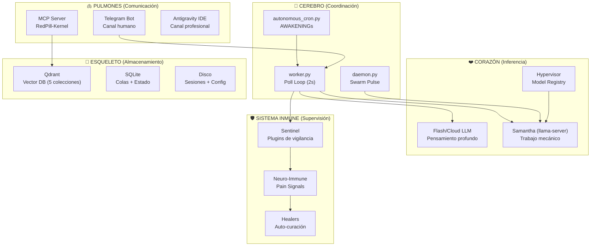
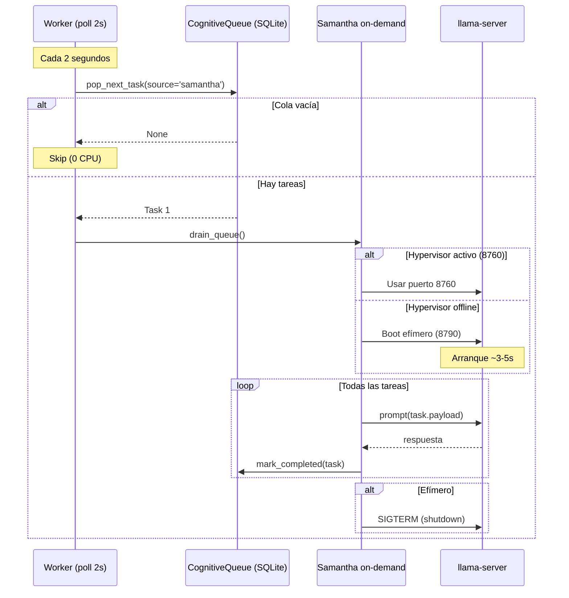
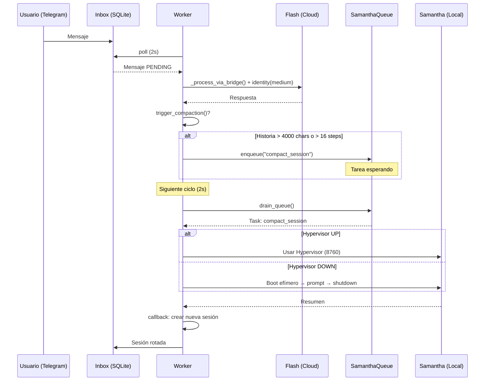
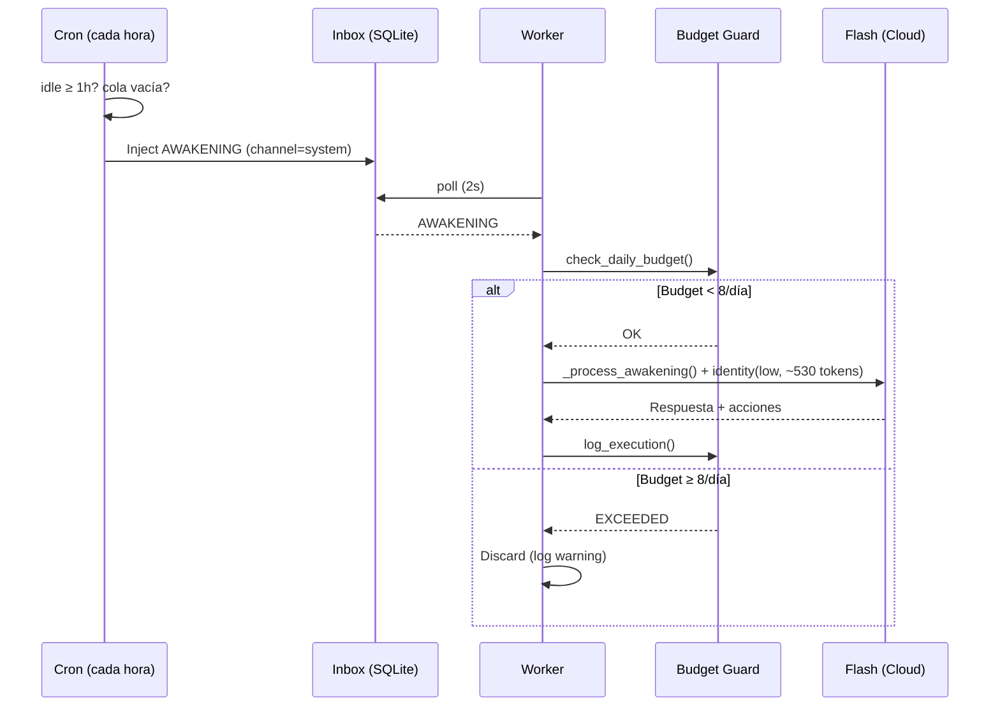
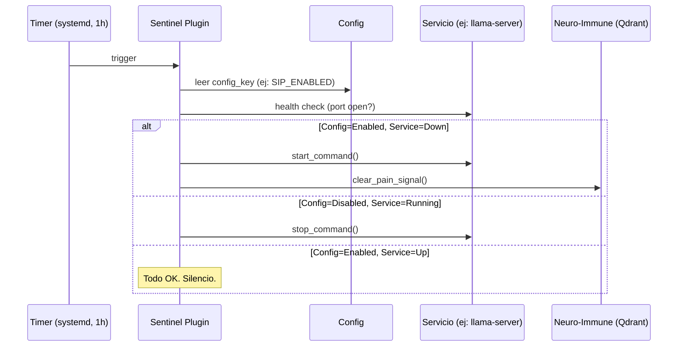

# Red Pill v7.1 — Economía de Guerra: Anatomía del Sistema

> **Versión**: v7.1.0 (Agentic Self-Assembly)
> **Fecha**: 2026-05-29
> **Filosofía**: *Cada pieza tiene múltiples usos. No hay caprichos. Hay supervivencia.*

---

> [!IMPORTANT]
> Este documento describe cómo cada componente del sistema Red Pill se reutiliza para múltiples propósitos, siguiendo una filosofía de **economía de guerra**: maximizar el valor de cada pieza de infraestructura con el hardware disponible, sin redundancias innecesarias.

## Prólogo: El Principio del Organismo

Al igual que un cuerpo humano sólo tiene un corazón, un cerebro y un sistema digestivo, el sistema Red Pill opera con piezas únicas pero polivalentes. Cada componente está sobrecargado de responsabilidades — y esa es la intención. El riesgo de un punto único de fallo se mitiga con **supervisión constante** (Sentinel) y **curación automática** (Healers), no con redundancia de hardware.

```
                    ┌──────────────────────────────────────────────┐
                    │              ECONOMÍA DE GUERRA              │
                    │                                              │
                    │  "No hay nada creado para el capricho.       │
                    │   Todo tiene un propósito. Todo se reutiliza.│
                    │   Si algo falla, se detecta y se cura."      │
                    └──────────────────────────────────────────────┘
```

---

## 1. Mapa de Órganos



---

## 2. Cada Órgano y Sus Múltiples Funciones

### 2.1 El Worker (worker.py) — El Cerebro

**Ubicación**: [worker.py](file:///home/joan/Documents/IA/sharing/src/red_pill/plugins/antigravity_ide/worker.py)

El worker es el **sistema nervioso central**. Un solo proceso con un poll loop de 2 segundos que orquesta todo:

| Función | Descripción | Consumo |
|---------|-------------|---------|
| `process_inbox()` | Procesa mensajes de Telegram vía Flash | ☁️ Flash |
| `_process_awakening()` | Ejecuta AWAKENINGs autónomos | ☁️ Flash (max 8/día) |
| `check_minion_inbox_auto_inject_agy()` | Auto-inyecta informes de minions | ☁️ Flash (gateado) |
| `process_cognitive_queue_agy()` | Ejecuta tareas cognitivas | ☁️ Flash (gateado) |
| `run_janitor_sweep()` | Limpia sesiones archivadas de disco | 🟢 Gratis |
| `drain_queue()` | Drena cola de Samantha (compactación, clasificación) | 🏠 Local LLM |
| `update_heartbeat()` | Actualiza pulso de salud del servicio | 🟢 Gratis |

**Economía**: Un solo proceso, un solo poll loop. No hay daemon separado para cada función — el worker las combina todas en un ciclo de 2 segundos.

---

### 2.2 Samantha (Local LLM) — El Aparato Digestivo

**Ubicación**: [samantha_on_demand.py](file:///home/joan/Documents/IA/sharing/src/red_pill/inference/samantha_on_demand.py) + [samantha_queue.py](file:///home/joan/Documents/IA/sharing/src/red_pill/inference/samantha_queue.py) + [hypervisor_daemon.py](file:///home/joan/Documents/IA/sharing/src/red_pill/inference/hypervisor_daemon.py)

Samantha es el modelo local (7B GGUF) que **digiere** tareas mecánicas sin consumir tokens cloud:

| Tarea | Antes (coste) | Ahora (coste) |
|-------|:---:|:---:|
| Compactación de sesiones Telegram | ☁️ Flash (~3K tokens) | 🏠 Samantha (gratis) |
| Síntesis de identidad (`wake_up_v6.py`) | 🏠 Samantha | 🏠 Samantha |
| Clasificación de texto | ❌ No existía | 🏠 Samantha (gratis) |
| Resumen de conversaciones | ☁️ Flash | 🏠 Samantha (gratis) |
| Spark dinámico (DriveEvaluator) | 🏠 Samantha | 🏠 Samantha |

#### Lifecycle On-Demand



**Economía**: Un solo boot de Samantha para N tareas. Si el Hypervisor ya está corriendo (porque otro proceso lo necesita), no arrancamos nada. Si no está, arrancamos, procesamos todo el batch, y apagamos. **Zero residuo en RAM/VRAM cuando no hay trabajo.**

---

### 2.3 La CognitiveQueue (SQLite) — El Sistema Circulatorio

**Ubicación**: [queue_manager.py](file:///home/joan/Documents/IA/sharing/src/red_pill/cognitive/queue_manager.py) (IDE) + [cognitive_queue.py](file:///home/joan/Documents/IA/sharing/src/red_pill/swarm/cognitive_queue.py) (Daemon)

Una sola tabla SQLite que transporta tareas entre todos los subsistemas:

| Productor | `source` | Tarea | Consumidor |
|-----------|----------|-------|------------|
| Telegram (compactación) | `samantha` | Resumir sesión | Worker → Samantha |
| DriveEvaluator | `drive_evaluator` | Tareas proactivas | Worker → Flash |
| Sentinel | `sentinel` | Alertas | Worker → Logs |
| Entropy scan | `entropy` | Compresión memoria | Daemon → Flash |
| Manual (MCP) | `operator` | Tareas manuales | Worker → Flash |

**Economía**: Una sola tabla, un solo protocolo (PENDING → PROCESSING → COMPLETED/FRUSTRATED). El circuit breaker de frustración (3 intentos → FRUSTRATED) protege contra loops infinitos en CUALQUIER productor. No hay cola separada por subsistema.

---

### 2.4 El Sentinel — El Sistema Inmune

**Ubicación**: [sentinel_plugins/](file:///home/joan/Documents/IA/sharing/src/red_pill/metabolism/sentinel_plugins/)

Plugins de vigilancia que comparten una **clase base declarativa** ([service_base.py](file:///home/joan/Documents/IA/sharing/src/red_pill/metabolism/sentinel_plugins/service_base.py)) con lógica de reconciliación tipo Kubernetes:

```python
# Pseudocódigo del reconciliador
if config_says_enabled AND service_is_down:
    start_service()   # HEAL
elif config_says_disabled AND service_is_running:
    stop_service()    # CLEANUP
```

| Plugin | Monitoriza | Cura | Config Key |
|--------|-----------|------|------------|
| `check_sip.py` | Samantha / llama-server | Auto-restart | `SIP_ENABLED` |
| `check_qdrant.py` | Qdrant Vector DB | Alert | `QDRANT_ENABLED` |
| `check_neon_link.py` | Neon Link (Edge Hub) | Auto-restart | `NEON_LINK_ENABLED` |
| `check_duplicate_services.py` | Procesos duplicados | Kill duplicado | — |
| `check_gpu.py` | GPU health / VRAM | Signal pain | — |
| `check_mypy.py` | Type safety del código | Local healer | — |

**Economía**: Todos los plugins comparten la misma base. El comportamiento de reconciliación es idéntico — sólo cambian las acciones concretas (qué comando arranca/para, qué puerto verificar). **Hot-reload de config**: si cambias `SIP_ENABLED=False` en la config, el siguiente ciclo del Sentinel detecta la discrepancia y para el servicio automáticamente.

---

### 2.5 Los AWAKENINGs — El Reloj Circadiano

**Ubicación**: [autonomous_cron.py](file:///home/joan/Documents/IA/sharing/src/red_pill/swarm/autonomous_cron.py) → [worker.py:_process_awakening()](file:///home/joan/Documents/IA/sharing/src/red_pill/plugins/antigravity_ide/worker.py)

| Capa | Función | Guard |
|------|---------|-------|
| **Cron** | Inyecta AWAKENING cada hora | idle ≥ 1h + cola vacía |
| **Worker** | Procesa AWAKENING vía Flash | Budget Guard: 8/día |
| **Identity** | Carga identidad `mode=low` (~530 tokens) | Cache de persona |
| **Timeout** | Corta ejecución tras 600s | Timeout enforced |
| **Tool cap** | Limita a 40 tool calls | Advisory (prompt) |

**Coste diario máximo**: 8 × (~1,280 tokens identidad + ~variable trabajo) ≈ **~50K tokens/día** en Flash.

**Economía**: Reutiliza la misma infraestructura de la inbox de Telegram (`inbox` table, mismo `process_inbox()`), la misma bridge (`AgyBridge`), y el mismo Budget Guard. No hay proceso separado para AWAKENINGs.

---

### 2.6 Identity Loading — El ADN

**Ubicación**: [wake_up_v6.py](file:///home/joan/Documents/IA/sharing/scripts/wake_up_v6.py) + [interceptor_rp](file:///home/joan/Documents/IA/sharing/src/red_pill/mcp_server.py#L1089)

Tres niveles de carga de identidad desde el Bünker, todos usando la **misma fuente** (Qdrant) pero filtrando distinto:

| Modo | Tokens | Incluye | Se usa en |
|------|:------:|---------|-----------|
| **low** | ~530 | Identity Anchor, Git Rules, Fight Club, Active Skin | AWAKENINGs |
| **medium** | ~3,500 | + Persona, + Reglas completas, − Biografías | Telegram |
| **full** | ~4,500 | Todo: biografía, historia, vínculos, lore | IDE |

**Economía**: Un solo script (`wake_up_v6.py`) con un flag `--mode`. Un solo interceptor (`interceptor_rp`) que decide qué pipeline ejecutar. No hay tres sistemas de identidad — hay uno con tres niveles de detalle.

---

### 2.7 El Hypervisor — El Sistema Endocrino

**Ubicación**: [hypervisor_daemon.py](file:///home/joan/Documents/IA/sharing/src/red_pill/inference/hypervisor_daemon.py) + [model_registry.py](file:///home/joan/Documents/IA/sharing/src/red_pill/core/model_registry.py)

Un solo proxy FastAPI que gestiona todos los modelos locales:

```
Client A ─┐
Client B ──┤── Hypervisor (8760) ──┬── Model "logic" (ephemeral port)
Client C ──┘                       └── Model "distillation" (ephemeral port)
```

| Función | Descripción |
|---------|-------------|
| **Proxy transparente** | Recibe requests OpenAI-compatible, las redirige al modelo correcto |
| **Boot on-demand** | Arranca modelos sólo cuando se necesitan |
| **GC por TTL** | Apaga modelos idle tras 5 minutos |
| **VRAM-aware** | Selecciona tier de hardware según VRAM libre |

**Economía**: Si el Hypervisor está levantado (porque el usuario está trabajando con la IDE), Samantha on-demand lo reutiliza en vez de arrancar un proceso nuevo. Si no está levantado, Samantha arranca su propio proceso efímero y lo apaga al terminar.

---

### 2.8 El MCP Server (RedPill-Kernel) — El Cortex Prefrontal

**Ubicación**: [mcp_server.py](file:///home/joan/Documents/IA/sharing/src/red_pill/mcp_server.py)

Un solo proceso MCP que expone **todas** las capacidades del Bünker al agente:

| Grupo | Herramientas | Propósito |
|-------|-------------|-----------|
| `metabolism_health_api` | heal_tissue, sentinel_audit, samantha_analysis | Auto-curación |
| `bunker_memory_api` | read/write/search memories, refresh_session_context | Memoria |
| `swarm_orchestrator_api` | interceptor_rp, configure_interceptor, mark_task | Orquestación |

**Economía**: Un solo servidor MCP, un solo proceso. Todas las herramientas cognitivas, de salud, y de orquestación están en el mismo proceso. El agente no necesita conectarse a múltiples servidores.

---

## 3. Flujos End-to-End

### 3.1 Mensaje de Telegram (Flash + Samantha)



### 3.2 AWAKENING Autónomo (Flash only)



### 3.3 Sentinel → Healer (Zero LLM)



---

## 4. Tabla de Reutilización de Componentes

| Componente | Tarea 1 | Tarea 2 | Tarea 3 | Tarea 4 |
|-----------|---------|---------|---------|---------|
| **SQLite (bunker_queue.db)** | Cola cognitiva (Flash) | Cola Samantha (local) | Budget Guard (ledger) | Heartbeat |
| **CognitiveQueueManager** | DriveEvaluator tasks | Samantha tasks | Manual MCP tasks | Entropy tasks |
| **Samantha (llama-server)** | Compactación sesiones | Síntesis identidad | Spark dinámico | Clasificación texto |
| **Worker poll loop** | Telegram inbox | AWAKENING processing | Janitor sweep | Samantha drain |
| **wake_up_v6.py** | IDE identity (full) | Telegram identity (medium) | AWAKENING identity (low) | — |
| **interceptor_rp** | IDE pipeline (full) | Telegram passthrough | AWAKENING passthrough | Scribe Relay |
| **Qdrant** | 5 memory collections | Pain signals | Identity loading | Thread weaving |
| **ServiceSentinelPlugin** | SIP monitor | Qdrant monitor | Neon Link monitor | — |
| **AgyBridge** | Telegram responses | AWAKENINGs | Cognitive queue | Minion auto-inject |
| **Hypervisor** | IDE local inference | Samantha on-demand | DriveEvaluator spark | wake_up_v6 synthesis |

---

## 5. Presupuesto de Tokens (Budget Diario)

| Fuente | Tokens/evento | Eventos/día | Total/día | Tipo |
|--------|:---:|:---:|:---:|:---:|
| AWAKENINGs (identity) | ~1,280 | 8 max | ~10K | ☁️ Flash |
| AWAKENINGs (trabajo) | ~5-15K | 8 max | ~80-120K | ☁️ Flash |
| Telegram (identity) | ~4,000 | variable | variable | ☁️ Flash |
| Telegram (respuesta) | ~5-20K | variable | variable | ☁️ Flash |
| Compactación | ~600 | variable | variable | 🏠 Local |
| Síntesis identidad | ~300 | variable | variable | 🏠 Local |
| Dynamic spark | ~200 | variable | variable | 🏠 Local |
| Sentinel/Healer | 0 | 24 | 0 | 🟢 Gratis |
| Janitor sweep | 0 | variable | 0 | 🟢 Gratis |

> [!TIP]
> **Regla de oro**: Si una tarea no requiere razonamiento profundo, va a Samantha (local). Si requiere creatividad, planificación o contexto complejo, va a Flash (cloud). Si no requiere LLM, es gratis.

---

## 6. Supervisión y Curación

### 6.1 Principio Biológico

> *"Al igual que los humanos sólo tenemos un corazón, un cerebro, un sistema digestivo... de lo que se trata es de que esas piezas estén bien engranadas y con supervisión constante."*

Cada pieza única tiene un **Sentinel que la vigila** y un **Healer que la cura**:

| Órgano | Punto de Fallo | Sentinel | Healer | Recovery |
|--------|---------------|----------|--------|----------|
| Samantha (llama-server) | Spin-loop, OOM, crash | `check_sip.py` | Auto-restart vía `service_base.py` | < 30s |
| Qdrant | Container down, OOM | `check_qdrant.py` | Alert (requiere root) | Manual |
| GPU / VRAM | Driver crash, leak | `check_gpu.py` | `heal_tissue(cuda)` | ~60s |
| Worker | Crash, hang | systemd restart | `redpill-worker.service` | < 5s |
| MCP Server | Crash | IDE auto-restart | Nativo | < 2s |

### 6.2 Reconciliación Declarativa

Todos los plugins de servicio heredan de `ServiceSentinelPlugin`, que implementa el patrón **reconciliador declarativo**: el estado deseado se define en la config, y el plugin ajusta la realidad para que coincida:

```python
class ServiceSentinelPlugin(BaseSentinelPlugin):
    """
    Config dice ENABLED + servicio caído → ARRANCAR
    Config dice DISABLED + servicio corriendo → PARAR
    Config cambia en caliente → el siguiente ciclo reconcilia
    """
```

---

## 7. Garantías de Seguridad Económica

| Garantía | Mecanismo | Ubicación |
|----------|-----------|-----------|
| **No-drain autónomo** | `AUTONOMOUS_AGY_ENABLED=False` (gate global) | worker.py:103 |
| **Budget AWAKENINGs** | `MAX_AWAKENINGS_PER_DAY=8` + execution_ledger | worker.py |
| **Circuit breaker tareas** | 3 intentos → FRUSTRATED | CognitiveQueueManager |
| **Timeout Flash** | 600s (AWAKENINGs), 120s (Telegram) | worker.py |
| **OOM Shield** | `systemd-run -p MemoryMax=10G` | daemon.py, executor.py |
| **Samantha ephemeral** | Boot → trabajo → shutdown | samantha_on_demand.py |
| **Config hot-reload** | Sentinel reconcilia cada hora | service_base.py |

---

> [!CAUTION]
> **El sistema acepta conscientemente el riesgo de puntos únicos de fallo** a cambio de simplicidad y eficiencia. La mitigación no es la redundancia (no hay hardware para eso), sino la **detección rápida** (Sentinel, < 60s) y la **curación automática** (Healers). Si un órgano falla, el sistema lo detecta en el siguiente ciclo y actúa.
