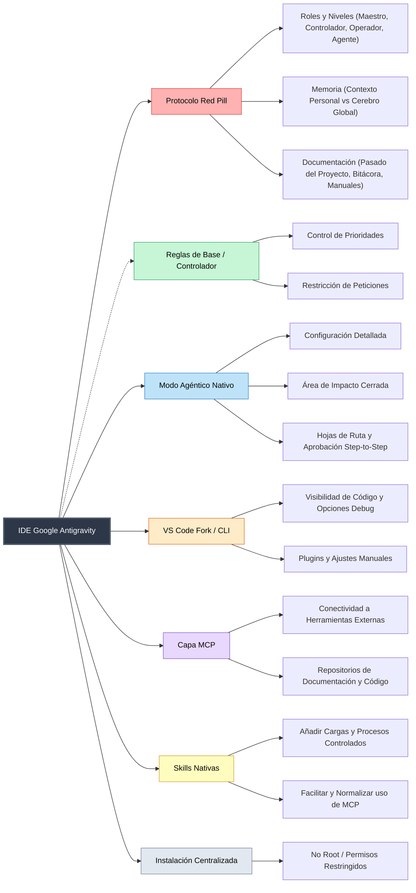

# Propuesta de Implantación de IA: Proyecto "IDE Google Antigravity" (Protocolo Red Pill)

## 1. Visión General
El objetivo de este documento es presentar al equipo técnico el nuevo enfoque de integración de Inteligencia Artificial en nuestro flujo de trabajo diario. No se trata simplemente de "usar ChatGPT", sino de implementar un entorno de desarrollo integrado (**IDE Google Antigravity**), donde la IA actúa como un asistente colaborativo bajo un marco estricto de seguridad, control y reglas predefinidas (**Protocolo Red Pill**).

Este sistema está diseñado para potenciar nuestras capacidades técnicas, automatizar tareas mecánicas y estandarizar procesos, manteniendo siempre al **desarrollador humano con el control absoluto**.

### 1.1 Mapa Mental del Ecosistema

A continuación se presenta un diagrama conceptual (basado en el diseño inicial en pizarra) que ilustra cómo se interconectan todos los módulos del IDE:

---

## 2. Arquitectura del IDE y Entorno de Trabajo

Nuestro entorno se apoyará en grandes pilares arquitectónicos:

1. **Modo Agéntico Nativo**: La IA no solo "charla", sino que opera con autonomía limitada. Trabajará sobre configuraciones detalladas, áreas de impacto restringidas y contará con un histórico de peticiones. Todo fluye mediante *Hojas de Ruta* que requieren tu aprobación, asegurando un control paso a paso.
2. **Entorno Base (VS Code Fork / CLI)**: Integración natural en un entorno que ya conocen. Asegura visibilidad total del código, soporte robusto para debug, ajustes manuales y total compatibilidad con nuestros plugins actuales.
3. **Capa MCP (Model Context Protocol)**: Permite que la IA se conecte de forma estandarizada a las herramientas externas de la empresa, dándole acceso segmentado a los repositorios de código y la documentación corporativa real.
4. **Skills Nativas**: "Poderes" controlados y estandarizados para que el Agente ejecute procesos complejos de la empresa sin que cada desarrollador deba inventar el proceso.
5. **Instalación Centralizada y Segura**: Tendremos un setup base compartido. Cero riesgos por accesos no deseados: se ejecutará con permisos restringidos y **nunca como Root**.

---

## 3. El Marco de Trabajo: Protocolo "Red Pill" y Roles

Para evitar el caos y garantizar un uso escalable, las interacciones se rigen por 4 roles perfectamente definidos:

*   **Maestro [CTO / Líderes]**: Son los encargados de marcar las directrices globales, reglas de diseño y objetivos a cumplir.
*   **Controlador [Capa Red Pill]**: Son las "Reglas de Base" del IDE. Esta capa garantiza que la IA entienda las reglas establecidas por los Maestros, forzando su cumplimiento, priorizando tareas y denegando peticiones fuera de los límites.
*   **Operador [Todo Desarrollador]**: **Tú**. Tu trabajo evoluciona de "picar teclas" a trabajar en conjunto con el Agente: lo armas, lo guías, lo supervisas y le marcas sus límites de actuación día a día.
*   **Agente [La IA - Tus manos]**: Es el "codificador/implementador". Usa sus capacidades para optimizar el trabajo y ejecutar tus hojas de ruta, manteniéndose siempre bajo la monitorización del *Operador* y las restricciones del *Controlador*.

---

## 4. Gestión del Contexto: La Memoria de la IA

Las IAs genéricas olvidan rápido. Nuestro sistema divide la memoria para ser realmente eficiente:

*   **Contexto Personal (Tu Área de Trabajo)**: El agente "aprende" de ti. Las acciones de cada Agente serán recordadas por su Operador; permitiendo retomar tareas, adaptarse a tus guías, a la UI y manteniendo un estado de reseteo persistente e histórico incremental. No empiezas de cero cada día.
*   **Cerebro Global (La Inteligencia del Proyecto)**: Absorbe y consolida cómo están estructurados los proyectos. Generando de forma asíncrona la consolidación de estrategias técnicas y volcándolas a su vez a los repositorios documentales para supervisar que no nos estemos desviando del camino.

---

## 5. El Impacto en la Documentación

La adopción del sistema solucionará la histórica deuda técnica documental:

1.  **Pasado del Proyecto**: La IA generará Logs de cambios ricos contextualmente, viajando atados a la evolución real del proyecto de código.
2.  **Bitácora de Negocio**: Documentación funcional destilada del código, mantenida actualizada y accesible directamente para Negocio.
3.  **Manuales Normativos**: Explicaciones claras de cómo y por qué operan las lógicas internas.

---

## 6. Conclusión y Beneficios para el Equipo

**¿Por qué utilizamos esta arquitectura?**
Principalmente para agilizar nuestro trabajo, sin perder el norte.
- Para un **Junior**, el Agente es un mentor empotrado: ayuda a comprender arquitecturas previas (legacy), evita atascos en sintaxis y configura flujos controlados donde puedes experimentar sin destruir nada, ya que la plataforma prohíbe operaciones destructivas.
- Para un **Senior**, el Agente quema trabajo rutinario y boilerplate, delegando iteraciones tediosas para poder enfocar energía mental en diseño de sistemas, seguridad y resolución de arquitecturas complejas.

*En Antigravity, el operador tiene siempre la última palabra. La IA no lidera, acelera y obedece.*
